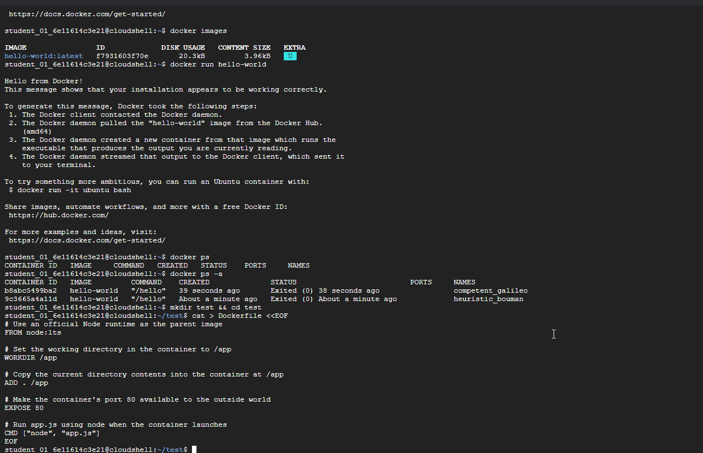
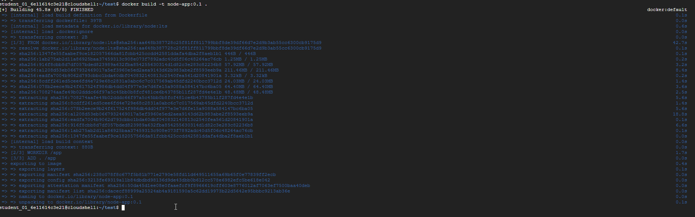
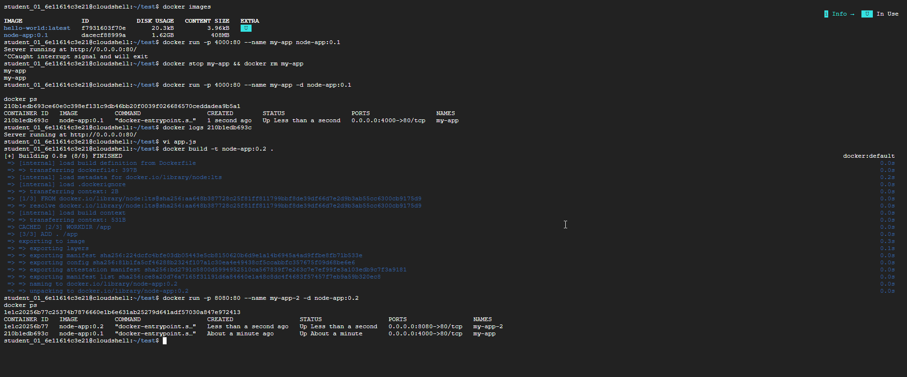
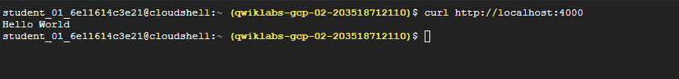
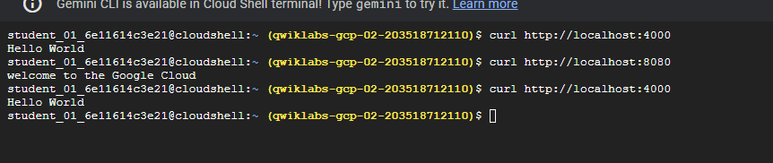
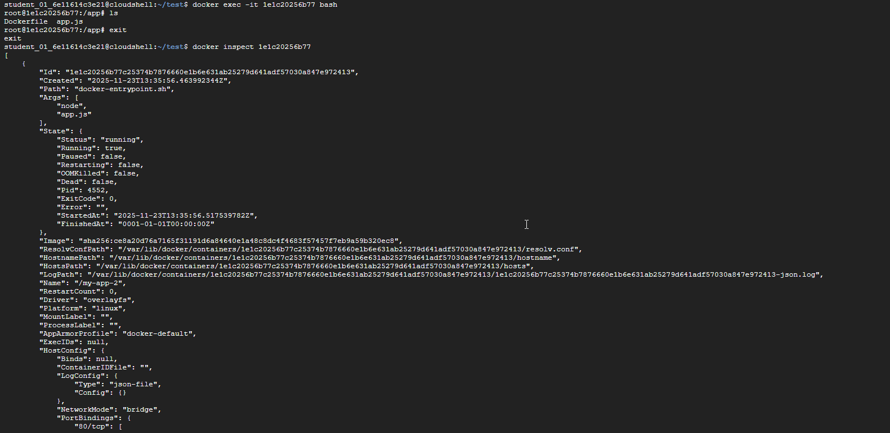
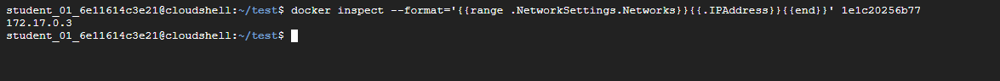
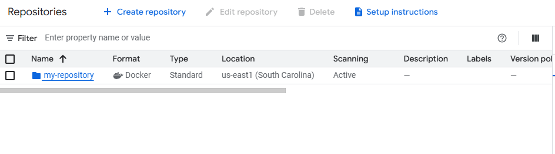
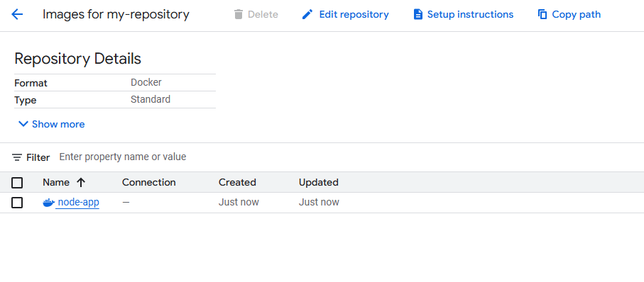
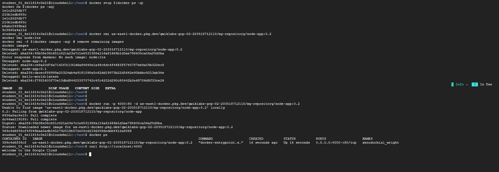

# Introduction to Docker

### Objectives

In this lab, you will learn how to:

* Build, run, and debug Docker containers.
* Pull Docker images from Docker Hub and Google Artifact Registry.
* Push Docker images to Google Artifact Registry.

## Task 1. Hello world

1. In Cloud Shell enter the following command to run a hello world container to get started:
```bash
   docker run hello-world

```   
 This simple container returns Hello from Docker! to your screen. While the command is simple, notice in the output the number of steps it performed. The Docker daemon searched for the hello-world image, didn't find the image locally, pulled the image from a public registry called Docker Hub, created a container from that image, and ran the container for you.


2. Run the following command to take a look at the container image it pulled from Docker Hub:
```bash
   docker images

```
 This is the image pulled from the Docker Hub public registry. The Image ID is in SHA256 hash format—this field specifies the Docker image that's been provisioned. When the Docker daemon can't find an image locally, it will by default search the public registry for the image.

3. Run the container again:
```bash
   docker run hello-world

```
Notice the second time you run this, the Docker daemon finds the image in your local registry and runs the container from that image. It doesn't have to pull the image from Docker Hub.

4. Finally, look at the running containers by running the following command:
```bash
   docker ps

```
There are no running containers. You already exited the hello-world containers you previously ran.

5. In order to see all containers, including ones that have finished executing, run docker ps -a:
```bash
   docker ps -a

```
This shows you the Container ID, a UUID generated by Docker to identify the container, and more metadata about the run. The container Names are also randomly generated but can be specified with docker run --name [container-name] hello-world.

## Task 2. Build

In this section, you will build a Docker image that's based on a simple node application.

1. Execute the following command to create and switch into a folder named test.
   
```bash
   mkdir test && cd test
```

2. Create a Dockerfile:
```bash
   cat > Dockerfile <<EOF
# Use an official Node runtime as the parent image
FROM node:lts

# Set the working directory in the container to /app
WORKDIR /app

# Copy the current directory contents into the container at /app
ADD . /app

# Make the container's port 80 available to the outside world
EXPOSE 80

# Run app.js using node when the container launches
CMD ["node", "app.js"]
EOF
```

This file instructs the Docker daemon on how to build your image.

    * The initial line specifies the base parent image, which in this case is the official Docker image for node version long term support (lts).
    * In the second, you set the working (current) directory of the container.
    * In the third, you add the current directory's contents (indicated by the "." ) into the container.
    * Then expose the container's port so it can accept connections on that port and finally run the node command to start the application.

Now you'll write the node application, and after that you'll build the image. 

3. Run the following to create the node application:
   
```bash
   cat > app.js << EOF;
const http = require("http");

const hostname = "0.0.0.0";
const port = 80;

const server = http.createServer((req, res) => {
	res.statusCode = 200;
	res.setHeader("Content-Type", "text/plain");
	res.end("Hello World\n");
});

server.listen(port, hostname, () => {
	console.log("Server running at http://%s:%s/", hostname, port);
});

process.on("SIGINT", function () {
	console.log("Caught interrupt signal and will exit");
	process.exit();
});
EOF
```

This is a simple HTTP server that listens on port 80 and returns "Hello World".
Now build the image.

4. Note again the ".", which means current directory so you need to run this command from within the directory that has the Dockerfile:
   
```bash
   docker build -t node-app:0.1 .
```
It might take a couple of minutes for this command to finish executing. When it does, your output should resemble the following:

The -t is to name and tag an image with the name:tag syntax. The name of the image is node-app and the tag is 0.1. The tag is highly recommended when building Docker images. If you don't specify a tag, the tag will default to latest and it becomes more difficult to distinguish newer images from older ones. Also notice how each line in the Dockerfile above results in intermediate container layers as the image is built.

5. Now, run the following command to look at the images you built:
   
```bash
   docker images
```

Notice node is the base image and node-app is the image you built. You can't remove node without removing node-app first. The size of the image is relatively small compared to VMs. Other versions of the node image such as node:slim and node:alpine can give you even smaller images for easier portability. The topic of slimming down container sizes is further explored in Advanced Topics. You can view all versions in the official repository in node.

## Task 3. Run

1. Use this code to run containers based on the image you built:
   
```bash
   docker run -p 4000:80 --name my-app node-app:0.1
```

The --name flag allows you to name the container if you like. The -p instructs Docker to map the host's port 4000 to the container's port 80. Now you can reach the server at http://localhost:4000. Without port mapping, you would not be able to reach the container at localhost.

2. Open another terminal (in Cloud Shell, click the + icon), and test the server:
   
```bash
   curl http://localhost:4000
```

The container will run as long as the initial terminal is running. If you want the container to run in the background (not tied to the terminal's session), you need to specify the -d flag.

3. Close the initial terminal and then run the following command to stop and remove the container:
   
```bash
   docker stop my-app && docker rm my-app
```

4. Now run the following command to start the container in the background:
   
```bash
   docker run -p 4000:80 --name my-app -d node-app:0.1

  docker ps
```
5. Notice the container is running in the output of docker ps. You can look at the logs by executing docker logs [container_id].

```bash
docker logs [container_id]
```

Now modify the application.

1. In your Cloud Shell, open the test directory you created earlier in the lab:
```bash
       cd test
```
2. Edit app.js with a text editor of your choice (for example nano or vim) and replace "Hello World" with another string:
   
```bash
   ....
const server = http.createServer((req, res) => {
    res.statusCode = 200;
    res.setHeader('Content-Type', 'text/plain');
    res.end('Welcome to Cloud\n');
});
....
```

3. Build this new image and tag it with 0.2:
   
```bash
   docker build -t node-app:0.2 .
```

Notice in Step 2 that you are using an existing cache layer. From Step 3 and on, the layers are modified because you made a change in app.js.

4. Run another container with the new image version. Notice how we map the host's port 8080 instead of 80. You can't use host port 4000 because it's already in use.
   
```bash
docker run -p 8080:80 --name my-app-2 -d node-app:0.2
docker ps
```

5. Test the containers:
   
```bash
   curl http://localhost:8080
```

6. And now test the first container you made:
   
```bash
   curl http://localhost:4000
```

## Task 4. Debug

1. You can look at the logs of a container using docker logs [container_id]. If you want to follow the log's output as the container is running, use the -f option.

```bash
   docker logs -f [container_id]
```
Sometimes you will want to start an interactive Bash session inside the running container.

2. You can use docker exec to do this. Open another terminal (in Cloud Shell, click the + icon) and enter the following command:
```bash
   docker exec -it [container_id] bash
```
The -it flags let you interact with a container by allocating a pseudo-tty and keeping stdin open. Notice bash ran in the WORKDIR directory (/app) specified in the Dockerfile. From here, you have an interactive shell session inside the container to debug.

3. Look at the directory and exit
```bash
   ls
   exit
```

4. You can examine a container's metadata in Docker by using Docker inspect:
```bash
   docker inspect [container_id]
```

5. Use --format to inspect specific fields from the returned JSON. For example:
 ```bash
   docker inspect --format='{{range .NetworkSettings.Networks}}{{.IPAddress}}{{end}}' [container_id]
```  

## Task 5. Publish

Now you're going to push your image to the Google Artifact Registry. After that you'll remove all containers and images to simulate a fresh environment, and then pull and run your containers. This will demonstrate the portability of Docker containers.

To push images to your private registry hosted by Artifact Registry, you need to tag the images with a registry name. The format is `<regional-repository>-docker.pkg.dev/my-project/my-repo/my-image`.

### Create the target Docker repository (Using Cloud Console)

You must create a repository before you can push any images to it. Pushing an image can't trigger creation of a repository and the Cloud Build service account does not have permissions to create repositories.

1. From the Navigation Menu, under CI/CD navigate to Artifact Registry > Repositories.

2. Click the +CREATE REPOSITORY icon next to repositories.

3. Specify my-repository as the repository name.

4. Choose Docker as the format.

5. Under Location Type, select Region and then choose the location : us-east1.

6. Click Create.

### Configure authentication

Before you can push or pull images, configure Docker to use the Google Cloud CLI to authenticate requests to Artifact Registry.

1. To set up authentication to Docker repositories in the region us-east1, run the following command in Cloud Shell:
```bash
gcloud auth configure-docker us-east1-docker.pkg.dev   
```

2. Enter Y when prompted.
The command updates your Docker configuration. You can now connect with Artifact Registry in your Google Cloud project to push and pull images.

#### Alternate  Create an Artifact Registry repository (Using CLI)

1. Run the following commands to create an Artifact Repository.
   
```bash
gcloud artifacts repositories create my-repository --repository-format=docker --location=us-east1 --description="Docker repository"   
```

### Push the container to Artifact Registry

1. Change into the directory with your Dockerfile.

```bash
   cd ~/test
```

2. Run the command to tag node-app:0.2.
```bash
docker build -t us-east1-docker.pkg.dev/qwiklabs-gcp-02-203518712110/my-repository/node-app:0.2 .
```

3. Run the following command to check your built Docker images.

```bash
docker images
```

4. Push this image to Artifact Registry.
```bash
   docker push us-east1-docker.pkg.dev/qwiklabs-gcp-02-203518712110/my-repository/node-app:0.2

```   
5. After the push finishes, from the Navigation Menu, under CI/CD navigate to Artifact Registry > Repositories.
6. Click on my-repository. You should see your node-app Docker container created:

### Test the image

You could start a new VM, ssh into that VM, and install gcloud. For simplicity, just remove all containers and images to simulate a fresh environment.

1. Stop and remove all containers:

```bash
docker stop $(docker ps -q)
docker rm $(docker ps -aq)
```

You have to remove the child images (of node:lts) before you remove the node image.

2. Run the following command to remove all of the Docker images.
```bash
docker rmi us-east1-docker.pkg.dev/qwiklabs-gcp-02-203518712110/my-repository/node-app:0.2
docker rmi node:lts
docker rmi -f $(docker images -aq) # remove remaining images
docker images
```
At this point you should have a pseudo-fresh environment.

3. Pull the image and run it.
```bash
docker run -p 4000:80 -d us-east1-docker.pkg.dev/qwiklabs-gcp-02-203518712110/my-repository/node-app:0.2   
```

4. Run a curl against the running container.
```bash
curl http://localhost:4000   
```

### Screenshots




















