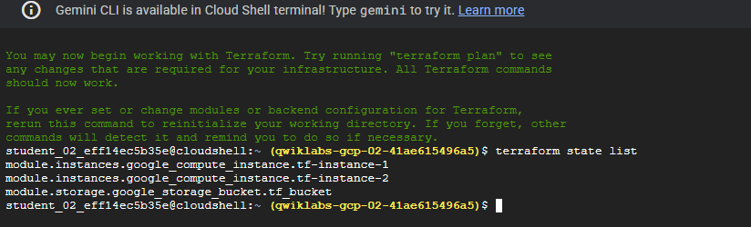
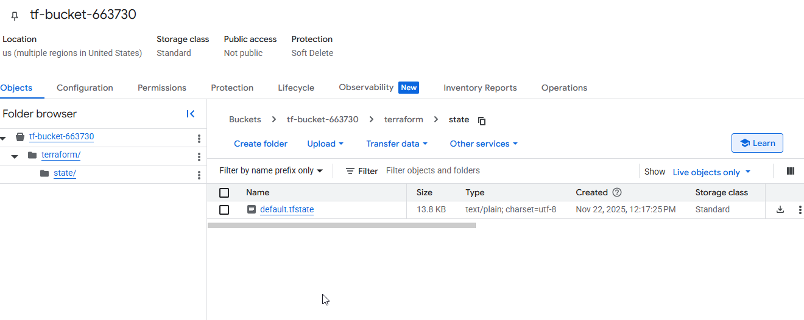
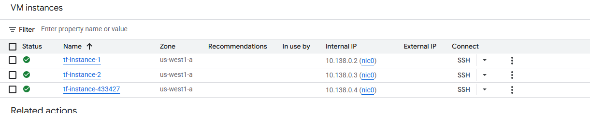
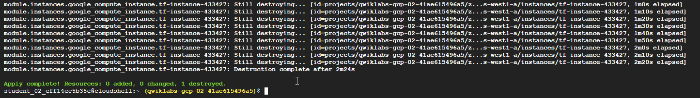
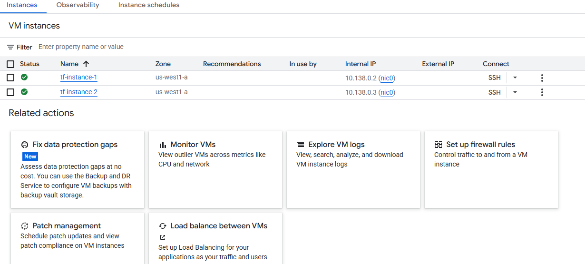
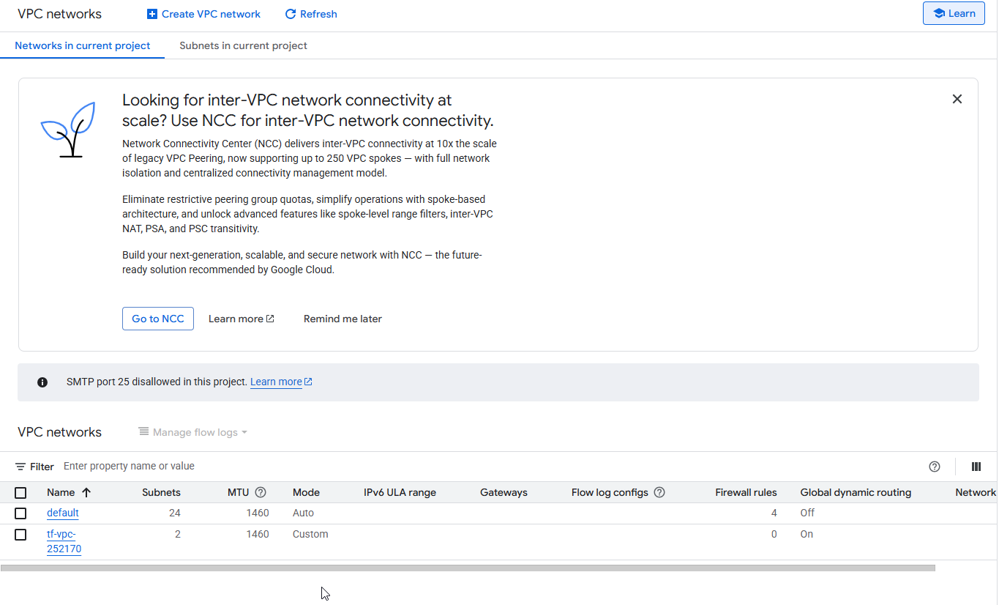
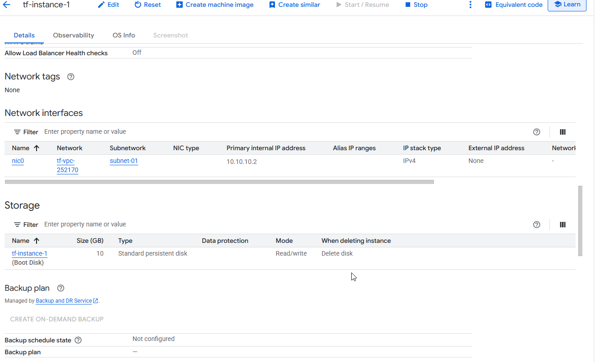
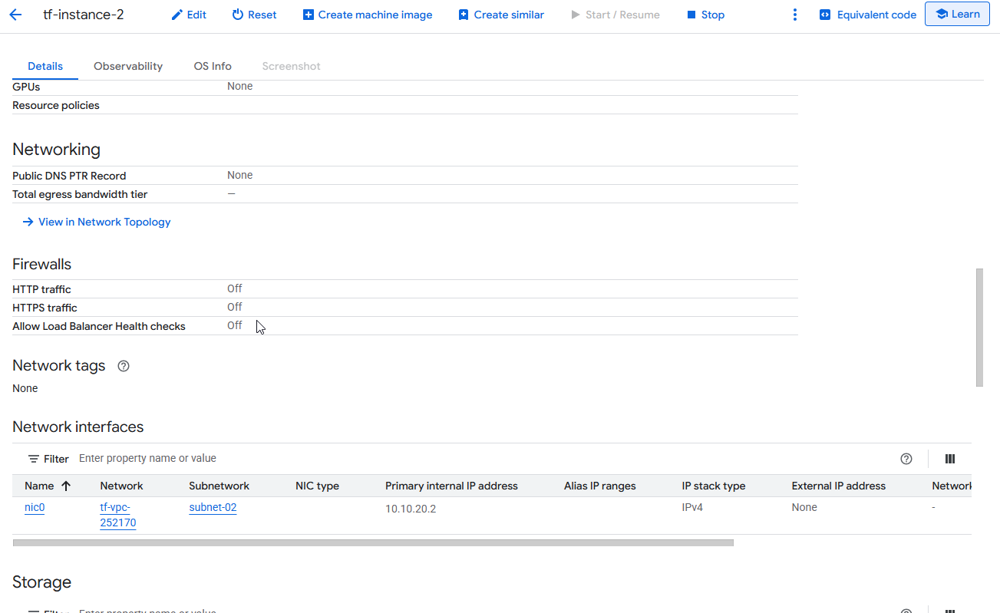
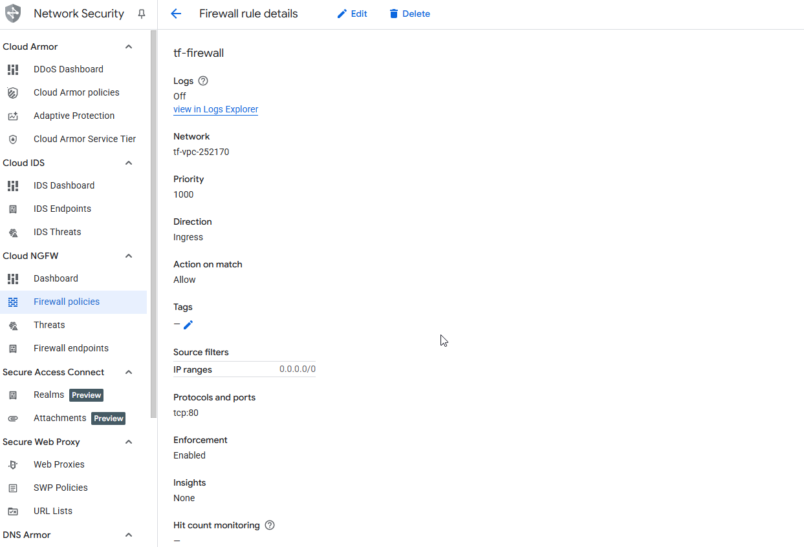

# Build Infrastructure with Terraform on Google Cloud: Challenge Lab

### Topics tested:
1. Build Infrastructure with Terraform on Google Cloud: Challenge Lab
      1. Topics tested:
   1. **Challenge scenario**
   2. **Task 1. Create the configuration files**
   3. **Task 2. Import infrastructure**
   4. **Task 3. Configure a remote backend**
   5. **Task 4. Modify and update infrastructure**
   6. **Task 5. Destroy resources**
   7. **Task 6. Use a module from the Registry**
   8. **Task 7. Configure a firewall**

## **Challenge scenario**

You are a cloud engineer intern for a new startup. For your first project, your new boss has tasked you with creating infrastructure in a quick and efficient manner and generating a mechanism to keep track of it for future reference and changes. You have been directed to use Terraform to complete the project.

For this project, you will use Terraform to create, deploy, and keep track of infrastructure on the startup's preferred provider, Google Cloud. You will also need to import some mismanaged instances into your configuration and fix them.

In this lab, you will use Terraform to import and create multiple VM instances, a VPC network with two subnetworks, and a firewall rule for the VPC to allow connections between the two instances. You will also create a Cloud Storage bucket to host your remote backend.

## **Task 1. Create the configuration files**

1. Build Infrastructure with Terraform on Google Cloud: Challenge Lab
      1. Topics tested:
   1. **Challenge scenario**
   2. **Task 1. Create the configuration files**
   3. **Task 2. Import infrastructure**
   4. **Task 3. Configure a remote backend**
   5. **Task 4. Modify and update infrastructure**
   6. **Task 5. Destroy resources**
   7. **Task 6. Use a module from the Registry**
   8. **Task 7. Configure a firewall**

```
main.tf
variables.tf
modules/
└── instances
    ├── instances.tf
    ├── outputs.tf
    └── variables.tf
└── storage
    ├── storage.tf
    ├── outputs.tf
    └── variables.tf
```

2. Fill out the variables.tf files in the root directory and within the modules. Add three variables to each file: region, zone, and project_id. For their default values, use us-west1, us-west1-a, and your Google Cloud Project ID.

3. Add the Terraform block and the Google Provider to the main.tf file. Verify the zone argument is added along with the project and region arguments in the Google Provider block.
4. Initialize Terraform.

## **Task 2. Import infrastructure**

1. In the Google Cloud Console, on the Navigation menu, click Compute Engine > VM Instances. Two instances named tf-instance-1 and tf-instance-2 have already been created for you.

2. Import the existing instances into the instances module. To do this, you will need to follow these steps:

    * First, add the module reference into the main.tf file then re-initialize Terraform.
    * Next, write the resource configurations in the instances.tf file to match the pre-existing instances.
        * Name your instances tf-instance-1 and tf-instance-2.
        * For the purposes of this lab, the resource configuration should be as minimal as possible. To accomplish this, you will only need to include the following additional arguments in your configuration: machine_type, boot_disk, network_interface, metadata_startup_script, and allow_stopping_for_update. For the last two arguments, use the following configuration as this will ensure you won't need to recreate it:
    
```
        metadata_startup_script = <<-EOT
                #!/bin/bash
        EOT
    allow_stopping_for_update = true
```

  * Once you have written the resource configurations within the module, use the terraform import command to import them into your instances module.
  
3. Apply your changes. Note that since you did not fill out all of the arguments in the entire configuration, the apply will update the instances in-place. This is fine for lab purposes, but in a production environment, you should make sure to fill out all of the arguments correctly before importing.  

## **Task 3. Configure a remote backend**

1. Create a Cloud Storage bucket resource inside the storage module. For the bucket name, use tf-bucket-663730. For the rest of the arguments, you can simply use:

```
location = "US"
force_destroy = true
uniform_bucket_level_access = true

```
2. Add the module reference to the main.tf file. Initialize the module and apply the changes to create the bucket using Terraform.

3. Configure this storage bucket as the remote backend inside the main.tf file. Be sure to use the prefix terraform/state so it can be graded successfully.

4. If you've written the configuration correctly, upon init, Terraform will ask whether you want to copy the existing state data to the new backend. Type yes at the prompt.





## **Task 4. Modify and update infrastructure**

1. Navigate to the instances module and modify the tf-instance-1 resource to use an e2-standard-2 machine type.

2. Modify the tf-instance-2 resource to use an e2-standard-2 machine type.

3. Add a third instance resource and name it tf-instance-433427. For this third resource, use an e2-standard-2 machine type. Make sure to change the machine type to e2-standard-2 to all the three instances.

4. Initialize Terraform and apply your changes.
 




## **Task 5. Destroy resources**

1. Destroy the third instance tf-instance-433427 by removing the resource from the configuration file. After removing it, initialize terraform and apply the changes.
   


  

## **Task 6. Use a module from the Registry**

1. In the Terraform Registry, browse to the Network Module.

2. Add this module to your main.tf file. Use the following configurations:
    * Use version 10.0.0 (different versions might cause compatibility errors).
    * Name the VPC tf-vpc-252170, and use a global routing mode.
    * Specify 2 subnets in the us-west1 region, and name them subnet-01 and subnet-02. For the subnets arguments, you just need the Name, IP, and Region.
    * Use the IP 10.10.10.0/24 for subnet-01, and 10.10.20.0/24 for subnet-02.
    * You do not need any secondary ranges or routes associated with this VPC, so you can omit them from the configuration.
  
3. Once you've written the module configuration, initialize Terraform and run an apply to create the networks.

4. Next, navigate to the instances.tf file and update the configuration resources to connect tf-instance-1 to subnet-01 and tf-instance-2 to subnet-02.  
   


 



## **Task 7. Configure a firewall**

* Create a firewall rule resource in the main.tf file, and name it tf-firewall.
    * This firewall rule should permit the tf-vpc-252170 network to allow ingress connections on all IP ranges (0.0.0.0/0) on TCP port 80.
    * Make sure you add the source_ranges argument with the correct IP range (0.0.0.0/0).
    * Initialize Terraform and apply your changes.
  
  