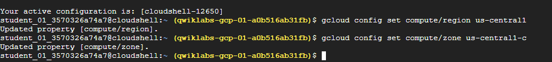
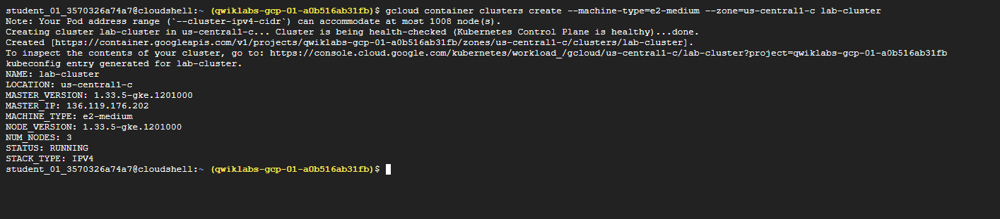
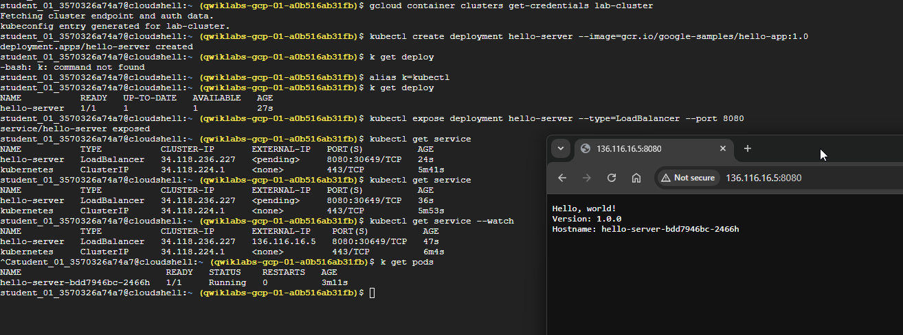

# Google Kubernetes Engine: Qwik Start

## Objectives

In this lab, you learn how to perform the following tasks:

1. Google Kubernetes Engine: Qwik Start
   1. Objectives
   2. Task 1. Set a default compute zone
   3. Task 2. Create a GKE cluster
   4. Task 3. Get authentication credentials for the cluster
   5. Task 4. Deploy an application to the cluster
   6. gcloud container clusters delete lab-cluster
      1. Screenshots

## Task 1. Set a default compute zone

Your compute zone is an approximate regional location in which your clusters and their resources live. For example, us-central1-a is a zone in the us-central1 region.

In your Cloud Shell session, run the following commands.

1. Set the default compute region:
```bash
gcloud config set compute/region us-central1   
```

2. Set the default compute zone:
```bash
Set the default compute zone:   
```

## Task 2. Create a GKE cluster

A cluster consists of at least one cluster master machine and multiple worker machines called nodes. Nodes are Compute Engine virtual machine (VM) instances that run the Kubernetes processes necessary to make them part of the cluster.


Run the following command:

1. Create a cluster:
```bash
gcloud container clusters create --machine-type=e2-medium --zone=us-central1-c lab-cluster   

```   

## Task 3. Get authentication credentials for the cluster

After creating your cluster, you need authentication credentials to interact with it.

* Authenticate with the cluster:
  
```bash
gcloud container clusters get-credentials lab-cluster  
```

## Task 4. Deploy an application to the cluster

You can now deploy a containerized application to the cluster. For this lab, you'll run hello-app in your cluster.

GKE uses Kubernetes objects to create and manage your cluster's resources. Kubernetes provides the Deployment object for deploying stateless applications like web servers. Service objects define rules and load balancing for accessing your application from the internet.

1. To create a new Deployment hello-server from the hello-app container image, run the following kubectl create command:

```bash
kubectl create deployment hello-server --image=gcr.io/google-samples/hello-app:1.0
```

This Kubernetes command creates a deployment object that represents hello-server. In this case, --image specifies a container image to deploy. The command pulls the example image from a Container Registry bucket. gcr.io/google-samples/hello-app:1.0 indicates the specific image version to pull. If a version is not specified, the latest version is used.

2. To create a Kubernetes Service, which is a Kubernetes resource that lets you expose your application to external traffic, run the following kubectl expose command:

```bash
kubectl expose deployment hello-server --type=LoadBalancer --port 8080
```

In this command:

 * --port specifies the port that the container exposes.

 * type="LoadBalancer" creates a Compute Engine load balancer for your container.

3. To inspect the hello-server Service, run kubectl get:

```bash
kubectl get service   
```

4. To view the application from your web browser, open a new tab and enter the following address, replacing [EXTERNAL IP] with the EXTERNAL-IP for hello-server.

```
http://[EXTERNAL-IP]:8080
```


## gcloud container clusters delete lab-cluster

1. To delete the cluster, run the following command:

```bash
gcloud container clusters delete lab-cluster   
```

2. When prompted, type Y and press Enter to confirm.

### Screenshots

  

  

  