## Orchestrating the Cloud with Kubernetes


## **Objectives**

In this lab, you learn how to:

* Provision a complete Kubernetes cluster using Kubernetes Engine.
* Deploy and manage Docker containers using kubectl.
* Break an application into microservices using Kubernetes' Deployments and Services.


## **Task 1. Get the sample code  **

To get the code, copy the sample code from a Google Cloud Storage bucket.

1. In Cloud Shell, copy the source code from the Cloud Shell command line:

```bash
gcloud storage cp -r gs://spls/gsp021/* .

```
2. Change into the directory needed for this lab:

```
cd orchestrate-with-kubernetes/kubernetes

```
3. List the files to see what you're working with:

```
ls

```
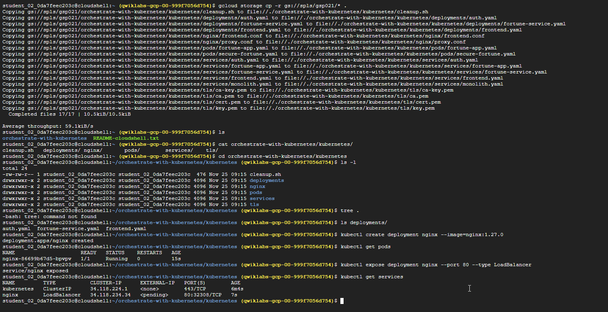 

## **Task 2. A quick Kubernetes demo**

The easiest way to get started with Kubernetes is to use the kubectl create command.

1. Use it to launch a single instance of the nginx container:

```bash
kubectl create deployment nginx --image=nginx:1.27.0

```
Kubernetes has created a Deployment—more about Deployments later, but for now all you need to know is that Deployments keep the Pods up and running even when the nodes they run on fail.

In Kubernetes, all containers run in a Pod.

2. Use the kubectl get pods command to view the running nginx container:

```bash
kubectl get pods

```
3. Once the nginx container has a Running status you can expose it outside of Kubernetes using the kubectl expose command:

```bash
kubectl expose deployment nginx --port 80 --type LoadBalancer

```
So what just happened? Behind the scenes Kubernetes created an external load balancer with a public IP address attached to it. Any client who hits that public IP address will be routed to the Pods behind the service. In this case that would be the nginx Pod.

4. List the services now using the kubectl get services command:

```bash
kubectl get services

```
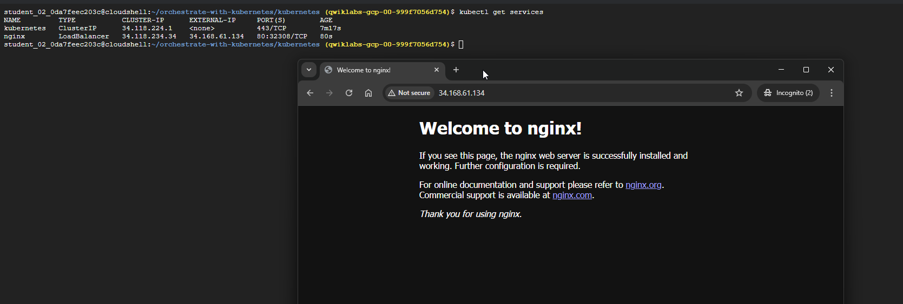 

Note: It may take a few seconds before the ExternalIP field is populated for your service. This is normal—just re-run the kubectl get services command every few seconds until the field populates.

5. Add the External IP to this command to hit the Nginx container remotely:

```bash
curl http://<External IP>:80

```
And there you go! Kubernetes supports an easy to use workflow out of the box using the kubectl run and expose commands.

## **Task 3. About Pods**

At the core of Kubernetes is the Pod.


Pods represent and hold a collection of one or more containers. Generally, if you have multiple containers with a hard dependency on each other, you package the containers inside a single Pod.

The following example shows a Pod that contains the monolith and nginx containers.

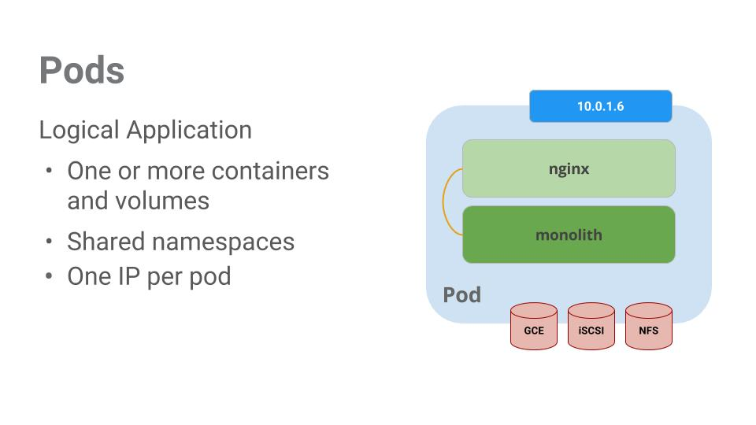

Pods also have Volumes. Volumes are data disks that live as long as the Pods live, and can be used by the containers in that Pod. Pods provide a shared namespace for their contents which means that the two containers inside of our example Pod can communicate with each other, and they also share the attached volumes.

Pods also share a network namespace. This means that there is one IP Address per Pod.

Next, a deeper dive into Pods.

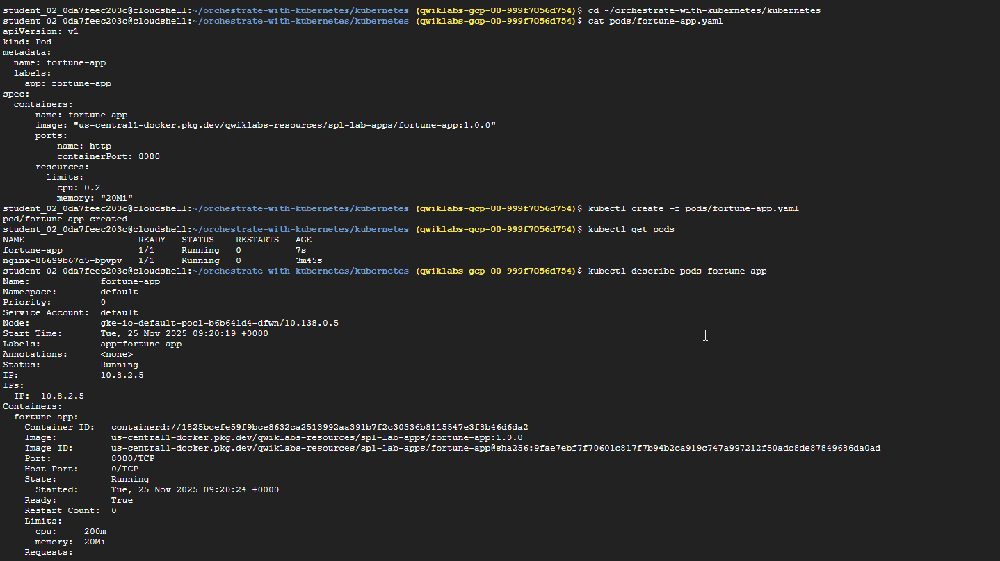 

## **Task 4. Create Pods**


Pods can be created using Pod configuration files. Take a moment to explore the fortune-app Pod configuration file.

1. Go to the directory:

```bash
cd ~/orchestrate-with-kubernetes/kubernetes

```
2. Run the following to view a configuration file:

```bash
cat pods/fortune-app.yaml

```

There's a few things to notice here:

* Your Pod is made up of one container (the fortune-app).
* You're opening port 8080 for http traffic.

3. Create the fortune-app Pod using kubectl:

```bash
kubectl create -f pods/fortune-app.yaml

```
4. Examine your Pods. Use the kubectl get pods command to list all Pods running in the default namespace:

```bash
kubectl get pods

```

5. Once the Pod is running, use the kubectl describe command to get more information about the fortune-app Pod:

```bash
kubectl describe pods fortune-app

```
You see a lot of the information about the fortune-app Pod, including the Pod IP address and the event log. This information comes in handy when troubleshooting.

Kubernetes makes it easy to create Pods by describing them in configuration files, and then view information about them when they are running. At this point you have the ability to create all the Pods your Deployment requires!

## **Task 5. Interact with Pods**

By default, Pods are allocated a private IP address and cannot be reached outside the cluster. Use the kubectl port-forward command to map a local port to a port inside the fortune-app Pod.

Note: From this point on, this lab will ask you to work in multiple cloud shell tabs to set up communication between the Pods. Any commands that are executed in a second or third command shell will be denoted in the command's instructions.


1. Open a second Cloud Shell terminal. Now you have two terminals, one to run the kubectl port-forward command, and the other to issue curl commands.

2. In the 2nd terminal, run this command to set up port-forwarding:

```bash
kubectl port-forward fortune-app 10080:8080

```

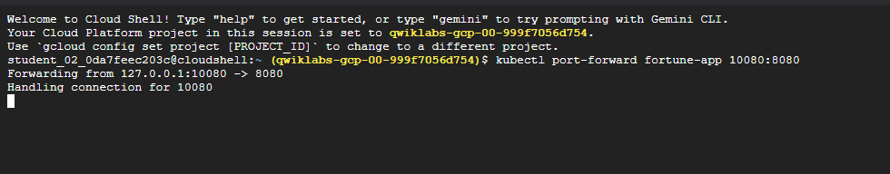 

3. Now in the 1st terminal start talking to your Pod using curl:

```bash
curl http://127.0.0.1:10080

```
You got a fortune cookie back from your container!

4. Now use the curl command to see what happens when you hit a secure endpoint. This endpoint requires authentication.

```bash
curl http://127.0.0.1:10080/secure

```
You'll receive an "Unauthorized" error, which is expected.

5. To get an auth token back from the app, try logging in:

```bash
curl -u user http://127.0.0.1:10080/login

```
6. At the login prompt, use the super-secret password password to login.
Logging in will return a JWT token.

7.Since Cloud Shell does not handle copying long strings well, create an environment variable for the token.

```bash
TOKEN=$(curl -u user http://127.0.0.1:10080/login | jq -r '.token')

```
8. Enter the super-secret password password again when prompted for the host password.

9. Use this command to copy and then use the token to hit the secure endpoint with curl:

```bash
curl -H "Authorization: Bearer $TOKEN" http://127.0.0.1:10080/secure

```
At this point you should get a fortune back from the application, letting you know everything is right in the world again.

10. Use the kubectl logs command to view the logs for the fortune-app Pod.

```bash
kubectl logs fortune-app

```
11. Open a 3rd terminal and use the -f flag to get a stream of the logs happening in real-time:

```bash
kubectl logs -f fortune-app

```
12. Now if you use curl in the 1st terminal to interact with the fortune-app, you can see the logs updating (in the 3rd terminal):

```bash
curl http://127.0.0.1:10080

```

13. Use the kubectl exec command to run an interactive shell inside the fortune-app Pod. This comes in handy when you want to troubleshoot from within a container:

```bash
kubectl exec fortune-app --stdin --tty -c fortune-app -- /bin/sh

```
14. For example, once you have a shell into the fortune-app container you can test external connectivity using the ping command:

```bash
ping -c 3 google.com

```
15. Be sure to log out when you're done with this interactive shell.

```
exit
```

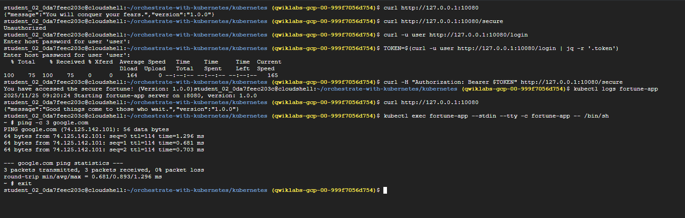 

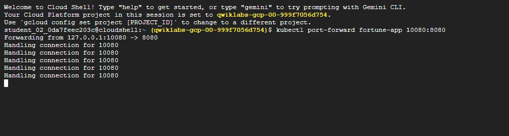 

As you can see, interacting with Pods is as easy as using the kubectl command. If you need to hit a container remotely, or get a login shell, Kubernetes provides everything you need to get up and going.

## **Task 6. About Services**


Pods aren't meant to be persistent. They can be stopped or started for many reasons, like failed liveness or readiness checks, which leads to a problem:

What happens if you want to communicate with a set of Pods? When they get restarted they might have a different IP address.

That's where Services come in. Services provide stable endpoints for Pods.

Services use labels to determine what Pods they operate on. If Pods have the correct labels, they are automatically picked up and exposed by our services.

The level of access a service provides to a set of Pods depends on the Service's type. Currently there are three types:

* ClusterIP (internal) is the default type. This Service is only visible inside the cluster.
* NodePort gives each node in the cluster an externally accessible IP.
* LoadBalancer adds a load balancer from the cloud provider which forwards traffic from the Service to Nodes within it.

Now you'll learn how to:

* Create a Service
* Use label selectors to expose a limited set of Pods externally

## **Task 7. Create a Service**

Before you can create Services, first create a secure Pod that can handle https traffic.

1. If you've changed directories, make sure you return to the ~/orchestrate-with-kubernetes/kubernetes directory:

```bash
cd ~/orchestrate-with-kubernetes/kubernetes

```
2. Explore the secure fortune-app service configuration file:

```bash
cat pods/secure-fortune.yaml

```
3. Create the secure-fortune Pods and their configuration data:

```bash
kubectl create secret generic tls-certs --from-file tls/  
kubectl create configmap nginx-proxy-conf --from-file nginx/proxy.conf  
kubectl create -f pods/secure-fortune.yaml

```
Now that you have a secure Pod, it's time to expose it externally. To do that, create a Kubernetes Service.

4. Explore the fortune-app service configuration file:

Note:
There's a selector which is used to automatically find and expose any Pods with the labels app: fortune-app and secure: enabled.

You have to expose the nodeport here because this is how you forward external traffic from port 31000 to nginx (on port 443).


5. Use the kubectl create command to create the fortune-app service from the configuration file:

```bash
 kubectl create -f services/fortune-app.yaml

```

 You're using a port to expose the service. This means that it's possible to have port collisions if another app tries to bind to port 31000 on one of your servers.

Normally, Kubernetes handles this port assignment. In this lab, you choose a port so that health checks are easier to configure later on.

6. Use the gcloud compute firewall-rules command to allow traffic to the fortune-app service on the exposed nodeport:

```bash
gcloud compute firewall-rules create allow-fortune-nodeport --allow tcp:31000

```
Now that everything is set up, you should be able to hit the secure-fortune service from outside the cluster without using port forwarding.

7. First, get an external IP address for one of the nodes.

```bash
gcloud compute instances list

```

8. Try hitting the secure-fortune service using curl:

```bash
curl -k https://<EXTERNAL_IP>:31000

```
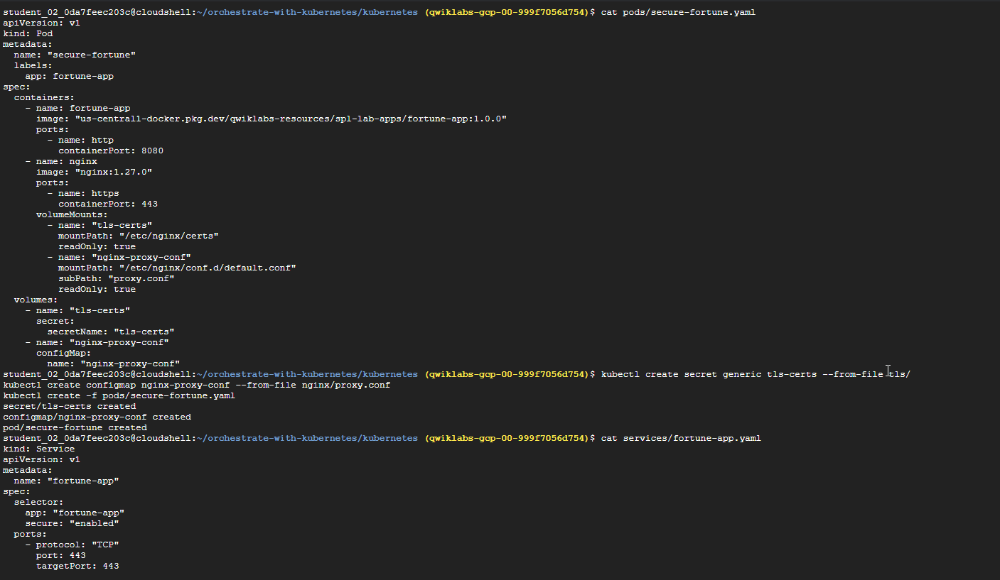 

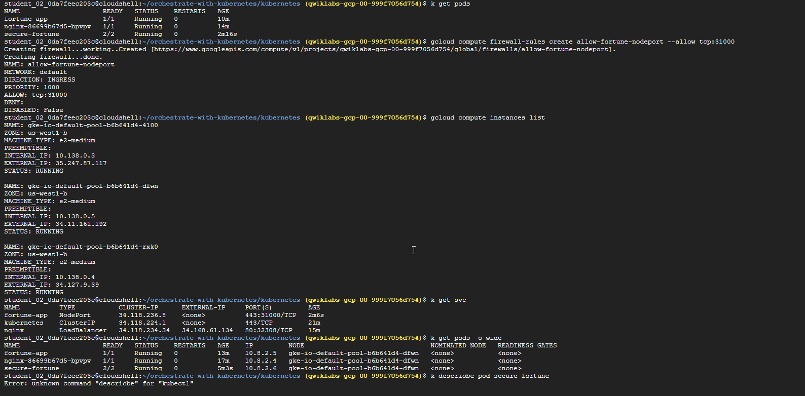 

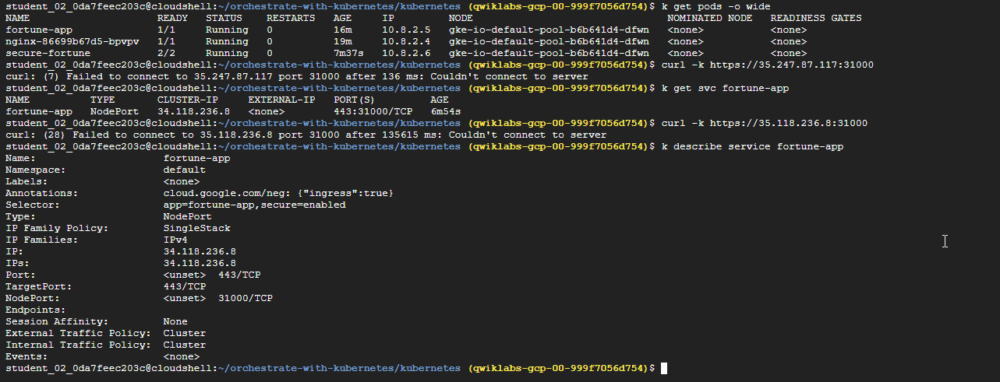 

Uh oh! That timed out. What's going wrong?

Note: It's time for a quick knowledge check.

Use the following commands to answer the questions below:
kubectl get services fortune-app

kubectl describe services fortune-app

Questions:

Why are you unable to get a response from the fortune-app service?
How many endpoints does the fortune-app service have?
What labels must a Pod have to be picked up by the fortune-app service?

## **Task 8. Add labels to Pods**

Currently the fortune-app service does not have endpoints. One way to troubleshoot an issue like this is to use the kubectl get pods command with a label query.

1. You can see that you have a Pod running with the fortune-app label:

```bash
kubectl get pods -l "app=fortune-app"

```
2. But what about "app=fortune-app" and "secure=enabled"?

```bash
kubectl get pods -l "app=fortune-app,secure=enabled"

```
Notice this label query does not print any results. It seems you need to add the "secure=enabled" label to them.

3. Use the kubectl label command to add the missing secure=enabled label to the secure-fortune Pod. Afterwards, you can check and see that your labels have been updated

```bash
kubectl label pods secure-fortune 'secure=enabled'
kubectl get pods secure-fortune --show-labels

```
4. Now that your Pods are correctly labeled, view the list of endpoints on the fortune-app service:

```bash
kubectl describe services fortune-app | grep Endpoints

```
And you have one!

5. Get an external IP address for one of the nodes.

```bash
gcloud compute instances list

```
6. Try hitting the secure-fortune service using curl:

```bash
curl -k https://<EXTERNAL_IP>:31000

```

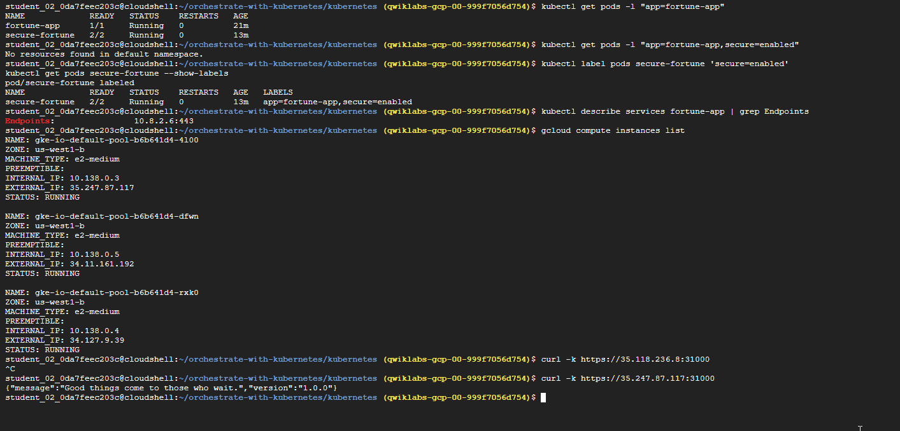 


## **Task 9. About Deployments**

The goal of this lab is to get you ready for scaling and managing containers in production. That's where Deployments come in. Deployments are a declarative way to ensure that the number of Pods running is equal to the desired number of Pods, specified by the user.

The main benefit of Deployments is in abstracting away the low level details of managing Pods. Behind the scenes Deployments use Replica Sets to manage starting and stopping the Pods. If Pods need to be updated or scaled, the Deployment will handle that. Deployment also handles restarting Pods if they happen to go down for some reason.

Look at a quick example:

Pods are tied to the lifetime of the Node they are created on. In the example above, Node3 went down (taking a Pod with it). Instead of manually creating a new Pod and finding a Node for it, your Deployment created a new Pod and started it on Node2.

That's pretty cool!

It's time to combine everything you learned about Pods and Services to break up the fortune-app application into smaller Services using Deployments.


## **Task 10. Create Deployments**

You're going to break the fortune-app app into three separate pieces:

* auth - Generates JWT tokens for authenticated users.
* fortune - Serves fortunes to authenticated users.
* frontend - Routes traffic to the auth and fortune services.
  
You are ready to create Deployments, one for each service. Afterwards, you'll define internal services for the auth and fortune Deployments and an external service for the frontend Deployment. Once finished, you'll be able to interact with the microservices just like with the monolith, only now each piece is able to be scaled and deployed, independently!

1. Get started by examining the auth Deployment configuration file:

```bash
cat deployments/auth.yaml

```
The Deployment creates 1 replica of the auth container.

When you run the kubectl create command to create the auth Deployment it will make one Pod that conforms to the data in the Deployment manifest. This means you can scale the number of Pods by changing the number specified in the Replicas field.

2. Go ahead and create your Deployment object:

```bash
kubectl create -f deployments/auth.yaml

```
3. It's time to create a service for your auth Deployment. Use the kubectl create command to create the auth service:

```bash
kubectl create -f services/auth.yaml

```
4. Do the same thing to create and expose the fortune Deployment:

```bash
kubectl create -f deployments/fortune-service.yaml
kubectl create -f services/fortune-service.yaml

```
5. And one more time to create and expose the frontend Deployment.

```bash
kubectl create configmap nginx-frontend-conf --from-file=nginx/frontend.conf  
kubectl create -f deployments/frontend.yaml  
kubectl create -f services/frontend.yaml

```
6.Interact with the frontend by grabbing its External IP and then curling to it:

```bash
kubectl get services frontend

curl -k https://<EXTERNAL-IP>

```
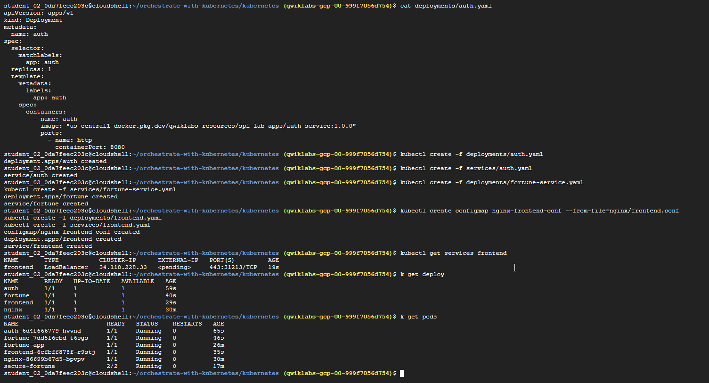 