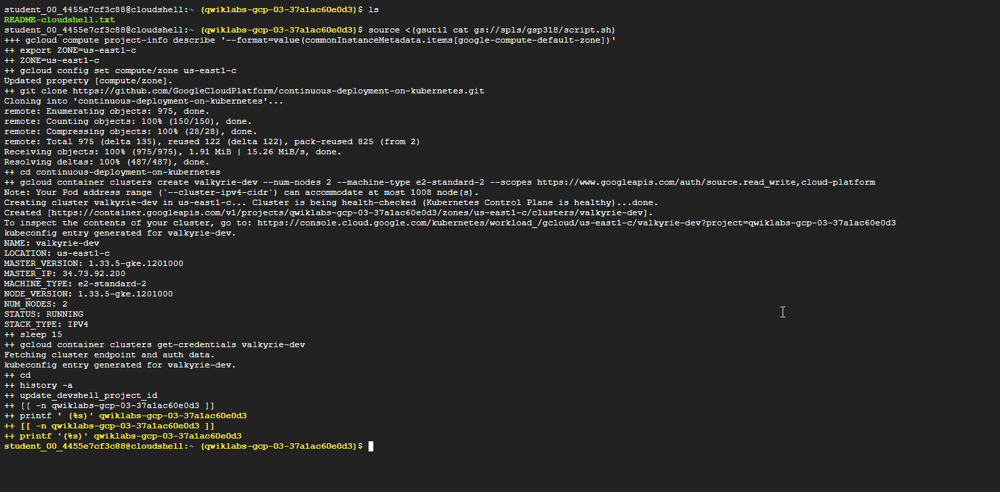
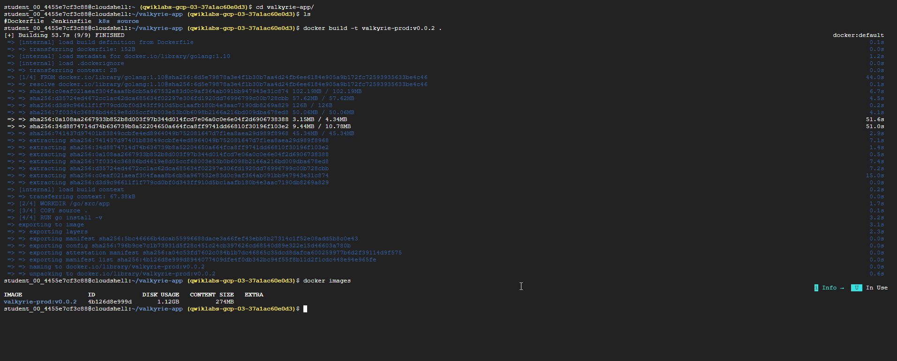
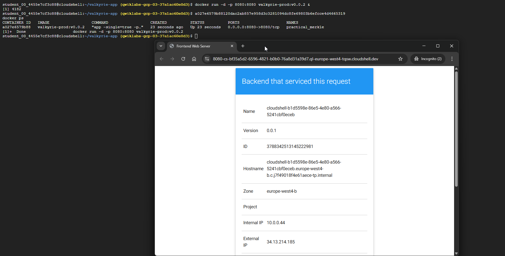
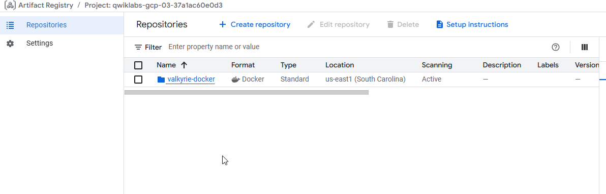
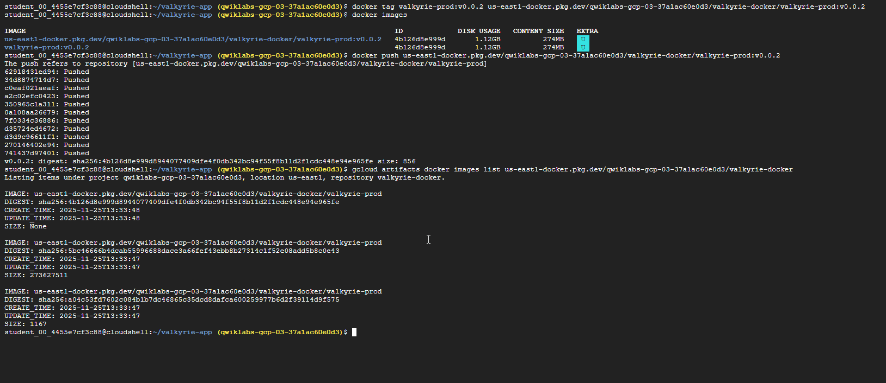
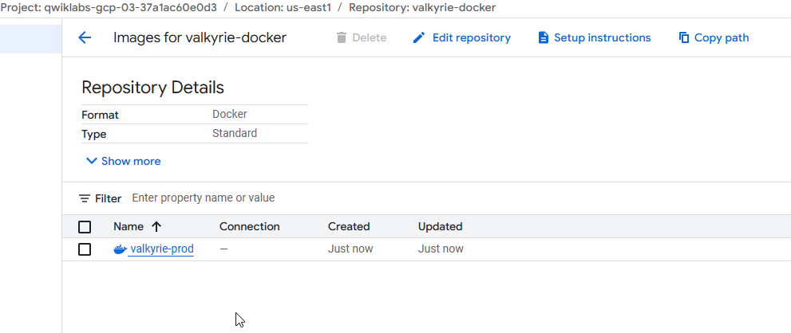
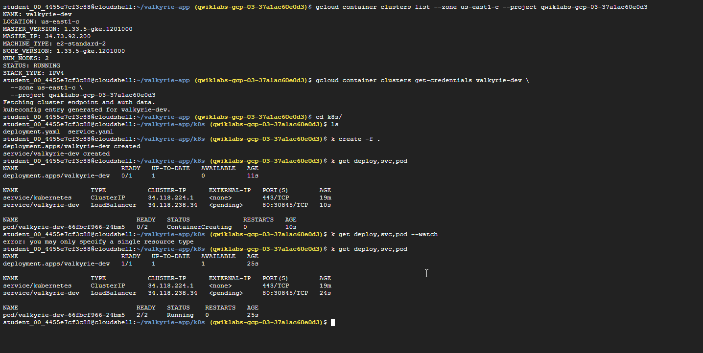
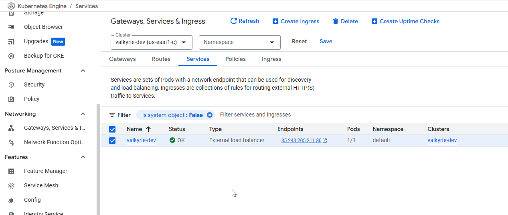
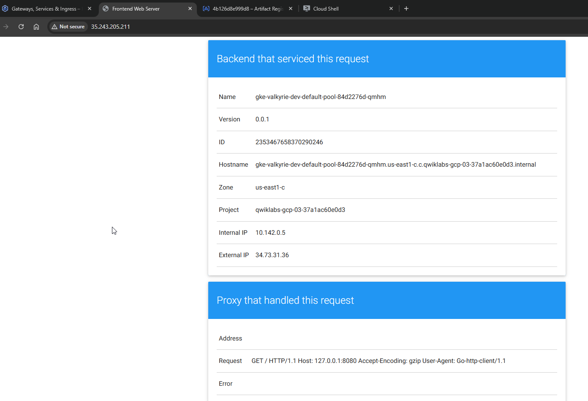

# Deploy Kubernetes Applications on Google Cloud: Challenge Lab

## Challenge scenario
You have just completed training on containers and their creation and management and now you need to demonstrate to the Jooli Inc. development team your new skills. You have to help with some of their initial work on a new project around an application environment utilizing Kubernetes. Some of the work was already done for you, but other parts require your expert skills.

You are expected to create container images, store the images in a repository, and expose a deployment in Kubernetes. Your know that Kurt, your supervisor, will ask you to complete these tasks:

1. Deploy Kubernetes Applications on Google Cloud: Challenge Lab
   1. Challenge scenario
   2. **Task 1. Create a Docker image and store the Dockerfile**
   3. Task 2. Test the created Docker image
   4. Task 3. Push the Docker image to the Artifact Registry
   5. Task 4. Create and expose a deployment in Kubernetes

## **Task 1. Create a Docker image and store the Dockerfile**

1. Open Cloud Shell and run the following command. This will install the script you will use to help check your progress.

```bash
source <(gsutil cat gs://spls/gsp318/script.sh)
```

2. Use Cloud Shell to copy the valkyrie-app source code into the ~/valkyrie-app directory. You can use the following command:

```bash
gsutil cp gs://spls/gsp318/valkyrie-app.tgz .
tar -xzf valkyrie-app.tgz
cd valkyrie-app
```

The app source code is in valkyrie-app/source.

3. Create valkyrie-app/Dockerfile and add the configuration below:

```dockerfile
FROM golang:1.10
WORKDIR /go/src/app
COPY source .
RUN go install -v
ENTRYPOINT ["app","-single=true","-port=8080"]

```

4. Use valkyrie-app/Dockerfile to create a Docker image called valkyrie-prod with the tag v0.0.2.
5. Verify that the Docker image was created by running the following command:
```bash
   docker images
```

 

 

## Task 2. Test the created Docker image

1. Launch a container using the image valkyrie-prod:v0.0.2.
   
* You need to map the host’s port 8080 to port 8080 on the container.
* Add & to the end of the command to cause the container to run in the background.

When your container is running you will see the page by Web Preview.

 

## Task 3. Push the Docker image to the Artifact Registry

1. Create a repository named valkyrie-docker in Artifact Registry. Use Docker as the format and use the us-east1 region as the location.

2. Before you can push or pull images, configure Docker to use the Google Cloud CLI to authenticate requests to Artifact Registry. You will need to set up authentication to Docker repositories. You can use the following command.
   
```bash
gcloud auth configure-docker us-east1-docker.pkg.dev   

```

3. Re-tag the container to be able push it to the repository. The format should resemble the following: LOCATION-docker.pkg.dev/PROJECT-ID/REPOSITORY/IMAGE.
4. Push the Docker image to the Artifact Registry.

 

 

 

## Task 4. Create and expose a deployment in Kubernetes


Kurt created the deployment.yaml and service.yaml to deploy your new container image to a Kubernetes cluster (called valkyrie-dev). The two files are in valkyrie-app/k8s.

1. Get the Kubernetes credentials using us-east1-c zone before you deploy the image onto the Kubernetes cluster.

2. Before you create the deployments, Make sure you check and replace some placeholder values in the deployment.yaml file and the format should be LOCATION-docker.pkg.dev/PROJECT-ID/REPOSITORY/IMAGE.

3. Create the deployments from the deployment.yaml and service.yaml files.

4. From the Navigation Menu, select Kubernetes Engine > Gateways, Services & Ingress. Click on the load balancer IP Address of the valkyrie-dev service to verify your services are up and running.

 

 

 