# Continuous Delivery with Jenkins in Kubernetes Engine

Overview

In this lab, you learn how to set up a continuous delivery pipeline with Jenkins on Kubernetes engine. Jenkins is the go-to automation server used by developers who frequently integrate their code in a shared repository. The solution you build in this lab is similar to the following diagram:

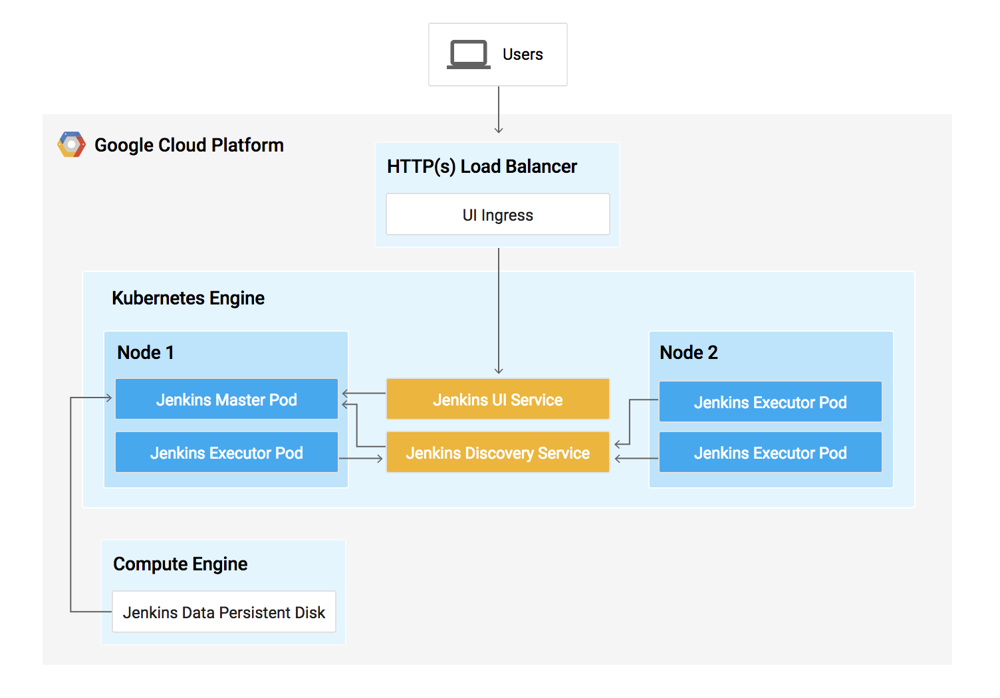

In the Cloud Architecture Center, see [Jenkins on Kubernetes Engine](https://cloud.google.com/solutions/jenkins-on-container-engine) to learn more about running Jenkins on Kubernetes.

What you'll learn

In this lab, you complete the following tasks to learn about running Jenkins on Kubernetes:

1. Continuous Delivery with Jenkins in Kubernetes Engine
   1. Task 1. Download the source code
   2. Task 2. Provision Jenkins
   3. Task 3. Set up Helm
   4. Task 4. Install and configure Jenkins
   5. Task 5. Connect to Jenkins
   6. Task 6. Understand the application
   7. Task 7. Deploy the application
   8. Task 8. Create the Jenkins pipeline
      1. Configure Jenkins Cloud for Kubernetes
      2. Authenticate Jenkins with a GitHub private repo using an SSH key
      3. Create the Jenkins job
   9. Task 9. Create the development environment
   10. Task 10. Start deployment
   11. Task 11. Deploy a canary release
   12. Task 12. Deploy to production

**What is Kubernetes Engine?**

Kubernetes Engine is Google Cloud's hosted version of Kubernetes - a powerful cluster manager and orchestration system for containers. Kubernetes is an open source project that can run on many different environments—from laptops to high-availability multi-node clusters; from virtual machines to bare metal. As mentioned before, Kubernetes apps are built on containers - these are lightweight applications bundled with all the necessary dependencies and libraries to run them. This underlying structure makes Kubernetes applications highly available, secure, and quick to deploy—an ideal framework for cloud developers.


**What is Jenkins?**

Jenkins is an open-source automation server that lets you flexibly orchestrate your build, test, and deployment pipelines. Jenkins allows developers to iterate quickly on projects without worrying about overhead issues that can stem from continuous delivery.

**What is Continuous Delivery / Continuous Deployment?**

When you need to set up a continuous delivery (CD) pipeline, deploying Jenkins on Kubernetes Engine provides important benefits over a standard VM-based deployment.

When your build process uses containers, one virtual host can run jobs on multiple operating systems. Kubernetes Engine provides ephemeral build executors—these are only utilized when builds are actively running, which leaves resources for other cluster tasks such as batch processing jobs. Another benefit of ephemeral build executors is speed—they launch in a matter of seconds.

Kubernetes Engine also comes pre-equipped with Google's global load balancer, which you can use to automate web traffic routing to your instance(s). The load balancer handles SSL termination and utilizes a global IP address that's configured with Google's backbone network—coupled with your web front, this load balancer always sets your users on the fastest possible path to an application instance.

Now that you've learned a little bit about Kubernetes, Jenkins, and how the two interact in a CD pipeline, it's time to go build one.

## Task 1. Download the source code

In this task, you download the source code for this lab.

1. To get set up, open a new session in Cloud Shell and run the following command to set your zone us-west1-b:

gcloud config set compute/zone us-west1-b

2. Then copy the lab's sample code:

gsutil cp gs://spls/gsp051/continuous-deployment-on-kubernetes.zip .

unzip continuous-deployment-on-kubernetes.zip

3. Now change to the correct directory:
   
```bash
cd continuous-deployment-on-kubernetes

```
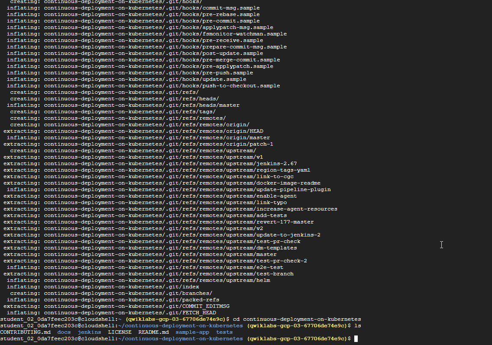

## Task 2. Provision Jenkins

Create a Kubernetes cluster and enable Jenkins to access GitHub repository and Google Container Registry.

Create a Kubernetes cluster
1. Now, run the following command to provision a Kubernetes cluster:
   
```bash
gcloud container clusters create jenkins-cd \
--num-nodes 2 \
--machine-type e2-standard-2 \
--scopes "https://www.googleapis.com/auth/source.read_write,cloud-platform"

```
This step can take up to several minutes to complete. The extra scopes enable Jenkins to access GitHub Repository and Google Container Registry.

Before continuing, confirm that your cluster is running by executing the following command:
```bash
gcloud container clusters list
```

Credential your cluster
1. Get the credentials for your cluster:
   
```bash
gcloud container clusters get-credentials jenkins-cd

```
1. Kubernetes Engine uses these credentials to access your newly provisioned cluster—confirm that you can connect to it by running the following command:
   
```bash
kubectl cluster-info
```
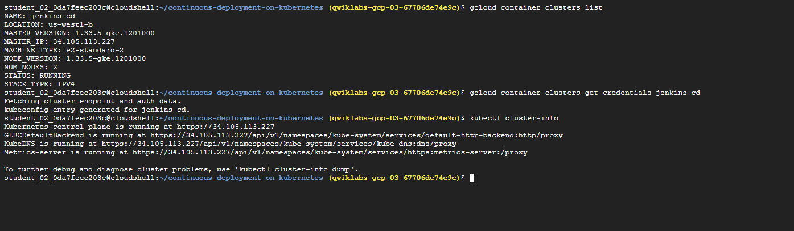

## Task 3. Set up Helm

Helm is a package manager that makes it easy to configure and deploy Kubernetes applications. Once you install Jenkins, you can set up your CI/CD pipeline.

In this task, you use Helm to install Jenkins from the Charts repository.

1. Add Helm's stable chart repo:
```bash
helm repo add jenkins https://charts.jenkins.io

```
2. Ensure the repo is up to date:
```bash
helm repo update
```
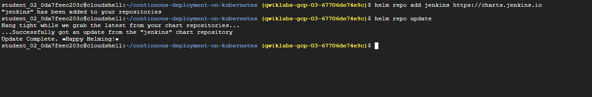

## Task 4. Install and configure Jenkins
When installing Jenkins, a values file can be used as a template to provide values that are necessary for setup.

You use a custom values file to automatically configure your Kubernetes Cloud and add the following necessary plugins:

* Kubernetes:latest
* Workflow-multibranch:latest
* Git:latest
* Configuration-as-code:latest
* Google-oauth-plugin:latest
* Google-source-plugin:latest
* Google-storage-plugin:latest
This allows Jenkins to connect to your cluster and your Google Cloud project.

1. Use the Helm CLI to deploy the chart with your configuration settings:
```bash
helm install cd jenkins/jenkins -f jenkins/values.yaml --wait

```

2. Once that command completes ensure the Jenkins pod goes to the Running state and the container is in the READY state:
```bash
kubectl get pods
```

3. Configure the Jenkins service account to be able to deploy to the cluster:
```bash
kubectl create clusterrolebinding jenkins-deploy --clusterrole=cluster-admin --serviceaccount=default:cd-jenkins
```

You should receive the following output:

```
clusterrolebinding.rbac.authorization.k8s.io/jenkins-deploy created
```

4. Run the following command to set up port forwarding to the Jenkins UI from Cloud Shell:
```bash
export POD_NAME=$(kubectl get pods --namespace default -l "app.kubernetes.io/component=jenkins-master" -l "app.kubernetes.io/instance=cd" -o jsonpath="{.items[0].metadata.name}")
kubectl port-forward $POD_NAME 8080:8080 >> /dev/null &
```

5. Now, check that the Jenkins Service was created properly:
```bash
kubectl get svc
```

Example Output:

```
  NAME               CLUSTER-IP     EXTERNAL-IP   PORT(S)     AGE
  cd-jenkins         10.35.249.67   <none>        8080/TCP    3h
  cd-jenkins-agent   10.35.248.1    <none>        50000/TCP   3h
  kubernetes         10.35.240.1    <none>        443/TCP     9h
  </none></none></none>
```

You are using the Kubernetes Plugin so that the builder nodes are automatically launched as necessary when the Jenkins master requests them. Upon completion of their work, builder nodes automatically turn down and their resources are added back to the cluster's resource pool.

Notice that this service exposes ports 8080 and 50000 for any pods that match the selector. This exposes the Jenkins web UI and builder/agent registration ports within the Kubernetes cluster. Additionally, the jenkins-ui service is exposed using a ClusterIP so that it is not accessible from outside the cluster.

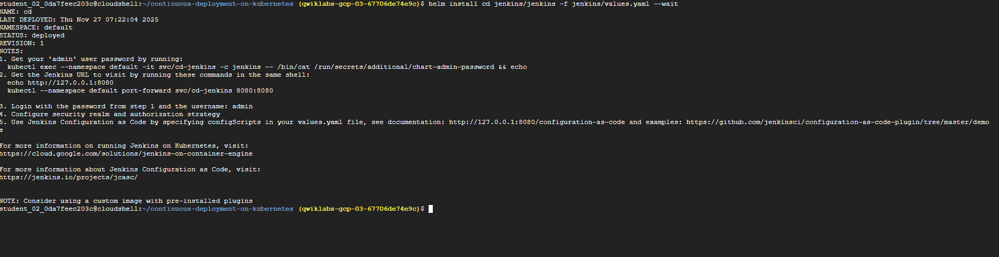

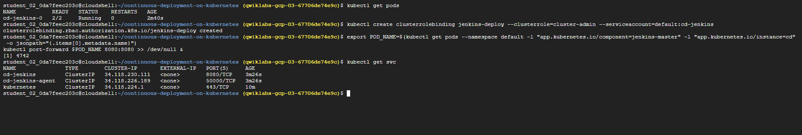

## Task 5. Connect to Jenkins

Retrieve the admin password and log into the Jenkins interface.

1. The Jenkins chart automatically creates an admin password for you. To retrieve it, run:
```bash
printf $(kubectl get secret cd-jenkins -o jsonpath="{.data.jenkins-admin-password}" | base64 --decode);echo

```
2. To get to the Jenkins user interface, in the Cloud Shell action bar, click Web Preview (Web Preview icon) Preview on port 8080:

3. If asked, log in with username admin and your auto-generated password.

You now have Jenkins set up in your Kubernetes cluster! Jenkins drives your automated CI/CD pipelines in the next sections.

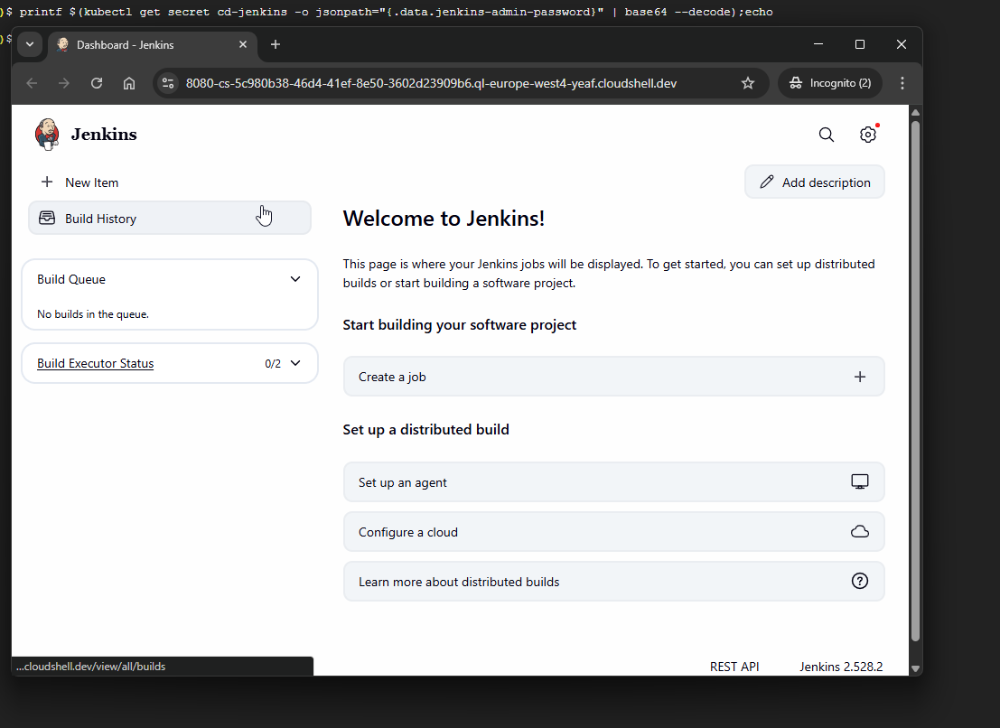

## Task 6. Understand the application

In this task, you deploy the sample application, gceme, in your continuous deployment pipeline. The application is written in the Go language and is located in the repo's sample-app directory. When you run the gceme binary on a Compute Engine instance, the app displays the instance's metadata in an info card.

The application mimics a microservice by supporting two operation modes.

* In backend mode: gceme listens on port 8080 and returns Compute Engine instance metadata in JSON format.
* In frontend mode: gceme queries the backend gceme service and renders the resulting JSON in the user interface.

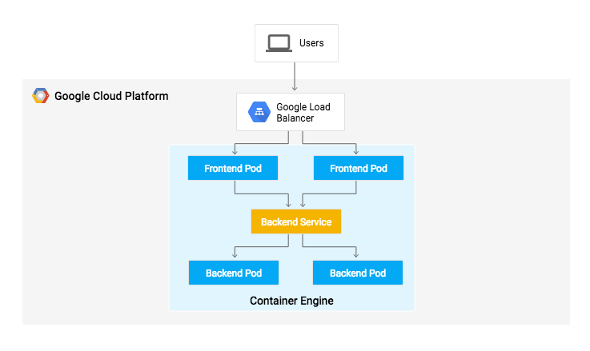

## Task 7. Deploy the application

Deploy the application into two different environments:

* Production: The live site that your users access.
* Canary: A smaller-capacity site that receives only a percentage of your user traffic. Use this environment to validate your software with live traffic before it's released to all your users.
  
1. In Google Cloud Shell, navigate to the sample application directory:
```
cd sample-app

```
2. Create the Kubernetes namespace to logically isolate the deployment:

```
kubectl create ns production

```
3. Create the production and canary deployments, and the services using the kubectl apply commands:

```bash
kubectl apply -f k8s/production -n production

kubectl apply -f k8s/canary -n production

kubectl apply -f k8s/services -n production
```

By default, only one replica of the frontend is deployed. Use the kubectl scale command to ensure that there are at least 4 replicas running at all times.

4. Scale up the production environment front ends by running the following command:
```
kubectl scale deployment gceme-frontend-production -n production --replicas 4

```
5. Now confirm that you have 5 pods running for the frontend, 4 for production traffic and 1 for canary releases (changes to the canary release affects only 1 out of 5 (20%) of users):
```
kubectl get pods -n production -l app=gceme -l role=frontend

```
6. Also confirm that you have 2 pods for the backend, 1 for production and 1 for canary:
```
kubectl get pods -n production -l app=gceme -l role=backend

```
7. Retrieve the external IP for the production services:
```
kubectl get service gceme-frontend -n production
```

Example Output:

```
NAME            TYPE          CLUSTER-IP     EXTERNAL-IP     PORT(S)  AGE
gceme-frontend  LoadBalancer  10.79.241.131  104.196.110.46  80/TCP   5h
```

8. Now, store the frontend service load balancer IP in an environment variable for use later:
export FRONTEND_SERVICE_IP=$(kubectl get -o jsonpath="{.status.loadBalancer.ingress[0].ip}" --namespace=production services gceme-frontend)

9. Confirm that both services are working by opening the frontend external IP address in your browser.

10. Check the version output of the service by running the following command (it should read 1.0.0):

```bash
curl http://$FRONTEND_SERVICE_IP/version

```
You have successfully deployed the sample application!

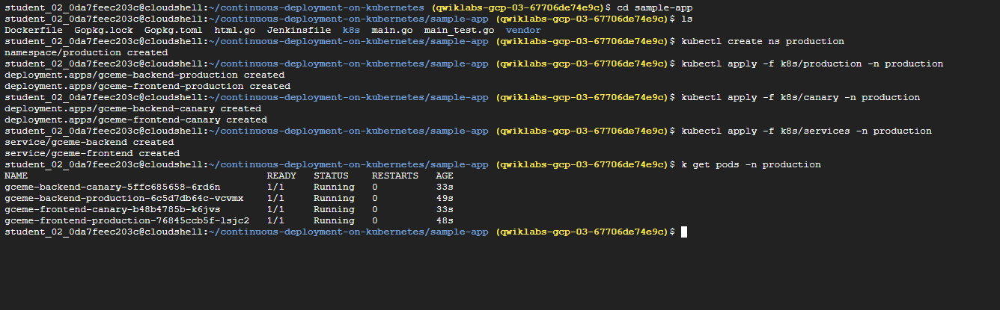

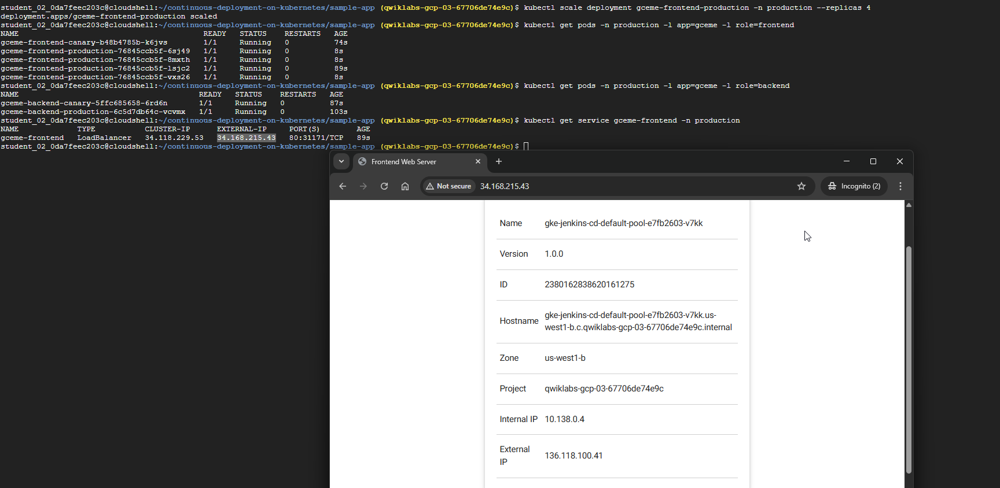

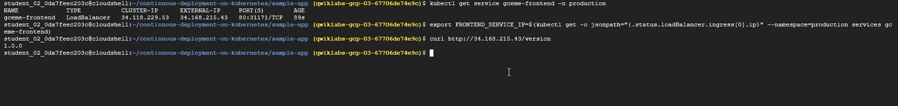

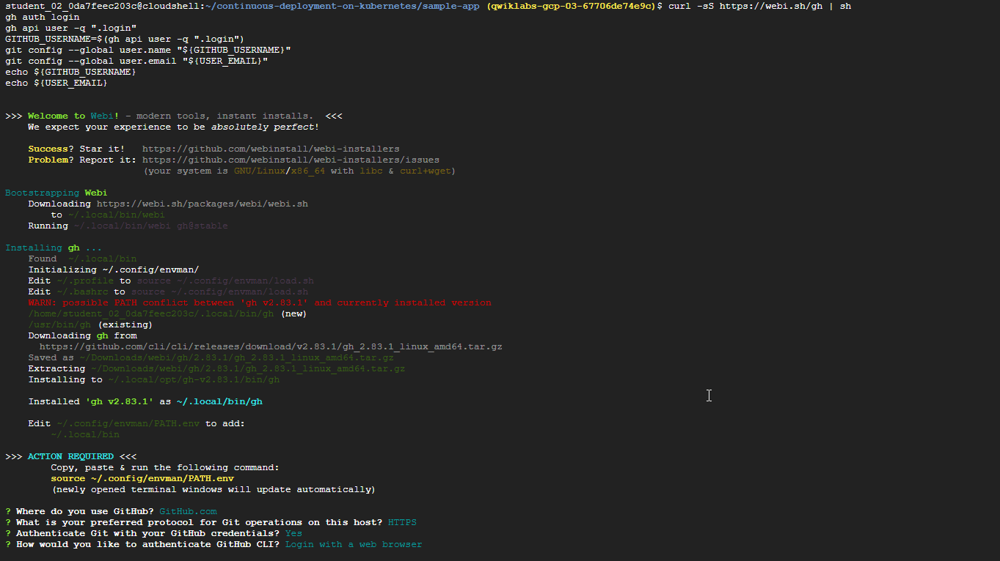

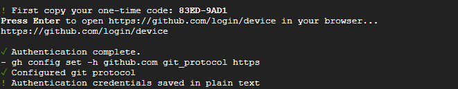

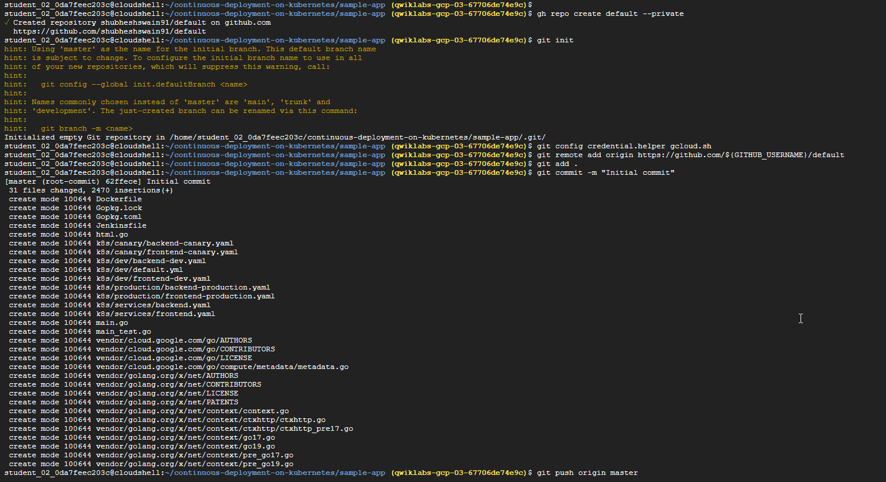

## Task 8. Create the Jenkins pipeline

In this task, you create the Jenkins pipeline as follows:

* Create a repository to host the source code
* Add credentials to give Jenkins access to the code repository
* Configure Jenkins Cloud for Kubernetes
* Authenticate Jenkins with the GitHub private repo
* Create the Jenkins job
  
**Create a repository to host the sample app source code**

1. Create a copy of the gceme sample app and push it to a GitHub Repository:
   
In Cloud Shell, run the following commands to configure Git and GitHub:

```bash
curl -sS https://webi.sh/gh | sh
gh auth login
gh api user -q ".login"
GITHUB_USERNAME=$(gh api user -q ".login")
git config --global user.name "${GITHUB_USERNAME}"
git config --global user.email "${USER_EMAIL}"
echo ${GITHUB_USERNAME}
echo ${USER_EMAIL}

```
* Press ENTER to accept the default options.
* Read the instructions in the command output to log in to GitHub with a web browser.
When you have successfully logged in, your GitHub username appears in the output in Cloud Shell.

```bash
gh repo create default --private 

```
You can ignore the warning as you are not billed for this repository.

```bash
git init

```
Initialize the sample-app directory as its own Git repository:
```bash
git config credential.helper gcloud.sh

```
Run the following command:
```bash
git remote add origin https://github.com/${GITHUB_USERNAME}/default

```
Add, commit, and push the files:
```bash
git add .

git commit -m "Initial commit"

git push origin master

```
**Add your service account credentials**

Configure your credentials to allow Jenkins to access the code repository. Jenkins uses your cluster's service account credentials to download code from the GitHub repository.

1. In the Jenkins user interface, click Manage Jenkins in the left navigation then click Security > Credentials.

2. Click System.
   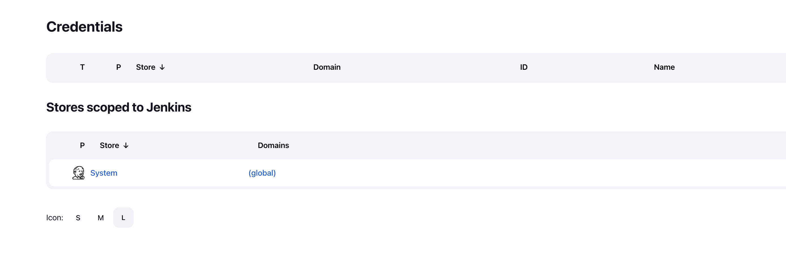

3. Click Global credentials (unrestricted).

4. Click Add Credentials in the top right corner.

5. Select Google Service Account from metadata from the Kind drop-down.

6. Under the ID field enter the Project ID and click Create.   
   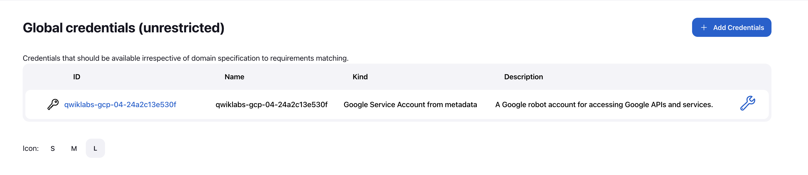

### Configure Jenkins Cloud for Kubernetes

1. In the Jenkins user interface, select Manage Jenkins > Nodes.
2. Click Clouds in the left navigation pane.
3. Click New cloud.
4. Type any name under Cloud name and then select Kubernetes for Type.
5. Click Create.
6. In the Jenkins URL field, enter the following value: http://cd-jenkins:8080
7. In the Jenkins tunnel field, enter the following value: cd-jenkins-agent:50000
8. Click Save.   

### Authenticate Jenkins with a GitHub private repo using an SSH key

To authenticate Jenkins with a GitHub private repository using an SSH key follow below steps:

a. **Generate the SSH Key**

1. Create a new GitHub SSH key, where github-email is your GitHub email address:
```bash
ssh-keygen -t rsa -b 4096 -N '' -f id_github -C [your-github-email]

```
2. To download the private key(id_github) and public key(id_github.pub) from your local machine, in the Cloud Shell action bar, click More (More icon) and select the folder continuous-deployment-on-kubernetes/sample-app.
   
b. Add the public key to GitHub

After generating the SSH key, you need to add the public key to GitHub so Jenkins can access your repositories.

1. Go to your GitHub account. Click your github profile and navigate to Settings.

2. From the side menu, select SSH and GPG keys.

3. Click New SSH key.

4. Enter the title SSH_KEY_LAB.

5. Paste the contents of your public key (id_github.pub) downloaded from path (~/continuous-deployment-on-kubernetes/sample-app/id_github.pub) into the Key field. You can also add a descriptive name in the Title field.

6. Click Add SSH key.

c. **Configure the Jenkins to use the SSH key**

1. Go to Jenkins and select Manage Jenkins from the main dashboard.

2. Select the Credentials option.

3. Under Stores scoped to Jenkins. click System.

4. Click Global credentials (unrestricted).

5. Click Add Credentials.

6. In the Kind dropdown, select SSH Username with private key.

7. For ID enter <filled in at lab start>_ssh_key.

8. For Username, type [your GitHub username]

9. Choose Enter directly for the private key and click Add. Paste the content of the id_github file (downloaded from ~/continuous-deployment-on-kubernetes/sample-app/id_github).

10. Click Create.

d. **Add the public SSH key to known hosts**

In Cloud Shell create a file named known_hosts.github and add the public SSH key to this file.

```bash
ssh-keyscan -t rsa github.com > known_hosts.github
chmod +x known_hosts.github
cat known_hosts.github
```

e. **Configure known host key**

1. Click Dashboard > Manage Jenkins in the left panel.

2. Under Security. Click Security.

3. Under Git Host Key Verification Configuration for Host Key Verification Strategy select Manually provided keys from drop down.

4. Paste the known hosts.github file content in Approved Host Keys.

5. Click Save.

### Create the Jenkins job

Navigate to your Jenkins user interface and follow these steps to configure a Pipeline job.

1. Click Dashboard > New Item in the left panel.

2. Name the project sample-app, then choose the Multibranch Pipeline option and click OK.

3. On the next page, in the Branch Sources section, select Git from Add Source dropdown.

4. Paste the HTTPS clone URL of your sample-app repo under the Project Repository field. Replace ${GITHUB_USERNAME} with your Github username:

```
git@github.com:${GITHUB_USERNAME}/default.git

```
5. From the Credentials menu options, select the github credentials name.

6. Under the Scan Multibranch Pipeline Triggers section, check the Periodically if not otherwise run box and set the Interval value to 1 minute.

7. Leave all other options at their defaults and click Save.

After you complete these steps, a job named Branch indexing runs. This meta-job identifies the branches in your repository and ensures changes haven't occurred in existing branches. If you click sample-app in the top left, the master job should be seen.


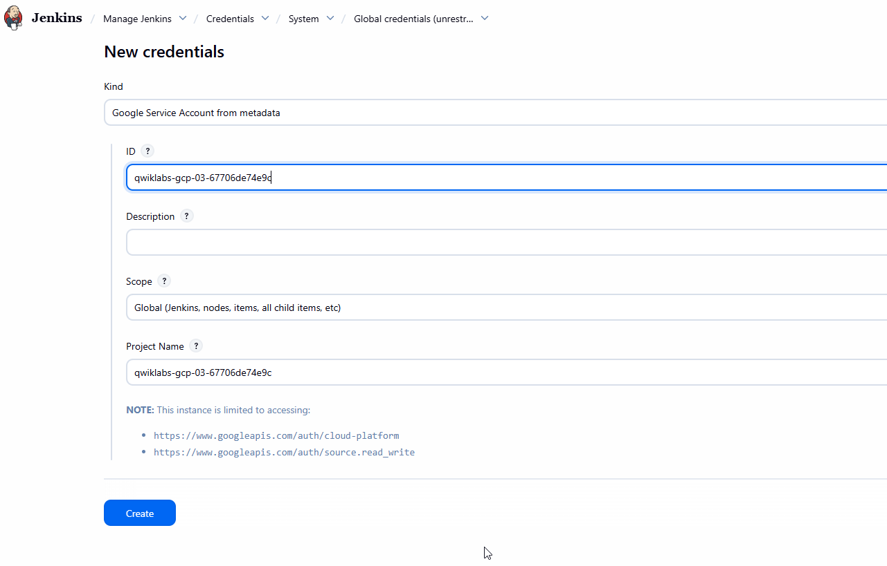

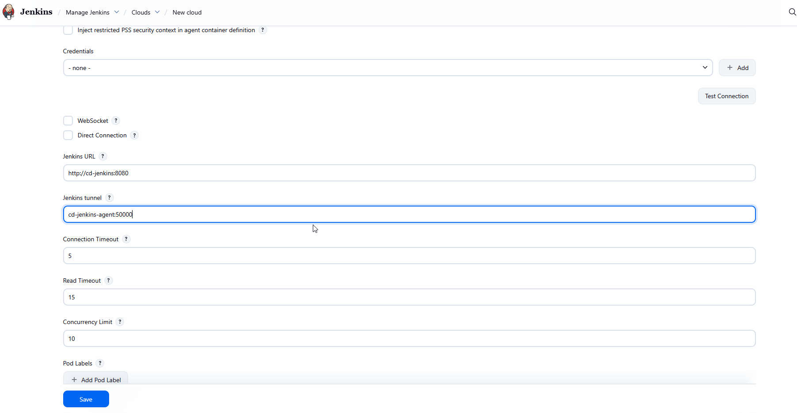

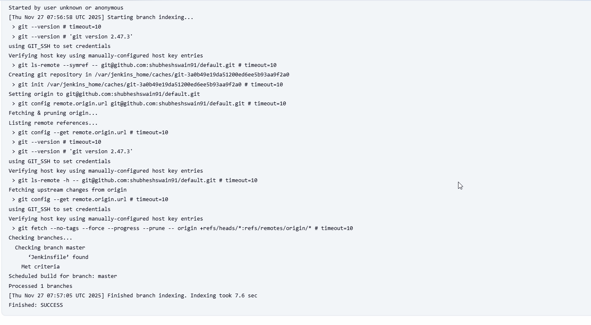

## Task 9. Create the development environment
Development branches are a set of environments your developers use to test their code changes before submitting them for integration into the live site. These environments are scaled-down versions of your application, but need to be deployed using the same mechanisms as the live environment.

**Create a development branch**

To create a development environment from a feature branch, you can push the branch to the Git server and let Jenkins deploy your environment.

* Create a development branch and push it to the Git server:
  
```bash
  git checkout -b new-feature
```

**Modify the pipeline definition**

The Jenkinsfile that defines that pipeline is written using the Jenkins Pipeline Groovy syntax. Using a Jenkinsfile allows an entire build pipeline to be expressed in a single file that lives alongside your source code. Pipelines support powerful features like parallelization and require manual user approval.

For the pipeline to work as expected, you need to modify the Jenkinsfile to set your project ID.

1. Open the Jenkinsfile in your terminal editor, for example vi:
```
   vi Jenkinsfile

```
2. Start the editor:
```
i

```
3. Add your PROJECT_ID to the REPLACE_WITH_YOUR_PROJECT_ID value. (Your PROJECT_ID is your Project ID found in the CONNECTION DETAILS section of the lab. You can also run gcloud config get-value project to find it.

4. Change the value of CLUSTER_ZONE to <filled in at lab start>. You can get this value by running gcloud config get compute/zone.   
   
```
PROJECT = "REPLACE_WITH_YOUR_PROJECT_ID"
APP_NAME = "gceme"
FE_SVC_NAME = "${APP_NAME}-frontend"
CLUSTER = "jenkins-cd"
CLUSTER_ZONE = ""
IMAGE_TAG = "gcr.io/${PROJECT}/${APP_NAME}:${env.BRANCH_NAME}.${env.BUILD_NUMBER}"
JENKINS_CRED = "${PROJECT}"
```
5. Save the Jenkinsfile file: press ESC then (for vi users):
```
   :wq
```

**Modify the site**

To demonstrate changing the application, you change the gceme cards from blue to orange.

1. Open html.go:
```
vi html.go

```
2. Start the editor:
```
i
```
3. Change the two instances of `<div class="card blue">` with following:
```
<div class="card orange">

```
4. Save the html.go file: press ESC then:
```
:wq

```
5. Open main.go:
```
vi main.go

```
6. Start the editor:
```
i

```
7. The version is defined in this line:
```go
const version string = "1.0.0"

```
Update it to the following:

```go
const version string = "2.0.0"

```
8. Save the main.go file one more time: ESC then:
```
:wq
```

## Task 10. Start deployment

In this task you deploy your development environment.

1. Commit and push your changes:
```bash
git add Jenkinsfile html.go main.go

git commit -m "Version 2.0.0"

git push origin new-feature

```

This starts a build of your development environment.

After the change is pushed to the Git repository, navigate to the Jenkins user interface where you can see that your build started for the new-feature branch. It can take up to a minute for the changes to be picked up.

2. After the build is running, click the down arrow next to the build in the left navigation and select Console output:
   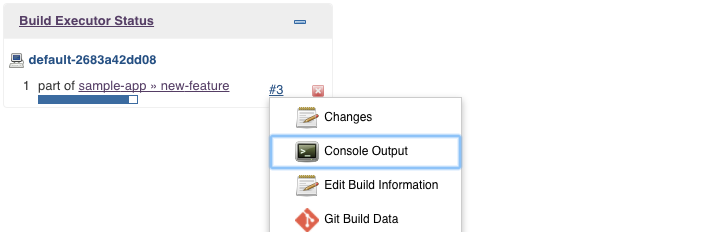

3. Track the output of the build for a few minutes and watch for the `kubectl --namespace=new-feature apply...` messages to begin. Your new-feature branch is now deployed to your cluster.   
   
```
   Note: In a development scenario, you wouldn't use a public-facing load balancer. To help secure your application, you can use kubectl proxy. The proxy authenticates itself with the Kubernetes API and proxies requests from your local machine to the service in the cluster without exposing your service to the Internet.
```

If you didn't see anything in Build Executor, don't worry. Just go to the Jenkins homepage > sample app. Verify that the new-feature pipeline has been created.

4. Once that's all taken care of, start the proxy in the background:
```bash
kubectl proxy &

```
5. If it stalls, press CTRL+C to exit. Verify that your application is accessible by sending a request to localhost and letting kubectl proxy forward it to your service:
```bash
curl \
http://localhost:8001/api/v1/namespaces/new-feature/services/gceme-frontend:80/proxy/version

```
You should see it respond with 2.0.0, which is the version that is now running.

If you receive a similar error:

```
{
  "kind": "Status",
  "apiVersion": "v1",
  "metadata": {
  },
  "status": "Failure",
  "message": "no endpoints available for service \"gceme-frontend:80\"",
  "reason": "ServiceUnavailable",
  "code": 503

```
6. It means your frontend endpoint hasn't propagated yet—wait a little bit and try the curl command again. Move on when you get the following output:
```
2.0.0

```
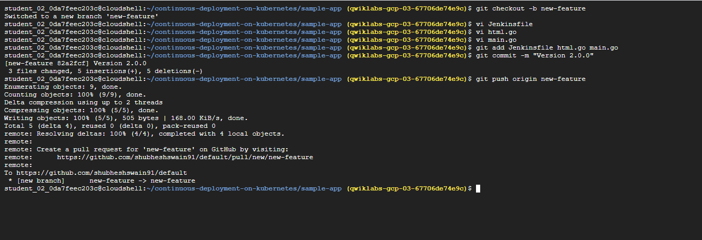

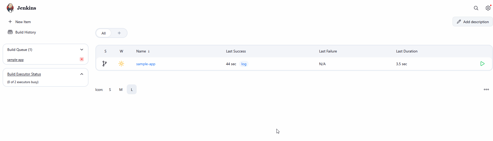

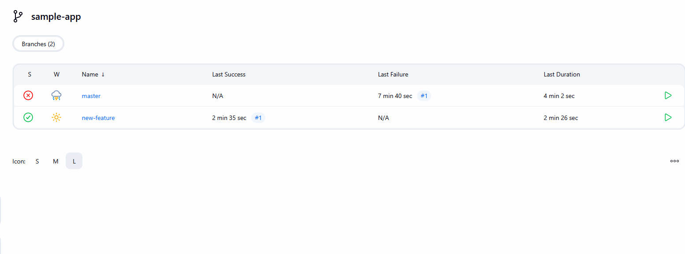

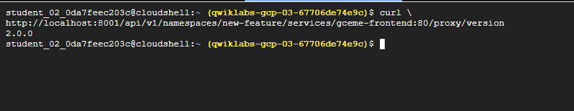

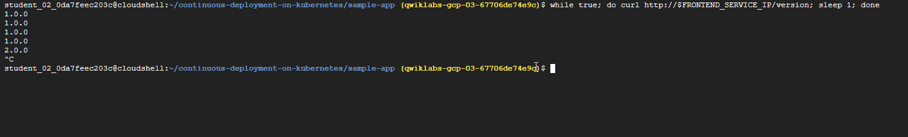

You have set up the development environment! Next, build on what you learned in the previous module by deploying a canary release to test out a new feature.

## Task 11. Deploy a canary release

You have verified that your app is running the latest code in the development environment, so now deploy that code to the canary environment.

1. Create a canary branch and push it to the Git server:
```bash
git checkout -b canary

git push origin canary

```
2. In Jenkins, you should see the canary pipeline has kicked off. Once complete, you can check the service URL to ensure your new version is serving some some of the traffic. You should see about 1 in 5 requests (in no particular order) returning version 2.0.0:
```
export FRONTEND_SERVICE_IP=$(kubectl get -o \
jsonpath="{.status.loadBalancer.ingress[0].ip}" --namespace=production services gceme-frontend)

while true; do curl http://$FRONTEND_SERVICE_IP/version; sleep 1; done

```
3. If you keep seeing 1.0.0, try running the above commands again. Once you've verified that the above works, end the command with CTRL+C.
That's it! You have deployed a canary release. Next you deploy the new version to production.


## Task 12. Deploy to production

Now that our canary release was successful and we haven't heard any customer complaints, deploy to the rest of your production fleet.

1. Create a canary branch and push it to the Git server:
```bash
git checkout master

git merge canary
 
git push origin master

``` 
In Jenkins, you should see the master pipeline has kicked off.

2. Once complete (which may take a few minutes), you can check the service URL to ensure your new version, 2.0.0 is serving all of the traffic.
```bash
export FRONTEND_SERVICE_IP=$(kubectl get -o \
jsonpath="{.status.loadBalancer.ingress[0].ip}" --namespace=production services gceme-frontend)
 
while true; do curl http://$FRONTEND_SERVICE_IP/version; sleep 1; done

``` 
3. Once again, if you see instances of 1.0.0 try running the above commands again. To stop this command press CTRL+C.
Example output:

```
gcpstaging9854_student@qwiklabs-gcp-df93aba9e6ea114a:~/continuous-deployment-on-kubernetes/sample-app$ while true; do curl http://$FRONTEND_SERVICE_IP/version; sleep 1; done
2.0.0
2.0.0
2.0.0
2.0.0
2.0.0
2.0.0
^C

```

You can also navigate to site on which the gceme application displays the info cards. The card color changed from blue to orange.

4. Here's the command again to get the external IP address. Paste the External IP into a new tab to see the info card displayed:
kubectl get service gceme-frontend -n production
 
Example output:

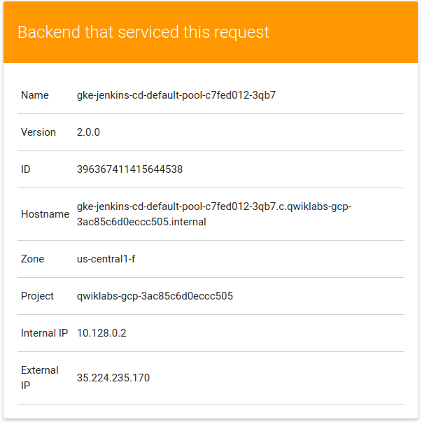


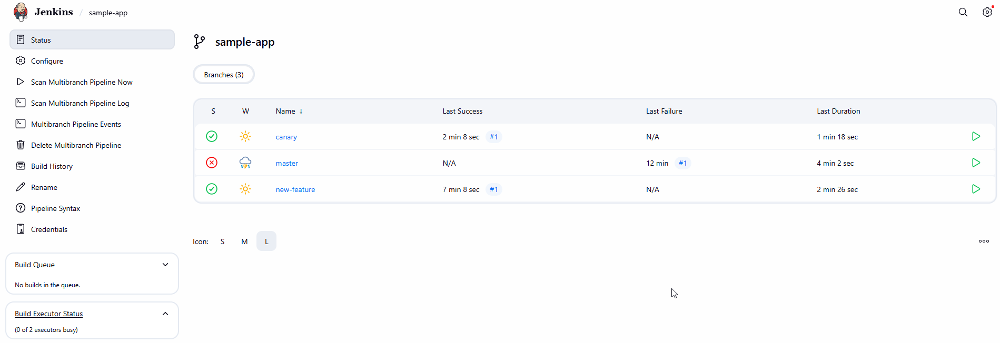

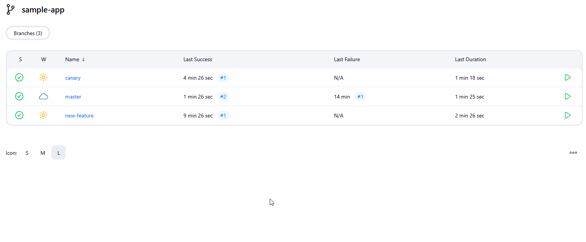

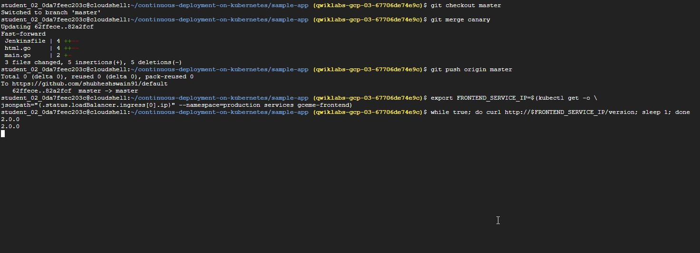

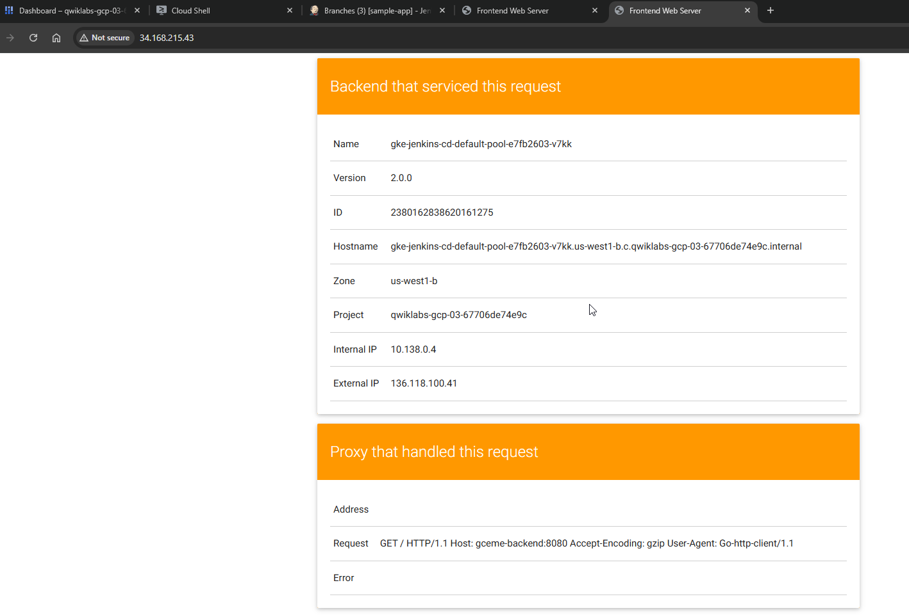