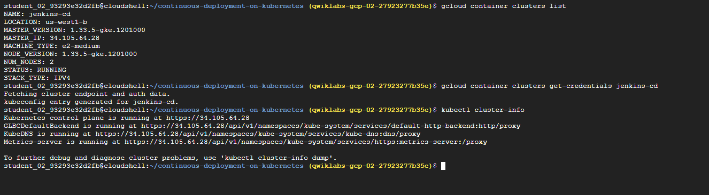
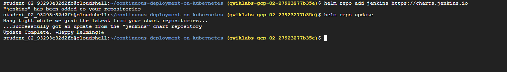
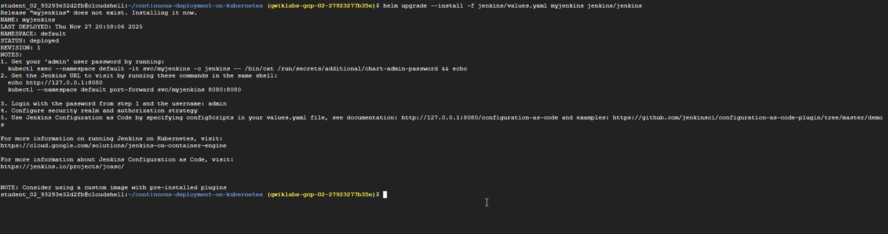
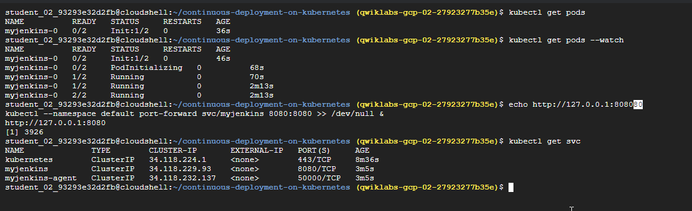
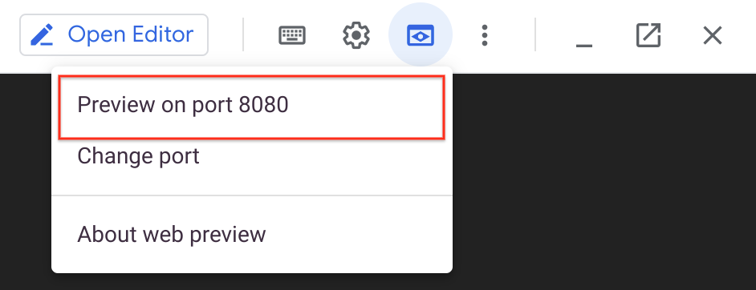
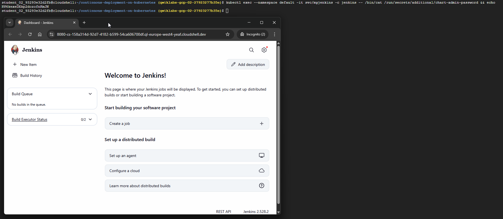

# Setting up Jenkins on Kubernetes Engine

In this hands-on lab, you'll learn how to set up Jenkins on Google Kubernetes Engine to help orchestrate your software delivery pipeline.

**Objectives**
* Creating a Kubernetes cluster with Kubernetes Engine.
* Creating a Jenkins deployment and services.
* Connecting to Jenkins.

## Task 1. Prepare the environment

First, you'll prepare your deployment environment and download a sample application.

1. Set the default Compute Engine zone to us-west1-b:
```bash
gcloud config set compute/zone us-west1-b

```
2. Clone the sample code:
```bash
git clone https://github.com/GoogleCloudPlatform/continuous-deployment-on-kubernetes.git

```
3. Navigate to the sample code directory:
```bash
cd continuous-deployment-on-kubernetes

```
Creating a Kubernetes cluster

Now you'll use the Kubernetes Engine to create and manage your Kubernetes cluster.

1. Next, provision a Kubernetes cluster using Kubernetes Engine. This step can take several minutes to complete:
```
gcloud container clusters create jenkins-cd \
--num-nodes 2 \
--scopes "https://www.googleapis.com/auth/projecthosting,cloud-platform"

```
The extra scopes enable Jenkins to access Artifact Registry.

2. Confirm that your cluster is running:
```bash
gcloud container clusters list   
```

Example Output:

Look for RUNNING in the STATUS column:
```

NAME        LOCATION                      MASTER_VERSION  MASTER_IP      MACHINE_TYPE   NODE_VERSION  NUM_NODES  STATUS
jenkins-cd  us-west1-b  1.9.7-gke.3     35.237.126.84  e2-medium      1.9.7-gke.3   2          RUNNING
```

3. Get the credentials for your cluster. Kubernetes Engine uses these credentials to access your newly provisioned cluster.
```bash
gcloud container clusters get-credentials jenkins-cd   

```
4. Confirm that you can connect to your cluster:
```bash
kubectl cluster-info

```
Example output: If the cluster is running, the URLs of where your Kubernetes components are accessible display:

```
Kubernetes master is running at https://130.211.178.38
GLBCDefaultBackend is running at https://130.211.178.38/api/v1/proxy/namespaces/kube-system/services/default-http-backend
Heapster is running at https://130.211.178.38/api/v1/proxy/namespaces/kube-system/services/heapster
KubeDNS is running at https://130.211.178.38/api/v1/proxy/namespaces/kube-system/services/kube-dns
kubernetes-dashboard is running at https://130.211.178.38/api/v1/proxy/namespaces/kube-system/services/kubernetes-dashboard
```


## Task 2. Configure Helm

In this lab, you will use Helm to install Jenkins from the Charts repository. Helm is a package manager that makes it easy to configure and deploy Kubernetes applications. Your Cloud Shell will already have a recent, stable version of Helm pre-installed.

If curious, you can run helm version in Cloud Shell to check which version you are using and also ensure that Helm is installed.

1. Add Helm's jenkins chart repository:
```bash
helm repo add jenkins https://charts.jenkins.io

```
2. Update the repo to ensure you get the latest list of charts:
```bash
helm repo update
```



## Task 3. Configure and install Jenkins

You will use a custom values file to add the Google Cloud specific plugin necessary to use service account credentials to reach Source Repository.

1. Use the Helm CLI to deploy the chart with your configuration set:

```bash
helm upgrade --install -f jenkins/values.yaml myjenkins jenkins/jenkins
```


2. Once that command completes ensure the Jenkins pod goes to the Running state and the container is in the READY state. This may take about 2 minutes:
   
```
kubectl get pods

```

Example output:

```
  NAME          READY     STATUS    RESTARTS   AGE
  myjenkins-0   2/2       Running   0          1m
```

3. Run the following command to setup port forwarding to the Jenkins UI from the Cloud Shell:
```bash
echo http://127.0.0.1:8080
kubectl --namespace default port-forward svc/myjenkins 8080:8080 >> /dev/null &   
```

4. Now, check that the Jenkins Service was created properly:
```bash
kubectl get svc   
```
Example output:

```
  NAME               CLUSTER-IP     EXTERNAL-IP   PORT(S)     AGE
  myjenkins          10.35.249.67   <none>        8080/TCP    3h
  myjenkins-agent    10.35.248.1    <none>        50000/TCP   3h
  kubernetes         10.35.240.1    <none>        443/TCP     9h
 </none></none></none>
```



We are using the Kubernetes Plugin so that our builder nodes will be automatically launched as necessary when the Jenkins master requests them. Upon completion of their work, they will automatically be turned down and their resources added back to the clusters resource pool.

Notice that this service exposes ports 8080 and 50000 for any pods that match the selector. This will expose the Jenkins web UI and builder/agent registration ports within the Kubernetes cluster.

Additionally, the jenkins-ui service is exposed using a ClusterIP so that it is not accessible from outside the cluster.

## Task 4. Connect to Jenkins

1. The Jenkins chart will automatically create an admin password for you. To retrieve it, run:
```bash
kubectl exec --namespace default -it svc/myjenkins -c jenkins -- /bin/cat /run/secrets/additional/chart-admin-password && echo

```
2. To get to the Jenkins user interface, click on the Web Preview button in cloud shell, then click Preview on port 8080:
   
   
3. You should now be able to log in with the username admin and your auto-generated password.

   
