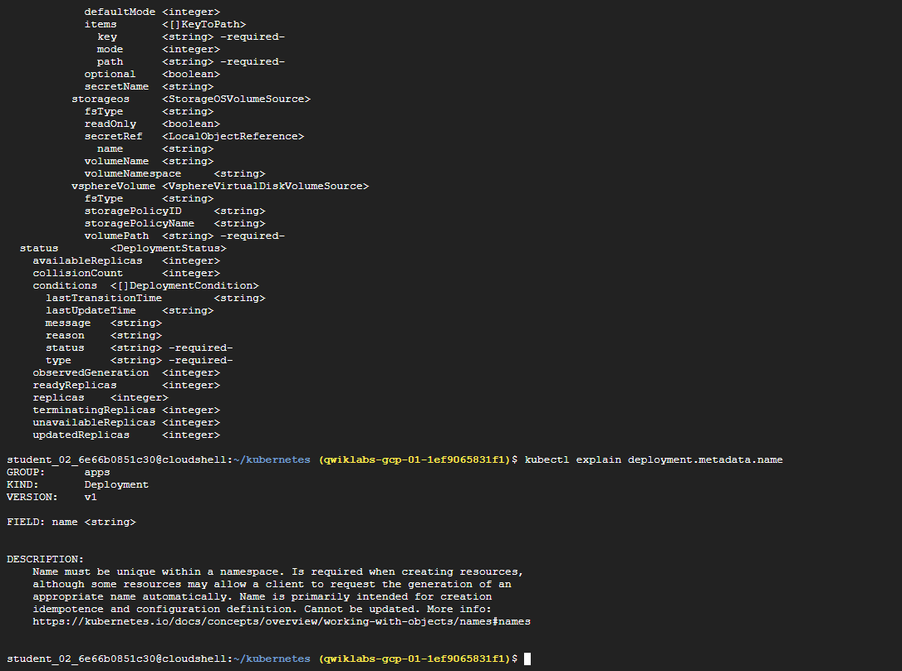
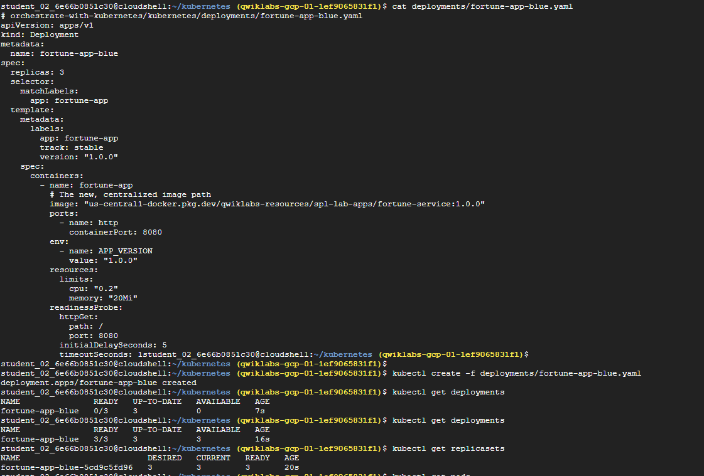
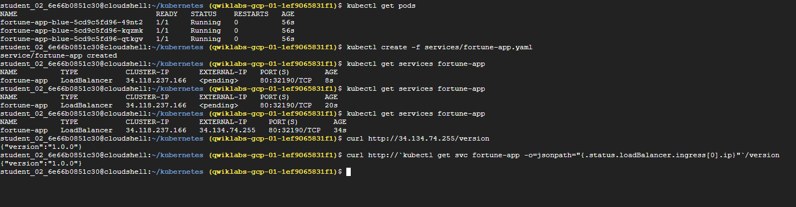
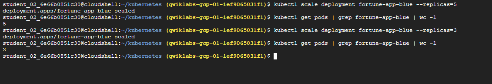
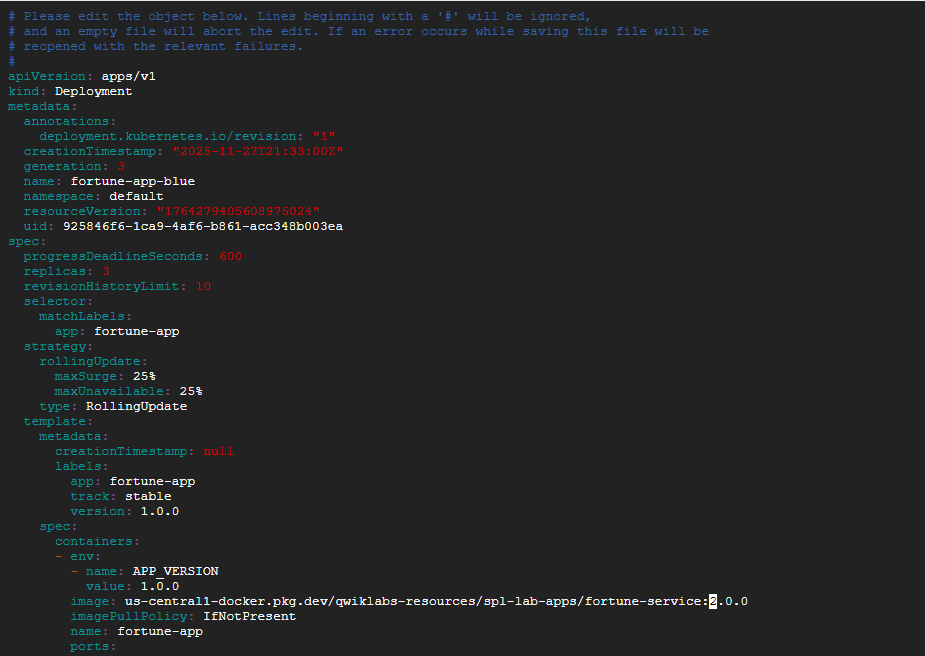
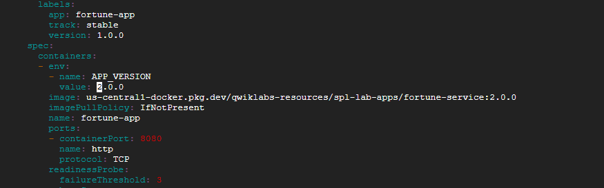
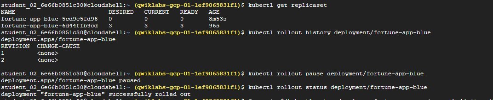
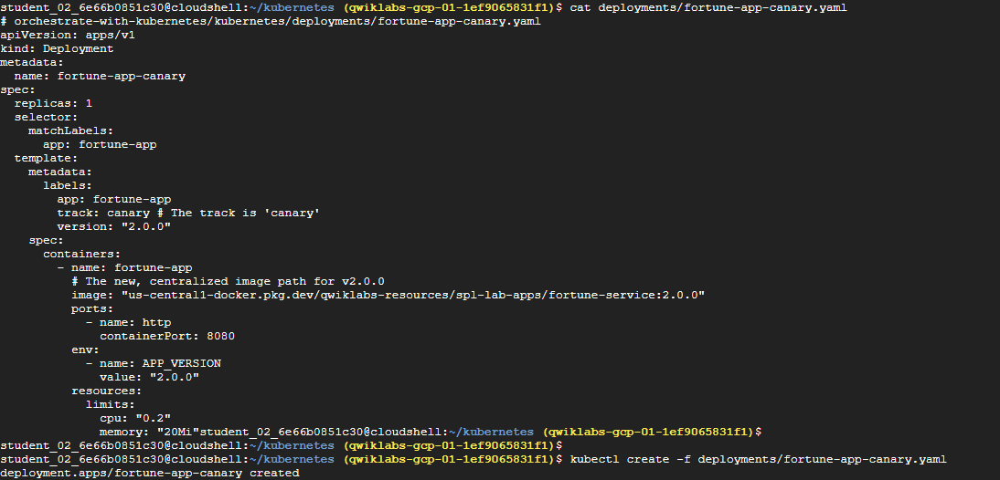
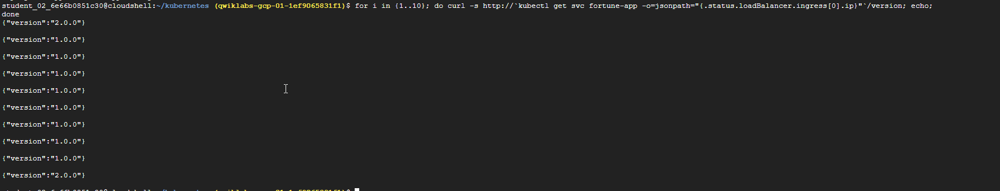
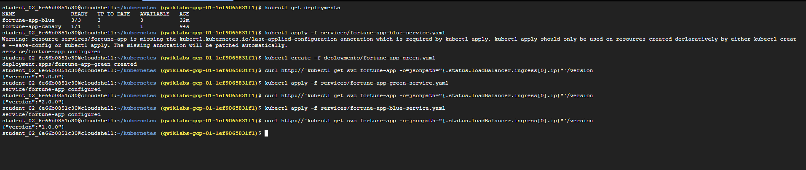

# Managing Deployments Using Kubernetes Engine

**Objectives**
In this lab, you will learn how to perform the following tasks:

1. Managing Deployments Using Kubernetes Engine
   1. Task 1. Learn about the deployment object
   2. Task 2. Create a deployment
   3. Scale a deployment
   4. Task 3. Rolling update
      1. Trigger a rolling update
      2. Pause a rolling update
   5. Task 4. Canary deployments
      1. Create a canary deployment
      2. Verify the canary deployment
   6. Task 5. Blue-green deployments
      1. Updating using Blue-Green deployment
      2. Blue-Green rollback


**Introduction to deployments**

Heterogeneous deployments typically involve connecting two or more distinct infrastructure environments or regions to address a specific technical or operational need. Heterogeneous deployments are called "hybrid", "multi-cloud", or "public-private", depending upon the specifics of the deployment.

For this lab, heterogeneous deployments include those that span regions within a single cloud environment, multiple public cloud environments (multi-cloud), or a combination of on-premises and public cloud environments (hybrid or public-private).

Various business and technical challenges can arise in deployments that are limited to a single environment or region:

* **Maxed out resources**: In any single environment, particularly in on-premises environments, you might not have the compute, networking, and storage resources to meet your production needs.
* **Limited geographic reach**: Deployments in a single environment require people who are geographically distant from one another to access one deployment. Their traffic might travel around the world to a central location.
* **Limited availability**: Web-scale traffic patterns challenge applications to remain fault-tolerant and resilient.
* **Vendor lock-in**: Vendor-level platform and infrastructure abstractions can prevent you from porting applications.
* **Inflexible resources**: Your resources might be limited to a particular set of compute, storage, or networking offerings.
* Heterogeneous deployments can help address these challenges, but they must be architected using programmatic and deterministic processes and procedures. One-off or ad-hoc deployment procedures can cause deployments or processes to be brittle and intolerant of failures. Ad-hoc processes can lose data or drop traffic. Good deployment processes must be repeatable and use proven approaches for managing provisioning, configuration, and maintenance.

Three common scenarios for heterogeneous deployment are:

* multi-cloud deployments
* fronting on-premises data
* continuous integration/continuous delivery (CI/CD) processes
  
The following exercises practice some common use cases for heterogeneous deployments, along with well-architected approaches using Kubernetes and other infrastructure resources to accomplish them.

**Get sample code for this lab**

1. Get the sample code for creating and running containers and deployments from the lab bucket:

```
gcloud storage cp -r gs://spls/gsp053/kubernetes .
cd kubernetes
```

2. Create a cluster with 3 nodes (this will take a few minutes to complete):
```bash
gcloud container clusters create bootcamp \
  --machine-type e2-small \
  --num-nodes 3 \
  --scopes "https://www.googleapis.com/auth/projecthosting,storage-rw"   
```

## Task 1. Learn about the deployment object

To get started, take a look at the deployment object.

1. The explain command in kubectl can tell us about the deployment object:
```
kubectl explain deployment

``` 
2. You can also see all of the fields using the --recursive option:
```
kubectl explain deployment --recursive

``` 
3. You can use the explain command as you go through the lab to help you understand the structure of a deployment object and understand what the individual fields do:
```
kubectl explain deployment.metadata.name

``` 


## Task 2. Create a deployment
  
1. Create the fortune-app deployment. Examine the deployment configuration file:
 
```bash
cat deployments/fortune-app-blue.yaml

```

Output:
```yaml
# orchestrate-with-kubernetes/kubernetes/deployments/fortune-app-blue.yaml
apiVersion: apps/v1
kind: Deployment
metadata:
  name: fortune-app-blue
spec:
  replicas: 3
  selector:
    matchLabels:
      app: fortune-app
  template:
    metadata:
      labels:
        app: fortune-app
        track: stable
        version: "1.0.0"
    spec:
      containers:
        - name: fortune-app
          # The new, centralized image path
          image: "us-central1-docker.pkg.dev/qwiklabs-resources/spl-lab-apps/fortune-service:1.0.0"
          ports:
            - name: http
              containerPort: 8080
...

```
Notice how the deployment is creating three replicas and it's using version 1.0.0 of the fortune-service container.

2. Go ahead and create your deployment object using kubectl create:
```
kubectl create -f deployments/fortune-app-blue.yaml

``` 
3. Once you have created the deployment, you can verify that it was created:
```
kubectl get deployments

``` 
4. Once the deployment is created, Kubernetes will create a ReplicaSet for the deployment. You can verify that a ReplicaSet was created for the deployment:
```
kubectl get replicasets

``` 
You should see a ReplicaSet with a name like fortune-app-blue-xxxxxxx



5. View the Pods that were created as part of the deployment:
```
kubectl get pods

``` 
6. Now, create a service to expose the fortune-app deployment externally.
```
kubectl create -f services/fortune-app.yaml

``` 
7. Interact with the fortune-app by grabbing its external IP and then curling the /version endpoint:
```
kubectl get services fortune-app

``` 
Note: It may take a few seconds before the External-IP field is populated for your service. This is normal. Just re-run the above command every few seconds until the field is populated.
curl http://<EXTERNAL-IP>/version
 
You should get back a JSON response indicating {"version":"1.0.0"}.

You can also use the output templating feature of kubectl to use curl as a one-liner:
```bash
curl http://`kubectl get svc fortune-app -o=jsonpath="{.status.loadBalancer.ingress[0].ip}"`/version

``` 




## Scale a deployment

Now that you have a deployment created, you can scale it. Do this by updating the spec.replicas field.

1. The replicas field can be most easily updated using the kubectl scale command:
```
kubectl scale deployment fortune-app-blue --replicas=5

``` 
Note: It may take a minute or so for all the new pods to start up.
2. Verify that there are now 5 fortune-app-blue Pods running:
kubectl get pods | grep fortune-app-blue | wc -l
 
3. Now scale back the application:
```
kubectl scale deployment fortune-app-blue --replicas=3

``` 
4. Again, verify that you have the correct number of Pods:
```
kubectl get pods | grep fortune-app-blue | wc -l

``` 


Now you know about Kubernetes deployments and how to manage & scale a group of Pods.

## Task 3. Rolling update

Deployments support updating images to a new version through a rolling update mechanism.

### Trigger a rolling update

1. To trigger a rolling update, you can simply apply the configuration of the "green" deployment. Kubernetes is smart enough to see the existing deployment (fortune-app-blue) and will "roll" the changes from the new file onto it.
kubectl edit deployment fortune-app-blue
 
2. In the editor, find the image line and change the version tag from 1.0.0 to 2.0.0. You can edit the file by pressing i on your keyboard to enter "insert mode".
First, change the image tag:

* Find this line: image: "us-central1-docker.pkg.dev/qwiklabs-resources/spl-lab-apps/fortune-service:1.0.0"
* And change it to: image: "us-central1-docker.pkg.dev/qwiklabs-resources/spl-lab-apps/fortune-service:2.0.0"
Next, update the environment variable:



* Find the env section and the APP_VERSION variable.
* Change value: "1.0.0" to value: "2.0.0"
3. Save and close the editor. You can do this by pressing Esc, then typing :wq, and pressing Enter. This will trigger the rolling update on the correct deployment and properly record its history. This will trigger the rolling update on the correct deployment and properly record its history.



4. See the new ReplicaSet that Kubernetes creates:

```
kubectl get replicaset

``` 
5. You can also see a new entry in the rollout history:
```
kubectl rollout history deployment/fortune-app-blue

``` 
### Pause a rolling update

1. Run the following to pause the rollout:
```
kubectl rollout pause deployment/fortune-app-blue

``` 
2. Verify the current state of the rollout:
```
kubectl rollout status deployment/fortune-app-blue

``` 
 

Note: The status command might immediately report "deployment "fortune-app-blue" successfully rolled out". This is expected and indicates that the pause command itself was successful. It does not mean the version update is complete.

3. Check the version of each pod. You'll see a mix of 1.0.0 and 2.0.0 pods, confirming the rollout is paused mid-way.

```bash
for p in $(kubectl get pods -l app=fortune-app -o=jsonpath='{.items[*].metadata.name}'); do echo $p && curl -s http://$(kubectl get pod $p -o=jsonpath='{.status.podIP}')/version; echo; done

``` 
4. Press Ctrl+C to exit the loop.

**Resume a rolling update**

1. Continue the rollout using the resume command:
```
kubectl rollout resume deployment/fortune-app-blue

``` 
2. When the rollout is complete, you should see the following when running the status command:
```
kubectl rollout status deployment/fortune-app-blue

``` 
**Roll back an update**

Assume that a bug was detected in your new version.

1. Use the rollout command to roll back to the previous version:
```
kubectl rollout undo deployment/fortune-app-blue

``` 
Note: the rollback may take a few moments to complete.

2. Verify that all the Pods have rolled back to version 1.0.0:

```bash
curl http://`kubectl get svc fortune-app -o=jsonpath="{.status.loadBalancer.ingress[0].ip}"`/version

``` 
Great! You learned how to do a rolling update for Kubernetes deployments.

## Task 4. Canary deployments

When you want to test a new deployment in production with a subset of your users, use a canary deployment.

### Create a canary deployment

1. First, create a new canary deployment for the new version using the fortune-app-canary.yaml file:
```
cat deployments/fortune-app-canary.yaml

``` 
2. Now create the canary deployment:
```
kubectl create -f deployments/fortune-app-canary.yaml

``` 
3. After the canary deployment is created, you should have two deployments. Verify with this command:
```
kubectl get deployments

```


The fortune-app service has a selector for app: fortune-app, which will match pods in both the fortune-app-blue (prod) and fortune-app-canary deployments.


### Verify the canary deployment

You can verify the version being served by making requests to the service.
```bash
for i in {1..10}; do curl -s http://`kubectl get svc fortune-app -o=jsonpath="{.status.loadBalancer.ingress[0].ip}"`/version; echo;
done

```


Run this several times and you should see that most of the requests are served by version 1.0.0 and a small subset are served by 2.0.0.

## Task 5. Blue-green deployments

For blue-green deployments, you'll create two separate deployments and switch traffic between them by updating the service selector.

**The service**
First, update the service to point only to the "blue" version (1.0.0).
```
kubectl apply -f services/fortune-app-blue-service.yaml

``` 
### Updating using Blue-Green deployment

1. Now, create the new "green" deployment for version 2.0.0.
```
kubectl create -f deployments/fortune-app-green.yaml

``` 
2. Once the green deployment has started, verify that the current version being served is still 1.0.0.
```
curl http://`kubectl get svc fortune-app -o=jsonpath="{.status.loadBalancer.ingress[0].ip}"`/version

``` 
3. Now, update the service to point to the new "green" version:
```
kubectl apply -f services/fortune-app-green-service.yaml

``` 
4. When the service is updated, the "green" deployment will be used immediately. You can now verify that version 2.0.0 is always being served:
```
curl http://`kubectl get svc fortune-app -o=jsonpath="{.status.loadBalancer.ingress[0].ip}"`/version

``` 
### Blue-Green rollback

1. To roll back, simply re-apply the service manifest for the "blue" deployment:
```
kubectl apply -f services/fortune-app-blue-service.yaml

``` 
2. Once you have updated the service, your rollback will have been successful. Verify that version 1.0.0 is now being used:
```
curl http://`kubectl get svc fortune-app -o=jsonpath="{.status.loadBalancer.ingress[0].ip}"`/version

```


You did it! You learned about blue-green deployments and how to deploy updates to applications that need to switch versions all at once.