# Debug Apps on Google Kubernetes Engine


Lab instructions and tasks

-   [GSP736](#step1)
-   [Overview](#step2)
-   [Setup and requirements](#step3)
-   [Task 1. Perform infrastructure setup](#step4)
-   [Task 2. Deploy an application](#step5)
-   [Task 3. Open the application](#step6)
-   [Task 4. Create a logs-based metric](#step7)
-   [Task 5. Create an alerting policy](#step8)
-   [Task 6. Fix the issue and verify the result](#step9)
-   [Congratulations!](#step10)


## GSP736


## Overview

Cloud Logging, and its companion tool, Cloud Monitoring, are full featured products that are both deeply integrated into Google Kubernetes Engine (GKE). This lab teaches you how Cloud Logging works with GKE clusters and applications as well as some best practices for log collection through common logging use cases.

### Objectives

In this lab, you learn how to perform the following tasks:

-   Use Cloud Monitoring to detect issues.
-   Use Cloud Logging to troubleshoot an application running on GKE.

### The demo application used in the lab

To use a concrete example, you will troubleshoot a sample [microservices demo](https://github.com/GoogleCloudPlatform/microservices-demo) app deployed to a GKE cluster. In this demo app, there are many microservices and dependencies among them. You will generate traffic using a loadgenerator and then use Logging, Monitoring, and GKE to notice the error (alert/metrics), identify a root cause with Logging, and then fix/confirm the issue is fixed with Logging and Monitoring.


## Setup and requirements

### Before you click the Start Lab button

Read these instructions. Labs are timed and you cannot pause them. The timer, which starts when you click **Start Lab**, shows how long Google Cloud resources are made available to you.

This hands-on lab lets you do the lab activities in a real cloud environment, not in a simulation or demo environment. It does so by giving you new, temporary credentials you use to sign in and access Google Cloud for the duration of the lab.

To complete this lab, you need:

-   Access to a standard internet browser (Chrome browser recommended).
**Note:** Use an Incognito (recommended) or private browser window to run this lab. This prevents conflicts between your personal account and the student account, which may cause extra charges incurred to your personal account.-   Time to complete the lab—remember, once you start, you cannot pause a lab.
**Note:** Use only the student account for this lab. If you use a different Google Cloud account, you may incur charges to that account.

### How to start your lab and sign in to the Google Cloud console

1.  Click the **Start Lab** button. If you need to pay for the lab, a dialog opens for you to select your payment method. On the left is the Lab Details pane with the following:
    
      3.   The Open Google Cloud console button
      4.   Time remaining
      5.   The temporary credentials that you must use for this lab
      6.   Other information, if needed, to step through this lab
    
2.  Click **Open Google Cloud console** (or right-click and select **Open Link in Incognito Window** if you are running the Chrome browser).
    
    The lab spins up resources, and then opens another tab that shows the Sign in page.
    
    12.*_Tip:_** Arrange the tabs in separate windows, side-by-side.
    
    14.*Note:** If you see the **Choose an account** dialog, click **Use Another Account**.
3.  If necessary, copy the **Username** below and paste it into the **Sign in** dialog.
    
    {{{user\_0.username | "Username"}}}
    
    You can also find the Username in the Lab Details pane.
    
4.  Click **Next**.
    
5.  Copy the **Password** below and paste it into the **Welcome** dialog.
    
    {{{user\_0.password | "Password"}}}
    
    You can also find the Password in the Lab Details pane.
    
6.  Click **Next**.
    
    31.*Important:** You must use the credentials the lab provides you. Do not use your Google Cloud account credentials. **Note:** Using your own Google Cloud account for this lab may incur extra charges.
7.  Click through the subsequent pages:
    
      34.   Accept the terms and conditions.
      35.   Do not add recovery options or two-factor authentication (because this is a temporary account).
      36.   Do not sign up for free trials.

After a few moments, the Google Cloud console opens in this tab.

**Note:** To access Google Cloud products and services, click the **Navigation menu** or type the service or product name in the **Search** field. 

### Activate Cloud Shell

Cloud Shell is a virtual machine that is loaded with development tools. It offers a persistent 5GB home directory and runs on the Google Cloud. Cloud Shell provides command-line access to your Google Cloud resources.

1.  Click **Activate Cloud Shell**  at the top of the Google Cloud console.
    
2.  Click through the following windows:
    
      5.   Continue through the Cloud Shell information window.
      6.   Authorize Cloud Shell to use your credentials to make Google Cloud API calls.

When you are connected, you are already authenticated, and the project is set to your **Project\_ID**, . The output contains a line that declares the **Project\_ID** for this session:

Your Cloud Platform project in this session is set to {{{project\_0.project\_id | "PROJECT\_ID"}}}

```
gcloud
```
 is the command-line tool for Google Cloud. It comes pre-installed on Cloud Shell and supports tab-completion.

3.  (Optional) You can list the active account name with this command:
gcloud auth list4.  Click **Authorize**.

**Output:**

ACTIVE: \* ACCOUNT: {{{user\_0.username | "ACCOUNT"}}} To set the active account, run: $ gcloud config set account \`ACCOUNT\`5.  (Optional) You can list the project ID with this command:
gcloud config list project

**Output:**

\[core\] project = {{{project\_0.project\_id | "PROJECT\_ID"}}} **Note:** For full documentation of 
```
gcloud
```
, in Google Cloud, refer to [the gcloud CLI overview guide](https://cloud.google.com/sdk/gcloud).

## Task 1. Perform infrastructure setup

Connect to a Google Kubernetes Engine cluster and validate that it's been created correctly.

1.  Use the following command to see the cluster's status:
gcloud container clusters list

The cluster status will say PROVISIONING.

2.  Wait a moment and run the above command again until the status is RUNNING. This could take several minutes.
    
3.  Verify that the cluster named 
    ```
    central
    ```
     has been created.

You can also monitor the progress in the Cloud console by navigating to **Navigation menu** > **Kubernetes Engine** > **Clusters**.

4.  Once your cluster has a RUNNING status, run the following command to get the cluster credentials:
gcloud container clusters get-credentials central --zone {{{project\_0.startup\_script.zone | ZONE}}}

**Output:**

Fetching cluster endpoint and auth data. kubeconfig entry generated for central.5.  Run the following command to verify that the nodes have been created:
kubectl get nodes

Your output should resemble the following.

**Output:**

NAME STATUS ROLES AGE VERSION gke-central-default-pool-5ff4130f-qz8v Ready 24d v1.27.2-gke.1200 gke-central-default--pool-5ff4130f-ssd2 Ready 24d v1.27.2-gke.1200 gke-central-default--pool-5ff4130f-tz63 Ready 24d v1.27.2-gke.1200 gke-central-default--pool-5ff4130f-zfmn Ready 24d v1.27.2-gke.1200

### Enable Gemini Code Assist in the Cloud Shell IDE

You can use Gemini Code Assist in an integrated development environment (IDE) such as Cloud Shell to receive guidance on code or solve problems with your code. Before you can start using Gemini Code Assist, you need to enable it.

1.  In Cloud Shell, enable the **Gemini for Google Cloud** API with the following command:
gcloud services enable cloudaicompanion.googleapis.com2.  Click **Open Editor** on the Cloud Shell toolbar.
**Note:** To open the Cloud Shell Editor, click **Open Editor** on the Cloud Shell toolbar. You can switch between Cloud Shell and the code Editor by clicking **Open Editor** or **Open Terminal**, as required.3.  In the left pane, click the **Settings** icon, then in the **Settings** view, search for **Gemini Code Assist**.
    
4.  Locate and ensure that the checkbox is selected for **Geminicodeassist: Enable**, and close the **Settings**.
    
5.  Click **Cloud Code - No Project** in the status bar at the bottom of the screen.
    
6.  Authorize the plugin as instructed. If a project is not automatically selected, click **Select a Google Cloud Project**, and choose .
    
7.  Verify that your Google Cloud project () displays in the Cloud Code status message in the status bar.

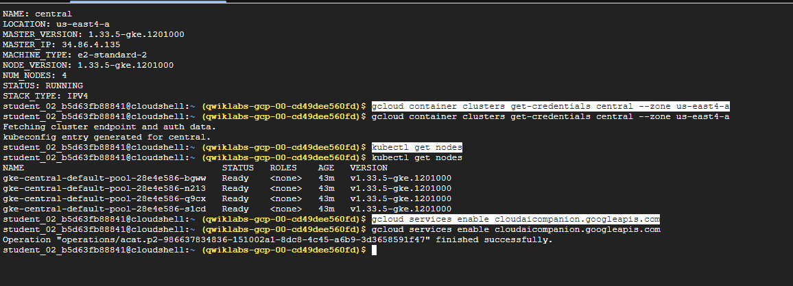

## Task 2. Deploy an application

Next, deploy a microservices application called Hipster Shop to your cluster to create a workload you can monitor.

1.  Run the following command to clone the repo:
git clone https://github.com/xiangshen-dk/microservices-demo.git2.  Change to the 
    ```
    microservices-demo
    ```
     directory with the following command:
cd microservices-demo3.  In the Cloud Shell Editor's file Explorer, navigate to **microservices-demo** > **release** > **kubernetes-manifests.yaml**.

You can use the AI-powered features of Gemini Code Assist to make changes to your code directly in your code editor. In this instance, you decide to let Gemini Code Assist help explain the **kubernetes-manifests.yaml** file to support the onboarding of a new member in your team.

4.  Open the 
    ```
    kubernetes-manifests.yaml
    ```
     file. This action enables Gemini Code Assist, as indicated by the presence of the  icon in the upper-right corner of the editor.
    
5.  Click the **Gemini Code Assist: Smart Actions**  icon and select **Explain this**.
    
6.  Gemini Code Assist opens a chat pane with the prefilled prompt of 
    ```
    Explain this
    ```
    . In the inline text box of the Code Assist chat, replace the prefilled prompt with the following, and click **Send**:
As a Kubernetes Architect at Cymbal AI, provide a formal and comprehensive explanation of the kubernetes-manifests.yaml file for new team member onboarding. Your explanation should: \* Detail the key components used in the configuration file \* Describe key Services and their functions \* Describe the common configuration elements \* Describe what the configuration deploys For the suggested improvements, don't update this file.

The explanation for the code in the 
```
kubernetes-manifests.yaml
```
 file appears in the **Gemini Code Assist** chat.


```
 
Gemini
Thinking
Of course. This YAML file, kubernetes-manifests.yaml, is a standard Kubernetes manifest file used to define and configure all the necessary resources for deploying a multi-service application, often called a microservices application.

Let's break down its structure and what each part does.

Overall Structure
The file is a collection of Kubernetes resource definitions written in YAML. Each resource definition is separated by ---. This allows you to define multiple resources (like Deployments, Services, etc.) in a single file and apply them all at once to a Kubernetes cluster using a command like kubectl apply -f kubernetes-manifests.yaml.

The file defines two main types of Kubernetes objects for each microservice:

Deployment: This object tells Kubernetes how to run your application. It manages a set of identical Pods (the smallest deployable units in Kubernetes). Key parts of a Deployment include:

spec.replicas: How many copies (Pods) of the application to run.
spec.selector: How the Deployment finds which Pods to manage.
spec.template: A blueprint for the Pods. This is where you define the containers, their images, ports, environment variables, resource requests/limits, and health checks.
Service: This object provides a stable network endpoint (a consistent IP address and DNS name) for a set of Pods. Since Pods can be created and destroyed, their IP addresses change. A Service sits in front of them, allowing other services to reliably connect to them.

spec.selector: Connects the Service to the Pods managed by a Deployment (matching the Pod labels).
spec.ports: Defines how the service exposes the container's port.
spec.type: Determines how the service is exposed.
ClusterIP: The service is only reachable from within the Kubernetes cluster. This is the default and is used for most internal microservice communication.
LoadBalancer: The service is exposed externally using a cloud provider's load balancer. This is used for the frontend-external service to allow users to access the application from the internet.
The Microservices
This file defines all the components of an e-commerce application:

frontend: The main web interface that users interact with. It's the only service exposed to the public internet via a LoadBalancer Service (frontend-external).
emailservice: Sends confirmation emails to users.
checkoutservice: Orchestrates the checkout process.
recommendationservice: Provides product recommendations.
paymentservice: Processes payments.
productcatalogservice: Manages the list of available products.
cartservice: Manages the user's shopping cart.
currencyservice: Handles currency conversion.
shippingservice: Calculates shipping costs.
adservice: Serves advertisements.
redis-cart: A Redis cache used as a persistent store for the cartservice.
loadgenerator: A utility service to simulate user traffic against the frontend for testing purposes.
Key Configuration Details
Across the file, you can see some common and important configurations:

Image Source: All application container images are pulled from gcr.io/shenxiang-gcp-solution/...:v0.1.0. This indicates they are all part of a single versioned release (v0.1.0) stored in Google Container Registry.
Service Discovery: Services find each other using environment variables (e.g., PRODUCT_CATALOG_SERVICE_ADDR: "productcatalogservice:3550"). Kubernetes provides internal DNS that resolves the service name (productcatalogservice) to the service's stable ClusterIP.
Health Checks (livenessProbe & readinessProbe):
readinessProbe: Tells Kubernetes when a container is ready to start accepting traffic. If this probe fails, the Pod's IP is removed from the Service endpoints.
livenessProbe: Tells Kubernetes if a container is still running correctly. If this probe fails, Kubernetes will restart the container.
Most services use grpc_health_probe, a tool for checking the health of gRPC applications. The frontend uses an httpGet probe, and redis-cart uses a tcpSocket probe.
Resource Management (requests & limits):
requests: The minimum amount of CPU and memory guaranteed to the container. Kubernetes uses this for scheduling Pods onto nodes.
limits: The maximum amount of CPU and memory the container is allowed to use. This prevents a single container from consuming all of a node's resources.
Autogenerated File Warning: The comment at the top, WARNING: This file is autogenerated. Do not manually edit., suggests that this file is the output of another tool (like Helm, Kustomize, or a custom script). This is a common practice to manage complex applications and means that direct edits to this file would be overwritten.
In summary, this file is a complete, self-contained declaration of a microservices application, defining what to run, how to run it, how to keep it healthy, and how the different pieces should communicate with each other within a Kubernetes cluster.

```


```

Gemini
Thinking
Of course. Welcome to the team!

As a Kubernetes Architect, I'd like to walk you through one of our key configuration files, kubernetes-manifests.yaml. Understanding this file is fundamental to how we deploy and manage our "Online Boutique" microservices application on Kubernetes.

This file is a comprehensive manifest that declares all the necessary Kubernetes resources for our application in a single place. Let's break it down.

What the Configuration Deploys
At a high level, this manifest deploys a multi-service, cloud-native e-commerce application. It consists of several independent microservices that work together to provide the full functionality of an online shop. The services include:

A web frontend.
Services for managing the product catalog, shopping cart, recommendations, and ads.
Backend services for handling payments, shipping, currency conversion, and sending emails.
A Redis instance for caching cart data.
A load generator for performance testing.
Key Kubernetes Components Used
The manifest primarily uses two core Kubernetes objects for each microservice: Deployment and Service.

Deployment: This object is the blueprint for running our application. It tells Kubernetes how to create and manage a set of identical application instances, called Pods.

It ensures that a specified number of Pods are always running. If a Pod fails, the Deployment Controller replaces it automatically.
It defines everything needed to run the application container, including the container image, environment variables, ports, and resource requirements.
It enables zero-downtime rolling updates to the application.
Service: This object provides a stable network endpoint for our Deployments. Pods are ephemeral and their IP addresses can change, but a Service provides a consistent IP address and DNS name that other services can use to connect.

ClusterIP: This is the default Service type, used for most of our backend services. It exposes the service on an internal IP within the cluster, making it reachable from other services but not from outside.
LoadBalancer: This Service type exposes the application externally using a cloud provider's load balancer. We use this for our frontend-external service to allow public internet traffic to reach our web UI.
Key Services and Their Functions
While the file defines many services, let's highlight a few critical ones:

frontend and frontend-external:

The frontend Deployment runs the main web application that users interact with.
It is exposed internally by a ClusterIP Service named frontend.
Crucially, it is also exposed to the public internet by a LoadBalancer Service named frontend-external. This is the main entry point for all user traffic.
checkoutservice:

This service orchestrates the complex process of a user checking out.
As you can see from its environment variables (PRODUCT_CATALOG_SERVICE_ADDR, SHIPPING_SERVICE_ADDR, etc.), it communicates with many other backend services to complete an order.
cartservice and redis-cart:

The cartservice manages users' shopping carts.
It is stateful and relies on the redis-cart Deployment for data persistence. The REDIS_ADDR environment variable points it to the redis-cart Service.
The redis-cart Deployment uses a standard redis:alpine image and an emptyDir volume.
Common Configuration Elements
You will notice several recurring patterns across the different Deployment definitions. These are standard best practices for defining robust applications on Kubernetes.

Labels and Selectors: Every Deployment's Pod template has a label (e.g., app: emailservice). The corresponding Service uses a selector (selector: app: emailservice) to identify which Pods to send traffic to. This label-selector mechanism is the core of how Kubernetes connects different resources.

Health Probes (readinessProbe & livenessProbe):

readinessProbe: Tells Kubernetes when a container is ready to start accepting traffic. If this probe fails, the Pod is removed from the Service's endpoints, preventing traffic from being sent to an unhealthy instance.
livenessProbe: Tells Kubernetes if the application is still running correctly. If this probe fails, Kubernetes will restart the container to attempt a recovery.
We use different probe types: exec for our gRPC services, httpGet for the frontend, and tcpSocket for Redis.
Resource Management (requests & limits):

requests: The amount of CPU and memory that Kubernetes guarantees for the container. This is used for scheduling decisions.
limits: The maximum amount of CPU and memory the container can use. This prevents a single faulty service from consuming all node resources and impacting other services.
Service Discovery: Services discover each other using environment variables that point to the DNS names of other Services (e.g., value: "productcatalogservice:3550"). Kubernetes provides internal DNS that automatically resolves the service name (productcatalogservice) to its stable ClusterIP.

Suggested Improvements
This file is an excellent starting point, but as we mature our processes, there are several areas we can improve for better security, reliability, and manageability. As per your request, I will not modify the file but will outline these suggestions for our discussion.

Configuration Management: The file has hardcoded image tags (v0.1.0) and service addresses. This makes it difficult to promote releases across different environments (e.g., dev, staging, production). We should adopt a tool like Kustomize or Helm to template these manifests, allowing us to override values for each environment.

Stateful Data Persistence: The redis-cart Deployment uses an emptyDir volume. This volume's lifecycle is tied to the Pod; if the Pod is deleted or moved to another node, all cart data is lost. For a production system, we should replace this with a PersistentVolumeClaim (PVC) to provision a persistent network disk.

High Availability: Most Deployments are running with a single replica (the default when replicas is not specified). This creates a single point of failure for each service. We should configure replicas: 2 or more for critical services and define a PodDisruptionBudget (PDB) to ensure a minimum number of replicas are available during voluntary disruptions like node upgrades.

Security Hardening: The containers are running without a specified securityContext. It's a best practice to explicitly define a context to run containers as non-root users (runAsUser, runAsNonRoot: true) and to drop unnecessary Linux capabilities to reduce the potential attack surface.

I hope this detailed overview is helpful for your onboarding. Please feel free to ask any questions as you dig in.
```
7.  Run the following command to install the app using 
    ```
    kubectl
    ```
    :
```bash
kubectl apply -f release/kubernetes-manifests.yaml8.  Run the following command to confirm everything is running correctly:
kubectl get pods

```
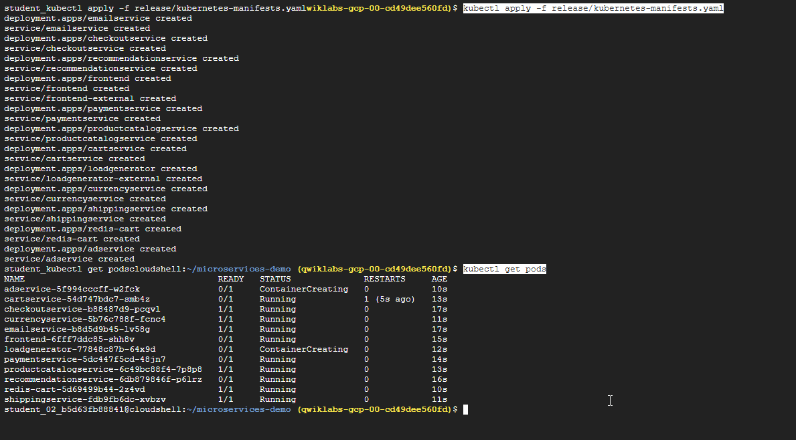

The output should look similar to the output below.

**Output:**

```bash
NAME                                     READY     STATUS      RESTARTS     AGE
adservice-55f94cfd9c-4lvml               1/1       Running     0            20m
cartservice-6f4946f9b8-6wtff             1/1       Running     2            20m
checkoutservice-5688779d8c-l6crl         1/1       Running     0            20m
currencyservice-665d6f4569-b4sbm         1/1       Running     0            20m
emailservice-684c89bcb8-h48sq            1/1       Running     0            20m
frontend-67c8475b7d-vktsn                1/1       Running     0            20m
loadgenerator-6d646566db-p422w           1/1       Running     0            20m
paymentservice-858d89d64c-hmpkg          1/1       Running     0            20m
productcatalogservice-bcd85cb5-d6xp4     1/1       Running     0            20m
recommendationservice-685d7d6cd9-pxd9g   1/1       Running     0            20m
redis-cart-9b864d47f-c9xc6               1/1       Running     0            20m
shippingservice-5948f9fb5c-vndcp         1/1       Running     0            20m

```

9.  Rerun the command until all pods are reporting a **Running** status before proceeding to the next step.

Click **Check my progress** to verify the objective. Deploy an application

10.  Run the following command to get the **external IP** of the application. This command only returns an IP address once the service has been deployed, so you may need to repeat the command until there's an external IP address assigned:
export EXTERNAL\_IP=$(kubectl get service frontend-external | awk 'BEGIN { cnt=0; } { cnt+=1; if (cnt > 1) print $4; }')11.  Finally, execute the following command to confirm that the app is up and running:
curl -o /dev/null -s -w "%{http\_code}\\n" http://$EXTERNAL\_IP

Your confirmation should resemble the following output.

**Output:**

200

After the application is deployed, you can also go to the Cloud console and view the status.

In the **Kubernetes Engine **\>** Workloads** page, you'll see that all of the pods are OK.


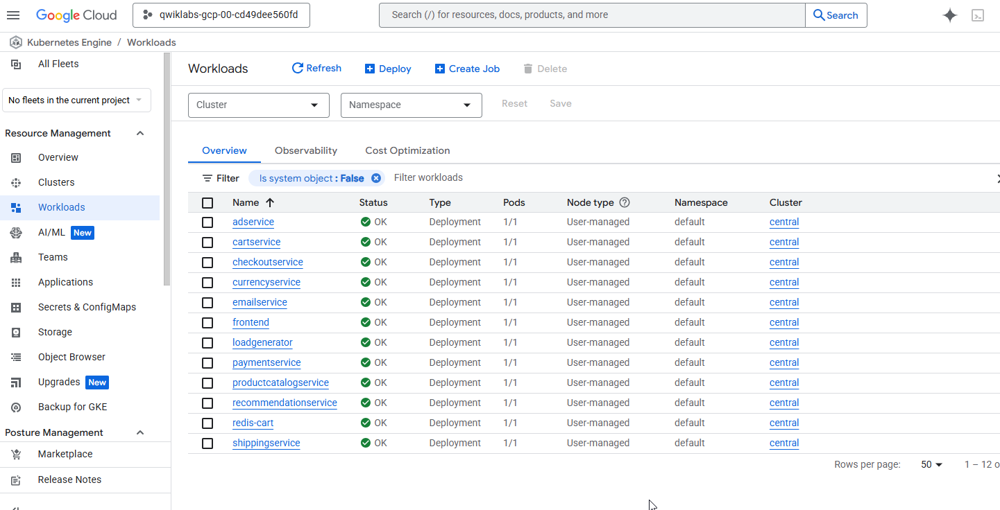

12.  Now, select **Gateways, Services & Ingress**, and then click on the **Services** tab to verify all services are OK. Stay on this screen to set up monitoring for the application.

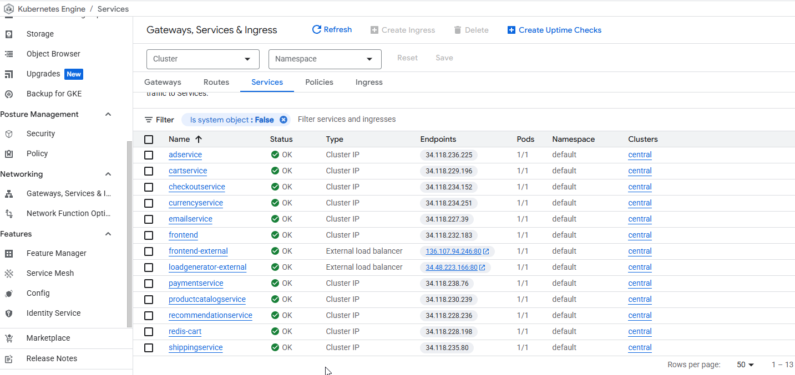

## Task 3. Open the application

-   Scroll down to **frontend-external** and click the Endpoints IP of the service.


It should open the application to display a page like the following:


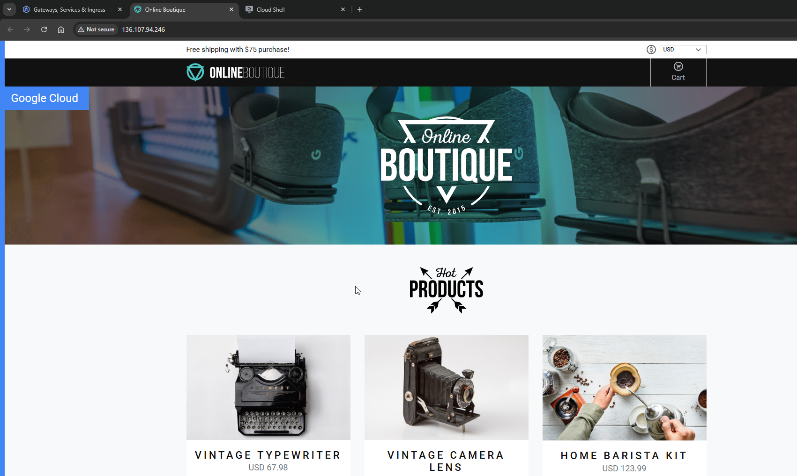

## Task 4. Create a logs-based metric

In this task, you configure Cloud Logging to create a [logs-based metric](https://cloud.google.com/logging/docs/logs-based-metrics), which is a custom metric in Cloud Monitoring made from log entries. Logs-based metrics are good for counting the number of log entries and tracking the distribution of a value in your logs.

In this case, you use the logs-based metric to count the number of errors in your frontend service. You can then use the metric in both dashboards and alerting.

1.  Return to the Cloud console, and from the **Navigation menu**, open **Logging**, then click **Logs Explorer**.


2.  Enable **Show query** and in the **Query builder** box, add the following query:
resource.type="k8s\_container" severity=ERROR labels."k8s-pod/app": "recommendationservice"


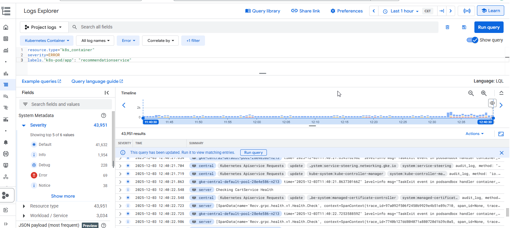

3.  Click **Run Query**.

The query you are using lets you find all errors from the frontend pod. However, you shouldn't see any results now since there are no errors yet.

4.  To create the logs-based metric, click the **Actions** dropdown, and select **Create Metric**.


5.  Name the metric **Error\_Rate\_SLI,** and click **Create Metric** to save the log-based metric:


The metric is now listed under User-defined Metrics on the Logs-based Metrics page.

Click **Check my progress** to verify the objective. Create a logs-based metric

## Task 5. Create an alerting policy

Alerting gives timely awareness to problems in your cloud applications so you can resolve the problems quickly.

In this task, you use Cloud Monitoring to monitor your frontend service availability by creating an alerting policy based on the frontend errors logs-based metric that you created previously. When the condition of the alerting policy is met, Cloud Monitoring creates and displays an incident in the Cloud console.

1.  In the **Navigation menu**, open **Monitoring,** then click **Alerting**.
    
2.  After the workspace is created, click **Create Policy** at the top.
**Note:** If required, click **Try It!** to use the updated alert creation flow.3.  Click on the **Select a metric** dropdown. Deselect the **Active** checkbox.
    
4.  In the **filter by resource and metric name** field, type **Error\_Rate**.
    
5.  Click on **Kubernetes Container > Logs-Based Metric**. Select **logging/user/Error\_Rate\_SLI** and click **Apply**.

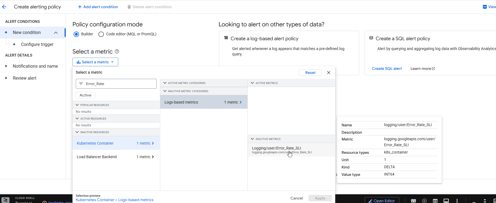

Your screen should look like this:


6.  Set **Rolling windows function** to 
    ```
    Rate
    ```
    .
    
7.  Click **Next**.
    
8.  Set **0.5** as your **Threshold value**.

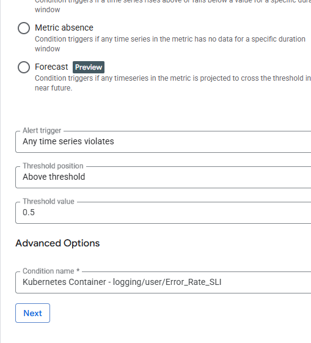

As expected, there are no failures, and your application is meeting its availability Service Level Objective (SLO).

1.  Click **Next** again.
    
2.   Disable **Use notification channel**.
    
3.   Provide an alert name such as 
    ```
    Error Rate SLI
    ```
     then click **Next**.
    
4.   Review the alert and click **Create Policy**.
**Note:** You will not create a notification channel for this lab but you should do it for your applications running in production, which allows you to send notifications in ways such as email, mobile app, SMS, Pub/Sub, and webhooks.


### Trigger an application error

In this section, you use a load generator to create some traffic for your web application. Since there is a bug that has been intentionally introduced into this version of the application, a certain amount of traffic volume triggers errors. You work through the steps to identify and fix the bug.

1.  From the **Navigation menu**, select **Kubernetes Engine**, then **Gateways, Services & Ingress**, and click the **Services** tab.
    
2.  Find the 
    ```
    loadgenerator-external
    ```
     service, then click on the 
    ```
    endpoints
    ```
     link.


Alternatively, you can open a new browser tab or window, copy/paste the IP to the URL field, for example: 
```
http://\[loadgenerator-external-ip\]
```
.

You should now be on the Locust load generator page:


Locust is an open-source load generator, which allows you to load test a web app. It can simulate a number of users simultaneously hitting your application endpoints at a certain rate.

3.  Simulate **300** users hitting the app with a hatch rate of **30**. Locust adds 30 users per second until it reaches 300 users.
    
4.  For the host field, you use the 
    ```
    frontend-external
    ```
    . Copy the URL from the Gateways, Services & Ingress page; be sure to exclude the port. For example:


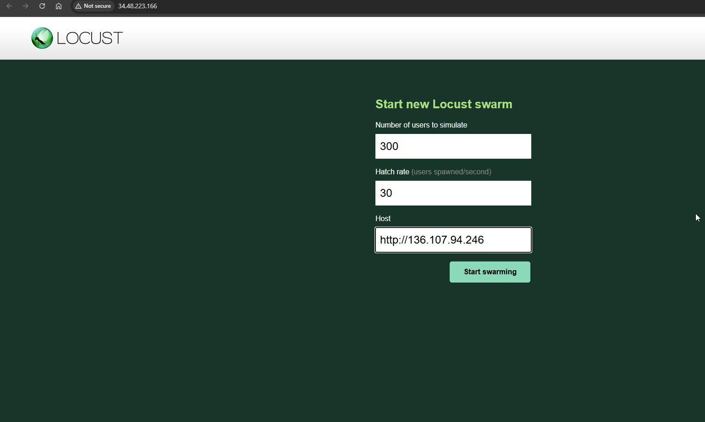

5.  Click the **Start swarming** button. You should have about 300 users to hit the predefined URLs in a few seconds.


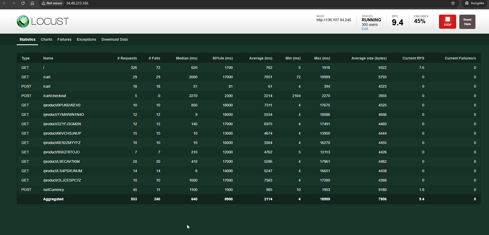

6.  Click on the **Failures** tab to see that there are failures starting to occur. You can see there are a large number of 500-errors.


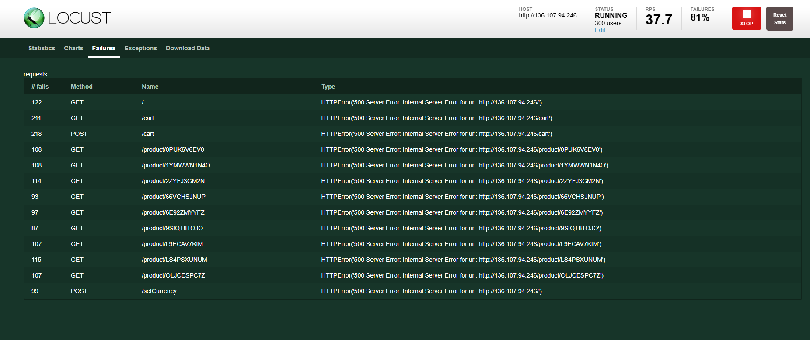

Meanwhile, if you click any product on the home page, it's either noticeably slow or you receive errors like the following if you click on a product:


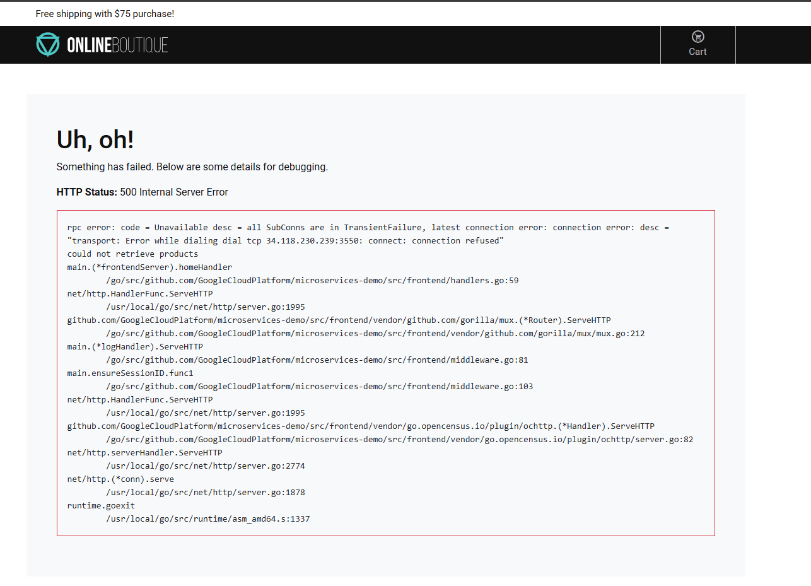

### Confirm the alert and application errors

1.  In the console, from the **Navigation menu**, click **Monitoring**, then **Alerting**. You should see an incident soon regarding **logging/user/Error\_Rate\_SLI**. If you don't see an incident right away, wait a minute or two and refresh your page. It can take up to 5 minutes for the alert to fire.

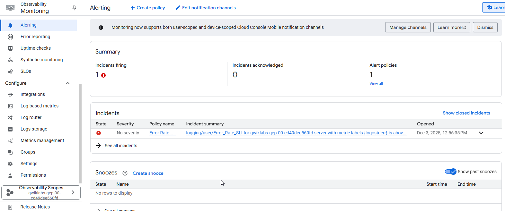   
    
2.  Click the link of the incident:


It brings you to the details page.

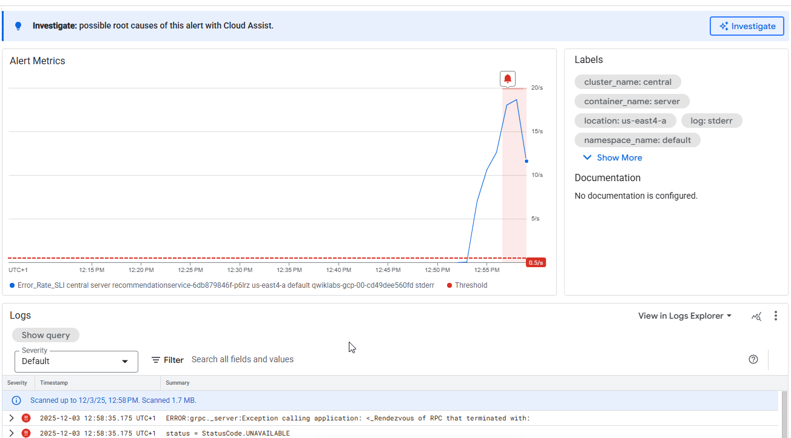

3.  In the Logs section, click **View in Logs Explorer** and select the project ID from the dropdown to view pod logs.


4.  You can also click the **Error** label in the Logs field explorer panel to only query the errors.

Alternatively, you can click into the Query preview field to show the query builder, then click the **Severity** dropdown, add **Error** to the query. Click the **Add** button, then click **Run Query**. The dropdown menu allows adding multiple severity values.

The result either way is adding 
```
severity=ERROR
```
 to your query. Once you do that, you should have all the errors for the recommendationservice pod.


5.  View the error details by expanding an error event. For example:


6.  Expand the 
    ```
    textPayload
    ```
    .
    
7.  Click the error message and select **Add field to summary line** to have the error messages appearing as a summary field:


From there, you can confirm there are indeed many errors for the 
```
RecommendationService
```
 service. Based on the error messages, it appears the 
```
RecommendationService
```
 couldn't connect to some downstream services to either get products or recommendations. However, it's still not clear what the root cause is for the errors.

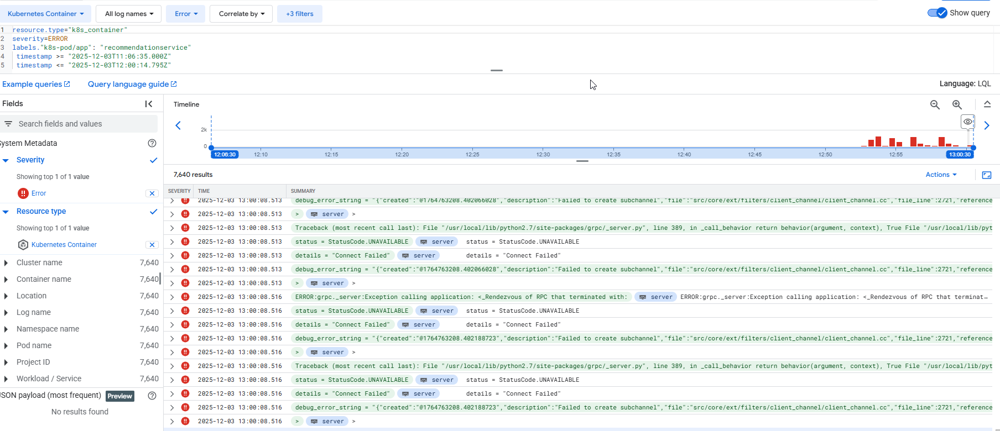

If you revisit the architecture diagram, the **RecommendationService** provides a list of recommendations to the **Frontend** services. However, both the **Frontend** service and the **RecommendationService** invoke **ProductCatalogService** for a list of products.


For the next step, you will look at the metrics of the main suspect, the **ProductCatalogService**, for any anomalies. Regardless, you can drill down in the logs to get some insights.

### Troubleshoot using the Kubernetes dashboard & logs

1.  One of the first places that you can look at the metrics is the [Kubernetes Engine](https://console.cloud.google.com/monitoring/dashboards/resourceList/kubernetes) section of the Monitoring console (**Navigation menu** > **Monitoring**\> **Dashboards** > **GKE**).
    
2.  View the **Workloads** section.
    
3.  Navigate to **Kubernetes Engine** > **Workloads** > **productcatalogservice**. You can see the pod for the service is constantly crashing and restarting.


Next, see if there is anything interesting in the logs.

There are 2 ways to easily get to your container logs:

4.  Click on the **Logs** tab to get a quick view of the most recent logs. Next, click the external link button in the upper right corner of the logs panel to go back to the Logs Explorer.


5.  In the overview page, click the **Container logs** link on the Deployment Details page.


You are on the Logs Explorer page again, now with a predefined query specifically filtered for the logs from the container you were viewing in GKE.

From the Log Viewer, both the log messages and the histogram show the container is repeatedly parsing product catalogs within a short period of time. It seems very inefficient.

At the bottom of the query results, there might also be a runtime error like the following one:

panic: runtime error: invalid memory address or nil pointer dereference \[signal SIGSEGV: segmentation violation

This could actually be causing the pod to crash.

To better understand the reason, search the log message in the code.

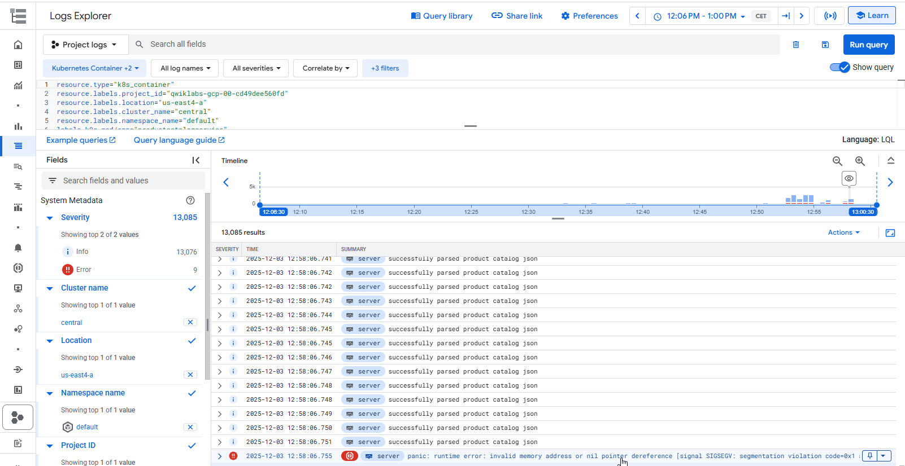

6.  In Cloud Shell terminal, run the following command:
grep -nri 'successfully parsed product catalog json' src

Your output should look like the following, which has the source file name with a line number.
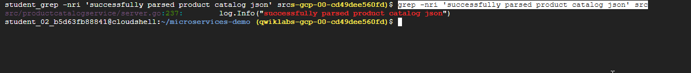

**Output:**

src/productcatalogservice/server.go:237: log.Info("successfully parsed product catalog json")7.  To view the source file, by clicking the **Open Editor** button in the Cloud Shell menu, then **Open in New Window** (if you see the Unable to load code editor because third-party cookies are disabled error, click the eye at the top of the Chrome page).


8.  Click the file 
    ```
    microservices-demo/src/productcatalogservice/server.go
    ```
    , scroll down to line 237, and you will find the **readCatalogFile** method logs this message:


With a little more effort, you can see that if the boolean variable **reloadCatalog** is true, the service reloads and parses the product catalog each time it's invoked, which seems unnecessary.

If you search the **reloadCatalog** variable in the code, you can see it's controlled by the environment variable 
```
ENABLE_RELOAD
```
 and writes a log message for its state.


9.  With the 
    ```
    server.go
    ```
     file open and Gemini Code Assist enabled in the IDE, notice the presence of the  icon in the upper-right corner of the editor.

In this instance, you decide to ask Gemini Code Assist for help explaining the server implementation to your new team member.

10.  Click the **Gemini Code Assist: Smart Actions**  icon and select **Explain this**.
    
11.  Gemini Code Assist opens a chat pane with the prefilled prompt of 
    ```
    Explain this
    ```
    . In the inline text box of the Code Assist chat, replace the prefilled prompt with the following, and click **Send**:
You are a Kubernetes Architect at Cymbal AI. A new team member is unfamiliar with this server implementation. Explain this server.go file in detail, breaking down its key components used in the code. For the suggested improvements, don't update this file.

The explanation for the code in the 
```
server.go
```
 file appears in the **Gemini Code Assist** chat.

```

student cd4ca8f2
Explain this: You are a Kubernetes Architect at Cymbal AI. A new team member is unfamiliar with this server implementation. Explain this server.go file in detail, breaking down its key components used in the code.

For the suggested improvements, don't update this file.


Gemini
Thinking
Of course! Welcome to the team. As a Kubernetes Architect at Cymbal AI, I'd be happy to walk you through the productcatalogservice. This service is a core part of our microservices-based e-commerce application.

Let's break down the productcatalogservice/server.go file.

Overview
This Go program implements a gRPC server that exposes a product catalog. Clients can list all products, get a specific product by its ID, or search for products. It's designed to be run as a container within our Kubernetes cluster. A key characteristic is its robust integration with observability tools for tracing, metrics, and profiling, which is essential for operating services in a distributed environment.

Key Components Breakdown
Here is a detailed look at the different parts of the server.go file.

1. Globals and Initialization (init function)
The server starts by defining several global variables and an init() function that runs before main().

var (...) block:

cat pb.ListProductsResponse: This variable holds the entire product catalog, loaded from a JSON file. pb.ListProductsResponse is a struct generated from the protobuf definition.
catalogMutex *sync.Mutex: A mutex is used to prevent race conditions. Since multiple requests (goroutines) might try to access or reload the catalog at the same time, this lock ensures that access is serialized and safe.
log *logrus.Logger: We use the popular logrus library for structured logging. The logs are formatted as JSON, which is a best practice for containerized applications as it makes them easily parseable by log aggregation systems like Google Cloud Logging.
extraLatency time.Duration: This is for chaos engineering and testing. By setting the EXTRA_LATENCY environment variable, we can introduce an artificial delay to every request to see how our system behaves under latency.
reloadCatalog bool: A flag to determine if the products.json file should be re-read on every request. This is useful for development but is typically disabled in production for performance.
init() function:

This function is automatically executed when the program starts.
It configures the logrus logger to output JSON.
It initializes the catalogMutex.
It performs the initial load of the product data by calling readCatalogFile(), which reads and unmarshals products.json.
2. Main Entrypoint (main function)
The main function is the heart of the application's startup and configuration logic.

Configuration via Environment Variables: The server is configured heavily through environment variables (e.g., DISABLE_TRACING, DISABLE_PROFILER, PORT, EXTRA_LATENCY). This is a cloud-native best practice that aligns with the 12-Factor App methodology. It allows us to change the service's behavior without rebuilding the container image, which is perfect for Kubernetes deployments.
Observability Setup: It conditionally initializes tracing and profiling. If not disabled, it spins up goroutines to set up exporters for Jaeger (an open-source tracing system) and Google Cloud Trace/Profiler. This is critical for monitoring and debugging in a complex microservices landscape.
Starting the Server: It calls the run() function to start the gRPC listener and then calls select {}, which is a Go idiom to block the main thread indefinitely, preventing the program from exiting while the server runs in the background.
3. gRPC Server Setup (run function)
This function handles the specifics of creating and starting the gRPC server.

It opens a TCP listener on the configured port.
It creates a new gRPC server instance using grpc.NewServer().
Crucially, it conditionally adds grpc.StatsHandler(&ocgrpc.ServerHandler{}). This is an interceptor from the OpenCensus library that automatically collects metrics (like request count, latency) for all gRPC calls.
It registers our service implementation (productCatalog) and a standard gRPC Health Checking service with the server.
Finally, it starts the server in a new goroutine with go srv.Serve(l), so it doesn't block the main function.
4. Service Implementation (productCatalog struct)
This is where the actual business logic of our service resides. The productCatalog struct implements the ProductCatalogServiceServer interface, which is generated from our protobuf file.

ListProducts(...): Returns the full list of products. It calls parseCatalog() to get the product data.
GetProduct(...): Finds and returns a single product by its Id. It iterates through the product list to find a match.
SearchProducts(...): Performs a simple case-insensitive substring search on product names and descriptions.
Check(...) and Watch(...): These implement the standard gRPC Health Checking Protocol. This allows orchestrators like Kubernetes to query the service's health status (SERVING, NOT_SERVING) to manage its lifecycle (e.g., in readiness and liveness probes).
5. Data Handling (readCatalogFile and parseCatalog)
readCatalogFile(..): This function is responsible for the I/O of reading products.json. It uses a mutex to ensure that the file isn't read by multiple goroutines simultaneously. It uses jsonpb to unmarshal the JSON data into the protobuf-generated Go structs.
parseCatalog(): This is a helper function that acts as a gatekeeper to the product data. It checks if the catalog needs to be reloaded (based on the reloadCatalog flag) before returning the list of products.
Suggested Improvements
While the code is functional, here are a couple of areas where we could make improvements for better performance and maintainability.

Inefficient Lookups in GetProduct and SearchProducts: The GetProduct function performs a linear scan (for loop) over the entire product list for every request. This is inefficient and will become slow as the number of products grows.

A better approach would be to pre-process the catalog into a map[string]*pb.Product after reading it from the file. This would make lookups in GetProduct an O(1) operation (constant time) instead of O(n).

go
 Show full code block 
// Inefficient O(n) lookup
for i := 0; i < len(parseCatalog()); i++ {
    if req.Id == parseCatalog()[i].Id {
        found = parseCatalog()[i]
    }
}
Repetitive Parsing in parseCatalog(): The parseCatalog() function is called multiple times within GetProduct and SearchProducts. Each call to parseCatalog() can potentially trigger a file read if reloadCatalog is true. Even if it's false, the function call itself is repeated.

The product slice should be retrieved once at the beginning of each gRPC method.

go
 Show full code block 
// Repetitive calls
func (p *productCatalog) GetProduct(ctx context.Context, req *pb.GetProductRequest) (*pb.Product, error) {
    // ...
    for i := 0; i < len(parseCatalog()); i++ { // Call 1
        if req.Id == parseCatalog()[i].Id {   // Call 2
            found = parseCatalog()[i]          // Call 3
        }
    }
    // ...
}
This could be improved by assigning the result to a local variable:

go
 Show full code block 
func (p *productCatalog) GetProduct(ctx context.Context, req *pb.GetProductRequest) (*pb.Product, error) {
    time.Sleep(extraLatency)
    var found *pb.Product
    products := parseCatalog() // Call only once
    for _, p := range products {
        if req.Id == p.Id {
            found = p
            break // Exit loop once found
        }
    }
    if found == nil {
        return nil, status.Errorf(codes.NotFound, "no product with ID %s", req.Id)
    }
    return found, nil
}
I hope this detailed breakdown is helpful. Let me know if you have any more questions!
```


Check the logs again by adding a message to your query and determine if there are any entries that exist.

12.  Return to the tab where Logs Explorer is open and add the following line to the query:
jsonPayload.message:"catalog reloading"

So the full query in your query builder is as follows:

resource.type="k8s\_container" resource.labels.location="{{{project\_0.startup\_script.zone | ZONE}}}" resource.labels.cluster\_name="central" resource.labels.namespace\_name="default" labels.k8s-pod/app="productcatalogservice" jsonPayload.message:"catalog reloading"13.  Click **Run Query** again and find an "Enable catalog reloading" message in the container log. This confirms that the catalog reloading feature is enabled.


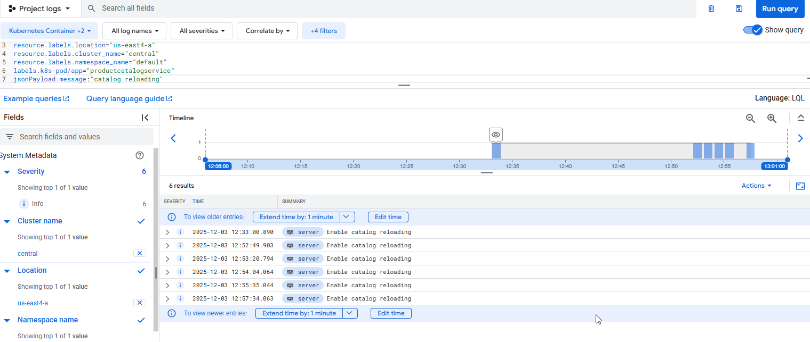

At this point you can be certain the frontend error is caused by the overhead to load the catalog for every request. When you increased the load, the overhead caused the service to fail and generate the error.

## Task 6. Fix the issue and verify the result

Based on the code and what you're seeing in the logs, you can try to fix the issue by disabling catalog reloading.

In this task, you remove the 
```
ENABLE_RELOAD
```
 environment variable for the product catalog service. Once you make the variable changes, you redeploy the application and verify that the changes have addressed the observed issue.

1.  Click the **Open Terminal** button to return to the Cloud Shell terminal if it has closed.
    
2.  Run the following command:
grep -A1 -ni ENABLE\_RELOAD release/kubernetes-manifests.yaml


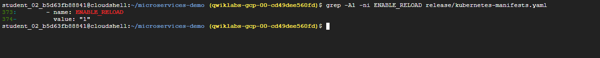

The output shows the line number of the environment variable in the manifest file.

**Output:**

373: - name: ENABLE\_RELOAD 374- value: "1"3.  Delete those two lines to disable the reloading by running the following command:
sed -i -e '373,374d' release/kubernetes-manifests.yaml4.  Then run the following command to reapply the manifest file:
kubectl apply -f release/kubernetes-manifests.yaml

You should notice that only the **productcatalogservice** is configured. The other services are unchanged.

5.  Return to the Deployment detail page (**Navigation menu** > **Kubernetes Engine** > **Workloads** > **productcatalogservice**), and wait until the pod runs successfully. Wait 2-3 minutes or until you can confirm it stops crashing.


6.  If you click the **Container logs** link again, note that the repeating 
    ```
    successfully parsing the catalog json
    ```
     messages are gone:


7.  If you go back to the webapp URL and click the products on the home page, it's also much more responsive and you shouldn't encounter any HTTP errors.
    
8.  Go back to the load generator, click the **Reset Stats** button in the top right. The failure percentage is reset and you should not see it increasing anymore.


All these checks indicate that the issue is fixed. If you are still seeing the 500-error, wait another couple of minutes and try clicking on a product again.

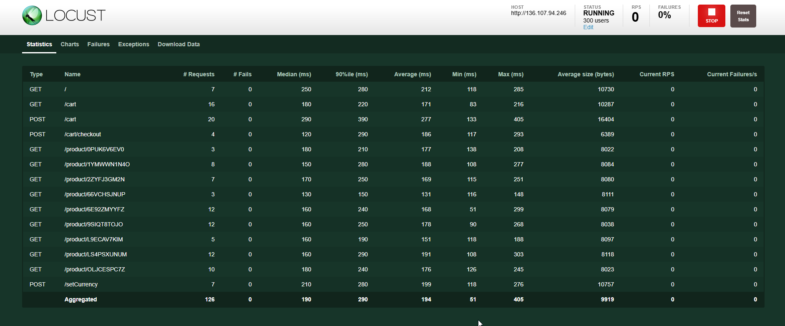

## Congratulations!

You used Cloud Logging and Cloud Monitoring to find an error in an intentionally misconfigured version of the microservices demo app. This is a similar troubleshooting process that you would use to narrow down issues for your GKE apps in a production environment.

First, you deployed the app to GKE and then set up a metric and alert for frontend errors. Next, you generated a load and then noticed that the alert was triggered. From the alert, you narrowed down the issue to particular services using Cloud Logging. Then, you used Cloud Monitoring and the GKE UI to look at the metrics for the GKE services. To fix the issue, you then deployed an updated configuration to GKE and confirmed that the fix addressed the errors in the logs.


