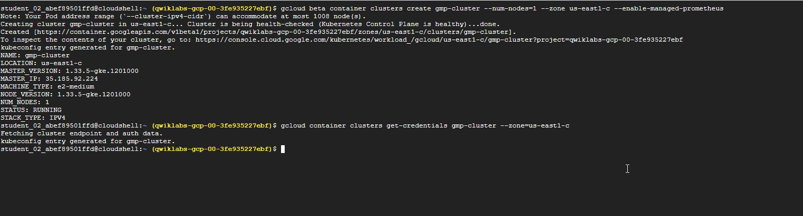
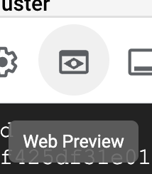
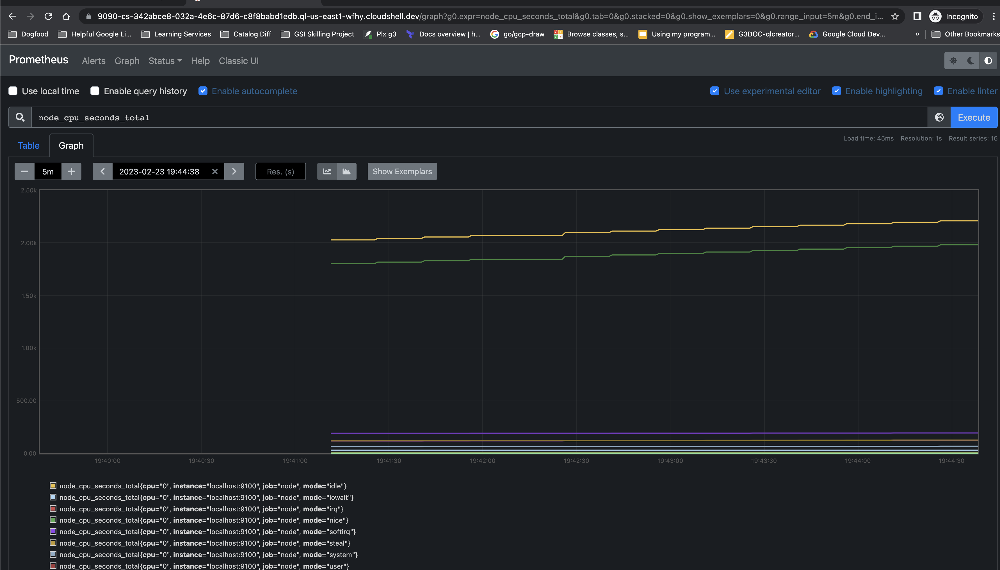
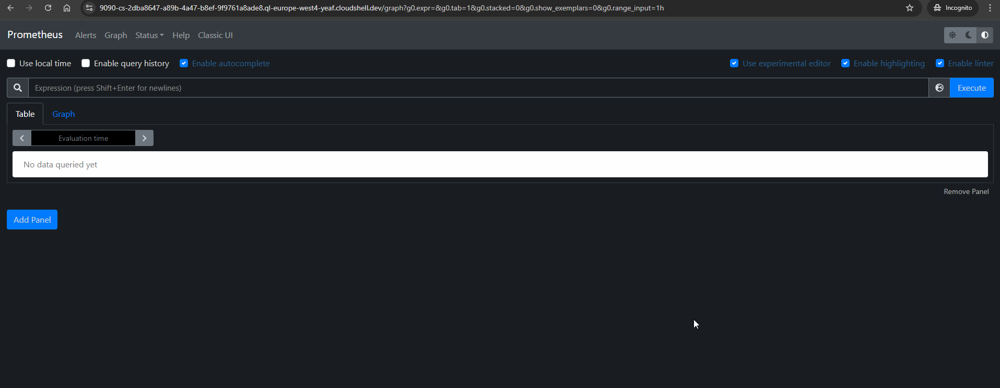
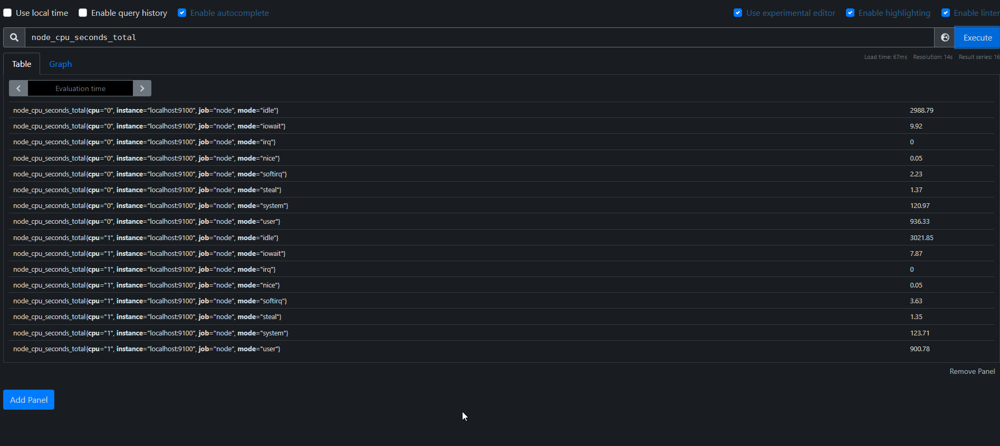

# Manage Kubernetes in Google Cloud - Collect Metrics from Exporters using the Managed Service for Prometheus 

## GSP1026

## Overview

In this lab, you will use Managed Service for Prometheus to collect metrics from other infrastructure sources via exporters.

### Objectives

In this lab, you will learn how to:

1.  Deploy a GKE instance
2.  Configure the 
    ```
    PodMonitoring
    ```
     custom resource and 
    ```
    node-exporter
    ```
     tool
3.  Build the GMP binary locally and deploy to the GKE instance
4.  Apply a Prometheus configuration to begin collecting metrics

## Setup and requirements

### Before you click the Start Lab button

Read these instructions. Labs are timed and you cannot pause them. The timer, which starts when you click **Start Lab**, shows how long Google Cloud resources are made available to you.

This hands-on lab lets you do the lab activities in a real cloud environment, not in a simulation or demo environment. It does so by giving you new, temporary credentials you use to sign in and access Google Cloud for the duration of the lab.

To complete this lab, you need:

-   Access to a standard internet browser (Chrome browser recommended).
**Note:** Use an Incognito (recommended) or private browser window to run this lab. This prevents conflicts between your personal account and the student account, which may cause extra charges incurred to your personal account.-   Time to complete the lab—remember, once you start, you cannot pause a lab.
**Note:** Use only the student account for this lab. If you use a different Google Cloud account, you may incur charges to that account.

### How to start your lab and sign in to the Google Cloud console

1.  Click the **Start Lab** button. If you need to pay for the lab, a dialog opens for you to select your payment method. On the left is the Lab Details pane with the following:
    
      3.   The Open Google Cloud console button
      4.   Time remaining
      5.   The temporary credentials that you must use for this lab
      6.   Other information, if needed, to step through this lab
    
2.  Click **Open Google Cloud console** (or right-click and select **Open Link in Incognito Window** if you are running the Chrome browser).
    
    The lab spins up resources, and then opens another tab that shows the Sign in page.
    
    12.*_Tip:_** Arrange the tabs in separate windows, side-by-side.
    
    14.*Note:** If you see the **Choose an account** dialog, click **Use Another Account**.
3.  If necessary, copy the **Username** below and paste it into the **Sign in** dialog.
    
    {{{user\_0.username | "Username"}}}
    
    You can also find the Username in the Lab Details pane.
    
4.  Click **Next**.
    
5.  Copy the **Password** below and paste it into the **Welcome** dialog.
    
    {{{user\_0.password | "Password"}}}
    
    You can also find the Password in the Lab Details pane.
    
6.  Click **Next**.
    
    31.*Important:** You must use the credentials the lab provides you. Do not use your Google Cloud account credentials. **Note:** Using your own Google Cloud account for this lab may incur extra charges.
7.  Click through the subsequent pages:
    
      34.   Accept the terms and conditions.
      35.   Do not add recovery options or two-factor authentication (because this is a temporary account).
      36.   Do not sign up for free trials.

After a few moments, the Google Cloud console opens in this tab.

**Note:** To access Google Cloud products and services, click the **Navigation menu** or type the service or product name in the **Search** field.

### Activate Cloud Shell

Cloud Shell is a virtual machine that is loaded with development tools. It offers a persistent 5GB home directory and runs on the Google Cloud. Cloud Shell provides command-line access to your Google Cloud resources.

1.  Click **Activate Cloud Shell** at the top of the Google Cloud console.
    
2.  Click through the following windows:
    
      5.   Continue through the Cloud Shell information window.
      6.   Authorize Cloud Shell to use your credentials to make Google Cloud API calls.

When you are connected, you are already authenticated, and the project is set to your **Project\_ID**, . The output contains a line that declares the **Project\_ID** for this session:

Your Cloud Platform project in this session is set to {{{project\_0.project\_id | "PROJECT\_ID"}}}

```
gcloud
```
 is the command-line tool for Google Cloud. It comes pre-installed on Cloud Shell and supports tab-completion.

3.  (Optional) You can list the active account name with this command:
gcloud auth list4.  Click **Authorize**.

**Output:**

ACTIVE: \* ACCOUNT: {{{user\_0.username | "ACCOUNT"}}} To set the active account, run: $ gcloud config set account \`ACCOUNT\`5.  (Optional) You can list the project ID with this command:
gcloud config list project

**Output:**

\[core\] project = {{{project\_0.project\_id | "PROJECT\_ID"}}} **Note:** For full documentation of 
```
gcloud
```
, in Google Cloud, refer to [the gcloud CLI overview guide](https://cloud.google.com/sdk/gcloud).

## Task 1. Deploy GKE cluster

-   Run the following to deploy a basic GKE cluster:
```bash
gcloud beta container clusters create gmp-cluster --num-nodes=1 --zone {{{project\_0.default\_zone | Zone}}} --enable-managed-prometheus 
gcloud container clusters get-credentials gmp-cluster --zone={{{project\_0.default\_zone | Zone}}}

```


## Task 2. Set up a namespace

-   Create the 
    ```
    gmp-test
    ```
     Kubernetes namespace for resources you create as part of the example application:
```bash
kubectl create ns gmp-test 

```
## Task 3. Deploy the example application

The managed service provides a manifest for an example application that emits Prometheus metrics on its metrics port. The application uses three replicas.

-   To deploy the example application, run the following command:
```
kubectl -n gmp-test apply -f https://raw.githubusercontent.com/GoogleCloudPlatform/prometheus-engine/v0.2.3/examples/example-app.yaml

```
## Task 4. Configure a PodMonitoring resource

To ingest the metric data emitted by the example application, you use target scraping. Target scraping and metrics ingestion are configured using Kubernetes [custom resources](https://kubernetes.io/docs/concepts/extend-kubernetes/api-extension/custom-resources/). The managed service uses [PodMonitoring](https://github.com/GoogleCloudPlatform/prometheus-engine/blob/v0.2.3/doc/api.md#podmonitoring) custom resources (CRs).

A PodMonitoring CR scrapes targets only in the namespace the CR is deployed in. To scrape targets in multiple namespaces, deploy the same PodMonitoring CR in each namespace. You can verify the PodMonitoring resource is installed in the intended namespace by running 
```
kubectl get podmonitoring -A
```
.

For reference documentation about all the Managed Service for Prometheus CRs, see the [prometheus-engine/doc/api reference](https://github.com/GoogleCloudPlatform/prometheus-engine/blob/v0.2.3/doc/api.md).

The following manifest defines a PodMonitoring resource, 
```
prom-example
```
, in the 
```
gmp-test
```
 namespace. The resource uses a [Kubernetes label selector](https://kubernetes.io/docs/concepts/overview/working-with-objects/labels/) to find all pods in the namespace that have the label 
```
app
```
 with the value 
```
prom-example
```
. The matching pods are scraped on a port named 
```
metrics
```
, every 30 seconds, on the 
```
/metrics
```
 HTTP path.

apiVersion: monitoring.googleapis.com/v1alpha1 kind: PodMonitoring metadata: name: prom-example spec: selector: matchLabels: app: prom-example endpoints: - port: metrics interval: 30s-   To apply this resource, run the following command:
```
kubectl -n gmp-test apply -f https://raw.githubusercontent.com/GoogleCloudPlatform/prometheus-engine/v0.2.3/examples/pod-monitoring.yaml

```
Your managed collector is now scraping the matching pods.

To configure horizontal collection that applies to a range of pods across all namespaces, use the [ClusterPodMonitoring](https://github.com/GoogleCloudPlatform/prometheus-engine/blob/v0.2.3/doc/api.md#clusterpodmonitoring) resource. The ClusterPodMonitoring resource provides the same interface as the PodMonitoring resource but does not limit discovered pods to a given namespace.

**Note**: An additional targetLabels field provides a simplified Prometheus-style [relabel configuration](https://prometheus.io/docs/prometheus/latest/configuration/configuration/#relabel_config). You can use relabeling to add pod labels as labels on the ingested time series. You can't overwrite the mandatory target labels; for a list of these labels, see the [prometheus\_target resource](https://cloud.google.com/stackdriver/docs/managed-prometheus/query#target-resource).

If you are running on GKE, then you can do the following:

-   To query the metrics ingested by the example application, see Query data from the Prometheus service.
-   To learn about filtering exported metrics and adapting your prom-operator resources, see Additional topics for managed collection.

## Task 5. Download the prometheus binary

-   Download the prometheus binary from the following bucket:
```bash
git clone https://github.com/GoogleCloudPlatform/prometheus && cd prometheus git checkout v2.28.1-gmp.4 wget https://storage.googleapis.com/kochasoft/gsp1026/prometheus chmod a+x prometheus

```
## Task 6. Run the prometheus binary

1.  Save your project id to a variable:
```bash
export PROJECT\_ID=$(gcloud config get-value project)2.  Save your zone to a variable. These values will be used when running your promtheus binary.
export ZONE={{{project\_0.default\_zone | Zone}}}3.  Run the prometheus binary on cloud shell using command here:
./prometheus \\ --config.file=documentation/examples/prometheus.yml --export.label.project-id=$PROJECT\_ID --export.label.location=$ZONE

```
After the prometheus binary begins you should be able to go to managed prometheus in the Console UI and run a PromQL query “up” to see the prometheus binary is available (will show localhost running one as the instance name).

## Task 7. Download and run the node exporter

1.  Open a new tab in Cloud Shell to run the 
    ```
    node_exporter
    ```
     commands.
    
2.  Download and run the exporter on the cloud shell box:
```bash
wget https://github.com/prometheus/node\_exporter/releases/download/v1.3.1/node\_exporter-1.3.1.linux-amd64.tar.gz tar xvfz node\_exporter-1.3.1.linux-amd64.tar.gz cd node\_exporter-1.3.1.linux-amd64 ./node\_exporter 

```**Note**: The port that the 
```
node_exporter
```
 tool is running on you will use to modify the config of prometheus on the next few steps.

You should see output like this indicating that the Node Exporter is now running and exposing metrics on port 9100:

```bash
ts=2023-03-01T10:27:17.262Z caller=node\_exporter.go:199 level=info msg="Listening on" address=:9100 ts=2023-03-01T10:27:17.263Z caller=tls\_config.go:195 level=info msg="TLS is disabled." http2=false

```
### Create a config.yaml file

1.  Stop the running prometheus binary in the 1st tab of Cloud Shell and have a new config file which will take the metrics from node exporter:
vi config.yaml2.  Create a 
    ```
    config.yaml
    ```
     file with the following spec:
global: scrape\_interval: 15s scrape\_configs: - job\_name: node static\_configs: - targets: \['localhost:9100'\]
3.  Upload the 
    ```
    config.yaml
    ```
     file you created to verify:

```bash
export PROJECT=$(gcloud config get-value project) 
gsutil mb -p $PROJECT gs://$PROJECT 
gsutil cp config.yaml gs://$PROJECT 
gsutil -m acl set -R -a public-read gs://$PROJECT 

```
Check if config.yaml is configured correctly4.  Re-run prometheus pointing to the new configuration file by running the command below:
```bash
./prometheus --config.file=config.yaml --export.label.project-id=$PROJECT --export.label.location=$ZONE

```
Use the following stat from the exporter to see its count in a PromQL query.

5.  In Cloud Shell, click on the web preview icon.
   
6.  Set the port to 
    ```
    9090
    ```
     by selecting **Change Preview Port** and preview by clicking **Change and Preview**.

Write any query in the PromQL query Editor prefixed with **“node\_”**. This should bring up an input list of metrics you can select to visualize in the graphical editor.

-   "node\_cpu\_seconds\_total" provides graphical data.
  

Try selecting other metrics that appear to view the data exported.





## Congratulations!

In this lab you deployed a GKE instance and configured 
```
node-exporter
```
. You then configured the GMP binary to ingest metrics from 
```
node-exporter
```
 and viewed the metrics.

### Next steps / Learn more

You can read more about [Google cloud Managed Service for Prometheus](https://cloud.google.com/stackdriver/docs/managed-prometheus).

