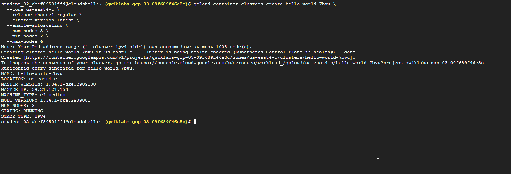
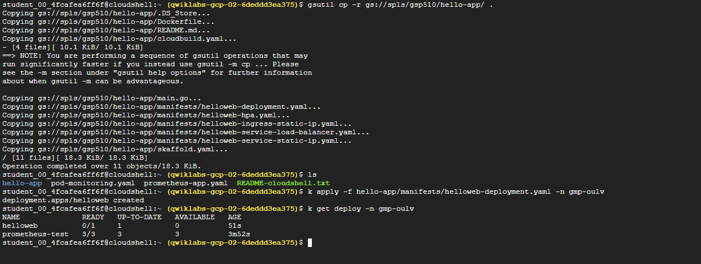
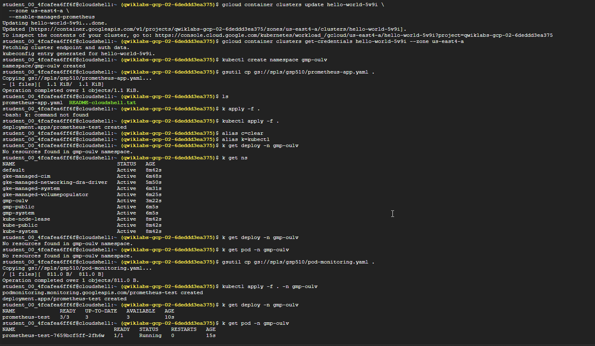
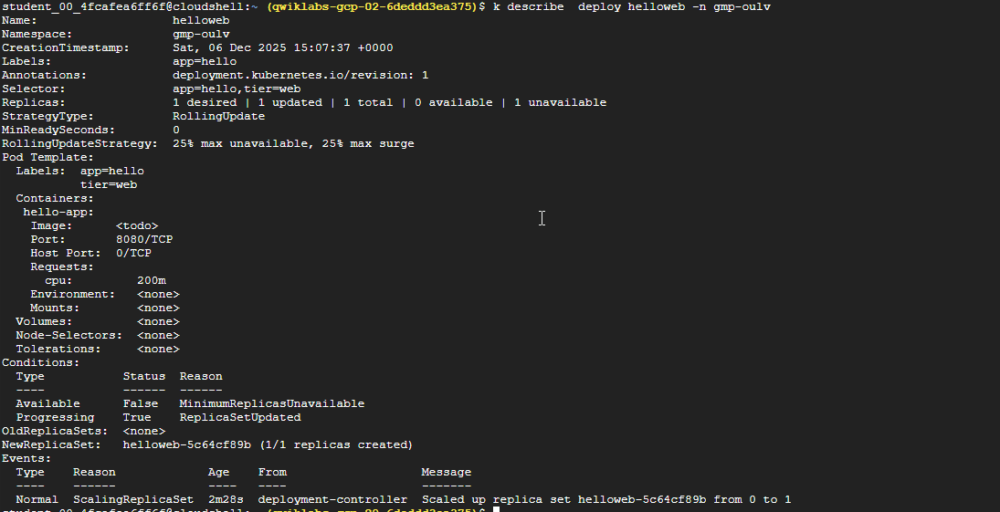
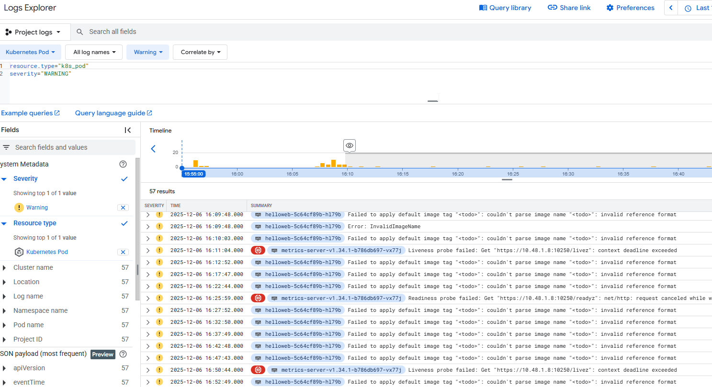
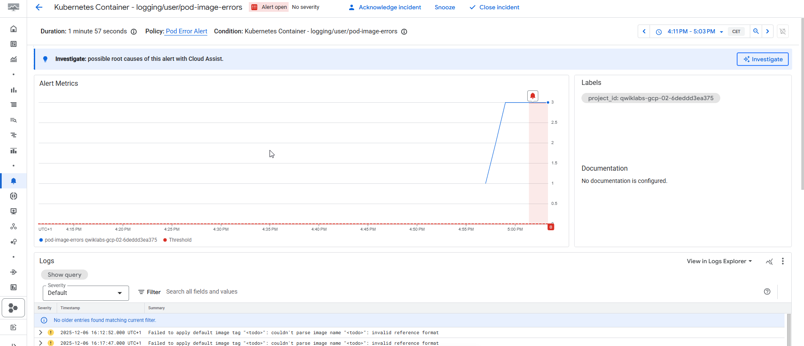
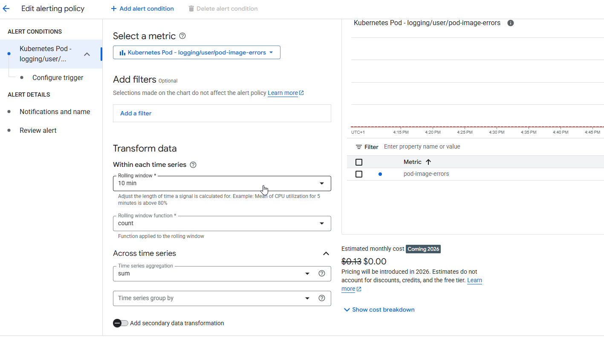

# Manage Kubernetes in Google Cloud: Challenge Lab

Lab instructions and tasks

-   [GSP510](#step1)
-   [Introduction](#step2)
-   [Challenge scenario](#step3)
-   [Task 1. Create a GKE cluster](#step4)
-   [Task 2. Enable Managed Prometheus on the GKE cluster](#step5)
-   [Task 3. Deploy an application onto the GKE cluster](#step6)
-   [Task 4. Create a logs-based metric and alerting policy](#step7)
-   [Task 5. Update and re-deploy your app](#step8)
-   [Task 6. Containerize your code and deploy it onto the cluster](#step9)
-   [Congratulations!](#step10)


This content is not yet optimized for mobile devices.

For the best experience, please visit us on a desktop computer using a link sent by email.

## GSP510


## Introduction

In a challenge lab you’re given a scenario and a set of tasks. Instead of following step-by-step instructions, you will use the skills learned from the labs in the course to figure out how to complete the tasks on your own! An automated scoring system (shown on this page) will provide feedback on whether you have completed your tasks correctly.

When you take a challenge lab, you will not be taught new Google Cloud concepts. You are expected to extend your learned skills, like changing default values and reading and researching error messages to fix your own mistakes.

To score 100% you must successfully complete all tasks within the time period!

This lab is recommended for students who have enrolled in the [Manage Kubernetes in Google Cloud](https://www.cloudskillsboost.google/authoring/course_templates/783) skill badge. Are you ready for the challenge?

### Before you click the Start Lab button

Read these instructions. Labs are timed and you cannot pause them. The timer, which starts when you click **Start Lab**, shows how long Google Cloud resources are made available to you.

This hands-on lab lets you do the lab activities in a real cloud environment, not in a simulation or demo environment. It does so by giving you new, temporary credentials you use to sign in and access Google Cloud for the duration of the lab.

To complete this lab, you need:

-   Access to a standard internet browser (Chrome browser recommended).
**Note:** Use an Incognito (recommended) or private browser window to run this lab. This prevents conflicts between your personal account and the student account, which may cause extra charges incurred to your personal account.-   Time to complete the lab—remember, once you start, you cannot pause a lab.
**Note:** Use only the student account for this lab. If you use a different Google Cloud account, you may incur charges to that account.

## Challenge scenario

You were onboarded at Cymbal Shops just a few months ago. You have spent a lot of time working with containers in Docker and Artifact Registry and have learned the ropes of managing new and existing deployments on GKE. You've had practice updating manifests as well as scaling, monitoring, and debugging applications running on your clusters.


Your team would like you to start managing their Kubernetes deployments to ensure smooth rollouts and application updates to their new e-commerce website. Before you switch to this new role, the development team would like you to demonstrate your new skills. As part of this demonstration, they have a list of tasks they would like to see you do in an allotted period of time in a sandbox environment.

### Your challenge

As part of the sandbox environment, your developers have created an Artifact Registry repository named that has some code with a basic example application that you will deploy onto a cluster.

**Note:** This image created in the repo is a containerized version of the code you will be downloading from the 
```
spls/gsp510/hello-app
```
 bucket later in the lab.

Your tasks will include the following:

1. Manage Kubernetes in Google Cloud: Challenge Lab
   1. GSP510
   2. Introduction
      1. Before you click the Start Lab button
   3. Challenge scenario
      1. Your challenge
   4. Task 1. Create a GKE cluster
   5. Task 2. Enable Managed Prometheus on the GKE cluster
   6. Task 3. Deploy an application onto the GKE cluster
   7. Task 4. Create a logs-based metric and alerting policy
      1. Create a logs-based metric
      2. Create an alerting policy
   8. Task 5. Update and re-deploy your app
   9. Task 6. Containerize your code and deploy it onto the cluster
   10. Congratulations!

## Task 1. Create a GKE cluster

The new Cymbal Shops e-commerce website will run natively on GKE and the team would like to see your experience working and setting up clusters. In this section, you will need to create a Kubernetes cluster based on a set of configurations provided to run your demo applications on.

1.  Create a GKE cluster named with the following configuration:

 Setting | Value |
| --- | --- |
 **Zone** |  |
 **Release channel** | **Regular** |
 **Cluster version** | 
```
1.27.8
```
 _or newer_ |
 **Cluster autoscaler** | **Enabled** |
 **Number of nodes** | **3** |
 **Minimum nodes** | **2** |
 **Maximum nodes** | **6** |

```bash
gcloud container clusters create hello-world-7bvu \
  --zone us-east4-c \
  --release-channel regular \
  --cluster-version latest \
  --enable-autoscaling \
  --num-nodes 3 \
  --min-nodes 2 \
  --max-nodes 6

```


## Task 2. Enable Managed Prometheus on the GKE cluster

As part of the e-commerce website strategy, Cymbal Shops would like to start using Managed Prometheus for metrics and monitoring on the cluster to ensure a good experience for their customers. In this section, you will enable Managed Prometheus on the cluster for metric monitoring and create a namespace to deploy a sample Prometheus application and pod monitoring on.

1.  Enable the Prometheus managed collection on the GKE cluster.
    
2.  Create a namespace on the cluster named .
    
3.  Download a sample Prometheus app:
gsutil cp gs://spls/gsp510/prometheus-app.yaml .



4.  Update the 
    ```
    <todo>
    ```
     sections (lines 35-38) with the following configuration.
    
      10.   **containers.image**: 
          ```
          nilebox/prometheus-example-app:latest
          ```
          
      15.   **containers.name:** 
          ```
          prometheus-test
          ```
          
      20.   **ports.name**: 
          ```
          metrics
          ```
    

5.  Deploy the application onto the namespace on your GKE cluster.
    

6.  Download the 
    ```
    pod-monitoring.yaml
    ```
     file:
gsutil cp gs://spls/gsp510/pod-monitoring.yaml .7.  Update the 
    ```
    <todo>
    ```
     sections (lines 18-24) with the following configuration:
    
      13.   **metadata.name**: 
          ```
          prometheus-test
          ```
          
      18.   **labels.app.kubernetes.io/name**: 
          ```
          prometheus-test
          ```
          
      23.   **matchLabels.app**: 
          ```
          prometheus-test
          ```
          
      28.   **endpoints.interval**: 45s
   
   
    
1.  Apply the pod monitoring resource onto the namespace on your GKE cluster.

Click **Check my progress** to verify the objective.

Enable Managed Prometheus on the GKE cluster

## Task 3. Deploy an application onto the GKE cluster

The development team at Cymbal Shops will be consistently releasing new application code to the cluster that you will have to successfully deploy into production. In this section, you will deploy a Kubernetes manifest onto the cluster and inspect the issue.

1.  Download the demo deployment manifest files:
gsutil cp -r gs://spls/gsp510/hello-app/ .2.  Create a deployment onto the namespace on your GKE cluster from the 
    ```
    helloweb-deployment.yaml
    ```
     manifest file. It is located in the 
    ```
    hello-app/manifests
    ```
     folder.
    
3.  Verify you have created the deployment, and navigate to the **helloweb** deployment details page. You should see the following error:


This error seems to stem from an invalid image name in the manifest that you just deployed. Before you fix the image name, you will create a logs-based metric and alerting policy so that your team can be notified if this happens again in the future.




## Task 4. Create a logs-based metric and alerting policy

Cymbal Shops would like to set up some logs based metrics and alerting policies to aggregate the number of errors and warnings in their Kubernetes pods and set up an alerting mechanism for their clusters when a certain amount of errors are above a specific threshold. In this section, you will demonstrate your knowledge on building these metrics and alerting policies for the team.

### Create a logs-based metric

1.  In the Logs Explorer, create a query that exposes warnings/errors you saw in the previous section on the cluster.
**Hint:** your query should have just one _Resource Type_ and one _Severity_ selected.

If the query is correct, upon running you should see the following errors show up in the logs:

Error: InvalidImageName Failed to apply default image tag "<todo>": couldn't parse image reference "<todo>": invalid reference format2.  Create a logs-based metric from this query. For **Metric type**, use **Counter** and for the **Log Metric Name** use 
    ```
    pod-image-errors
    ```
    .


### Create an alerting policy

1.  Create an Alerting Policy based on the logs-based metric you just created. Use the following details to configure your policy:  -   **Rolling Window**: 
          ```
          10 min
          ```
          
      6.   **Rolling window function**: 
          ```
          Count
          ```
          
      11.   **Time series aggregation**: 
          ```
          Sum
          ```
          
      16.   **Condition type**: 
          ```
          Threshold
          ```
          
      21.   **Alert trigger**: 
          ```
          Any time series violates
          ```
          
      26.   **Threshold position**: 
          ```
          Above threshold
          ```
          
      31.   **Threshold value**: 
          ```
          0
          ```
          
      36.   **Use notification channel**: _**Disable**_
      37.   **Alert policy name**: 
          ```
          Pod Error Alert
          ```

Click **Check my progress** to verify the objective.

Create a logs-based metric and alerting policy

## Task 5. Update and re-deploy your app

The development team would like to see you demonstrate your knowledge on deleting and updating deployments on the cluster in case of an error. In this section, you will update a Kubernetes manifest with a correct image reference, delete a deployment, and deploy the updated application onto the cluster.

1.  Replace the 
    ```
    <todo>
    ```
     in the image section in the 
    ```
    helloweb-deployment.yaml
    ```
     deployment manifest with the following image:
    
      11.   ```
          us-docker.pkg.dev/google-samples/containers/gke/hello-app:1.0
          ```
    
2.  **Delete** the **helloweb** deployment from your cluster.
    
3.  Deploy the updated 
    ```
    helloweb-deployment.yaml
    ```
     manifest onto your cluster on the namespace.

You should verify that it has deployed correctly with no errors. Your Kubernetes Workloads page should resemble the following:


Click **Check my progress** to verify the objective.

Update and re-deploy your app

## Task 6. Containerize your code and deploy it onto the cluster

Lastly, as part of the Cymbal Shops e-commerce strategy, the application team will be providing you code that you will need to containerize and store in a registry, and then update the cluster with the newest version of that code.

In this section, you will containerize your application code, update an image in Artifact Registry, and set that to the image on your cluster. Your team has a repository in Artifact Registry named that contains a containerized version of the 
```
hello-app
```
 sample app in Docker. You will update the code for the build locally, then push a new version to the repository.

1.  In the 
    ```
    hello-app
    ```
     directory, update the **main.go** file to use 
    ```
    Version: 2.0.0
    ```
     on line 49.
    
2.  Use the 
    ```
    hello-app/Dockerfile
    ```
     to create a Docker image with the 
    ```
    v2
    ```
     tag.
**Note:** you should follow the Artifact Registry naming conventions as detailed [here](https://cloud.google.com/artifact-registry/docs/docker/names#containers).3.  Push the newly built Docker image to your repository in Artifact Registry using the 
    ```
    v2
    ```
     tag.
    
4.  Set the image on your **helloweb** deployment to reflect the 
    ```
    v2
    ```
     image you pushed to Artifact Registry.
    
5.  Expose the **helloweb** deployment to a LoadBalancer service named on port 8080, and set the target port of the container to the one specified in the Dockerfile.
    
6.  Navigate to the external load balancer IP address of the service, and you should see the following text returned by the service:
Hello, world! Version: 2.0.0 Hostname: helloweb-6fc7476576-cvv5f **Note:** It may take a few minutes for the webpage to load.

Click **Check my progress** to verify the objective.

Containerize your code and deploy it onto the cluster

## Congratulations!

Congratulations! In this lab you verified your skills on creating a GKE cluster based on a set of configurations and enabling the Prometheus managed collection. You also troubleshooted errors on a cluster and created a logs-based metric and alerting policy, and then updated Kubernetes manifests to fix the issue. Lastly, you containerized your application code and pushed a new build to a repository in Artifact Registry using Docker, updated your cluster to reflect the new image, and exposed a service on the cluster. You are ready to start managing Kubernetes in your own environments!


